# Data Acquisition aNd DisplaY

## 1.0 Introduction
### 1.1 What is DANDY?
[`DANDY`](https://github.com/amitofsk/dandy) is a set of reusable python examples and a library of python functions to help display sensor data in a graphical user interface (GUI).

### 1.2 What are we building?
Here's a typical hardware setup. A sensor is connected to a microcontroller. The microcontroller sends the sensor data to a computer either over USB or wirelessly. Data is displayed in a GUI on the laptop, perhaps numerically, as a needle rotating in a dial, using a slider, or on a chart plot.
<br><br>
All of these steps can be implemented using existing open software, but some steps are easier than others. For example, Arduino makes writing the microcontroller software easy, and Tkinter and Qt are user-friendly libraries for writing GUIs. 

**Where are the challenges in writing the software?**
 
First, the code for the microcontroller and the code for the GUI on the laptop are typically written in different languages. Multiple languages are not a problem for an experienced coder, but they are an obstacle for a novice or a hobbyist. Second, libraries for writing GUI software typically have reusable widgets like buttons and spinboxes, but they don't have ones made specifically for handling inputs from analog sensors. Third, the software on the laptop has to both continually read from the sensors and continually update the GUI. These should appear to the user to happen simultaneously, without either task blocking the other.
<br><br> 
This project addresses all of these challenges. The goal of this project is not to show a new application of a sensor. Instead, it is to simplify writing software for this typical setup easier.  
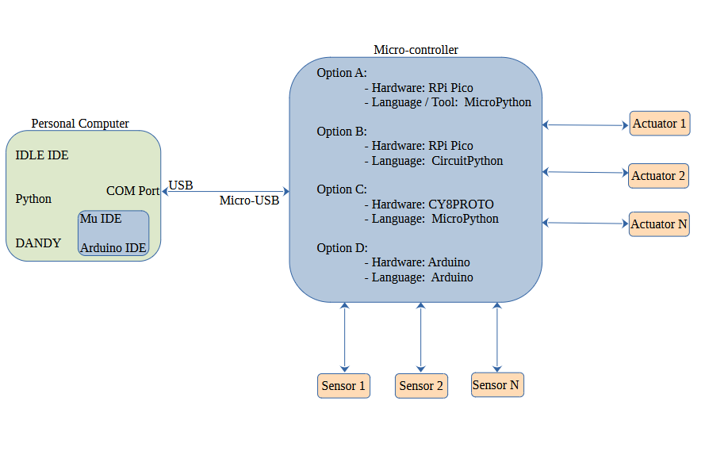


### 1.3 Who is this tutorial for?

This guide is intended for:
 - Students interested in learning about sensor hardware, microcontroller programming,  and writing GUI software.
 - Engineers who want to learn a new way to perform data acquisition using the Python language. 
 - People with at least a little Python coding experience. For example, you should know how to write functions in Python, and you should know what classes and objects are. 
<br><br>

This guide is NOT for you if:
 - You have not programmed before.
 - You want a plug-and-play solution. This is a software library, so you will have to program.
 - You want to acquire sensor data with precise timing. In this project, data collection happens with an inexpensive microcontroller without a real time operating system.
 - You want to collect data using elaborate equipment. This project involves small discrete sensors.  

### What is in DANDY?

This project contains:
 - Example MicroPython, CircuitPython, and Arduino programs for reading from sensors connected to a Raspberry Pi Pico, Arduino, or PSoC6 microcontroller
 - Example Python programs for displaying sensor data graphically on a computer
 - A set of reusable widgets designed for displaying numerical data from sensors or sending numerical data to actuators
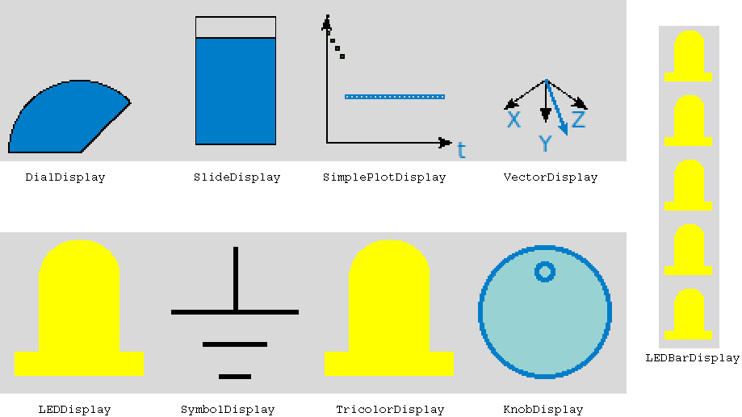

 - Additional widgets designed to look like specific microcontrollers
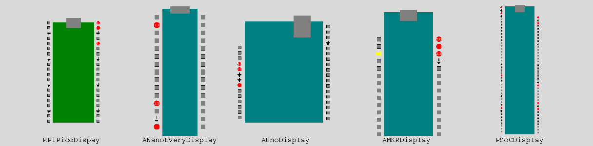

 - An [API](./docs/widgetApi.md) describing how to use the widgets
 - A [tutorial](./docs/Dandy.md) demonstrating how to use everything


## 2.0 Gather hardware supplies
Hardware used:
- Small [protoboard](https://www.digikey.com/en/products/detail/bud-industries/BB-32656/8602381) and wires
- Buttons that fit in the protoboard
- Resistors (300 $\Omega$ - 1k $\Omega$ ) 
- [Potentiometer](https://www.digikey.com/en/products/detail/bourns-inc/PTV09A-4025U-B103/3781137) that fits in the protoboard
- LED
- Small [servo motor](https://www.digikey.com/en/products/detail/adafruit-industries-llc/169/5154651) (Sections 10.2 and 10.3 only)
- The TLE493DW2B6-A0 [magnetic field sensor](https://www.digikey.com/en/products/detail/infineon-technologies/S2GO3DTLE493DW2B6A0TOBO1/10667589?s=N4IgTCBcDaICoBkCiAWAnAZgCIHUwCEA2AWgEEAGEAXQF8g) (Section 8.5 only)
- USB cable to connect your microcontroller
- Microcontroller
  - Options A and B: [Raspberry Pi Pico](https://www.digikey.com/en/products/detail/raspberry-pi/SC0915/13624793) (RPi)
  - Option C: The [CY8CPROTO-062-4343W](https://www.digikey.com/en/products/detail/infineon-technologies/CY8CPROTO-062-4343W/9739908?0=%2Frf-evaluation-and-development-kits-boards&s=N4IgjCBcoCwOxVAYygMwIYBsDOBTANCAPZQDaIAzBQGxwUAMIAuoQA4AuUIAyuwE4BLAHYBzEAF9xhAExkQSAJ4AOJKz5F2JJuKA) (PSoC6)
  - Option D: [Arduino](https://www.digikey.com/en/products/detail/arduino/A000073/3476357)

We will be using the button as an example digital input sensor, and we will be using the potentiometer as an example analog sensor.

This tutorial has four options, depending on your choice of microcontroller and language to program it in. Option A is the Raspberry Pi Pico (RPi) with MicroPyton, option B is the RPi with CircuitPython, option C is the PSoC6 with MicroPython, and option D is Arduino hardware programmed in the Arduino language.  Some steps have different versions for the different options.

If you are using the RPi and your microcontroller didn't come with headers pre-installed, solder them on now, Then, plug your RPi into the protoboard. The picture below shows a RPi without and with headers. 

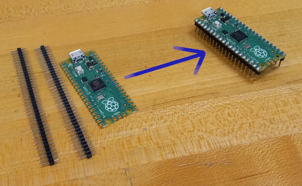

If you are using the PSoC microcontroller, solder headers near pins 6.0, 6.1, and 10.0 as well as to a power and ground connection.

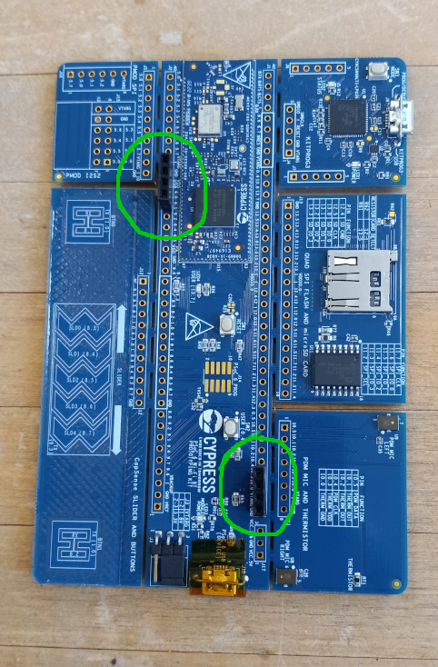

If you are using the Arduino, you can use any version. However, these instructions show pin numbers and details for the Uno.

This tutorial will be entered into the hackster.io [Connect Things With Code](https://www.hackster.io/contests/connectthingswithcode) contest, and the PSoC6 microcontroller was chosen since it is part of that contest. If you are using the PSoC6, you do not need the button, potentiometer, and other components because the microcontroller has these built in. The magnetic field sensor is also part of that contest.


## 3.0 Install software
This tutorial involves both writing Python code for a computer as well as writing code for a microcontroller, so we have two programming environments to set up.

### 3.1 Check your Python installation

We will write Python code with a GUI for the computer. This tutorial requires at least Python version 3.7. It has been tested on both Windows and Linux systems.
<br><br>
If you do not have Python, you can download the latest version from [`Python's website`](https://www.python.org/downloads/).
<br><br>
If you do not know what version you have, run the command below in a command line terminal. On a Windows machine, use a Windows PowerShell window as the terminal.

 ```python
 py --version
 ```
Python comes with a minimalist Integrated Development Environment (IDE) named IDLE. This tutorial assumes you will use IDLE to write Python code that will be run on the computer. However, you can use another IDE such as PyCharm or Thonny if you prefer, or you can use your favorite text editor.


### 3.3 Install the pyserial library 
The pyserial library is used to communicate with devices connected by a USB cable. We will use it to communicate between the computer and the microcontroller.

On Windows, execute the following command in a Windows Powershell terminal. On Linux, execute the following command in a terminal.


```python
pip install pyserial
```


 
### 3.4 Download the DANDY library.
The next step is to download the DANDY library from github. Github is a website that hosts tons of open source software projects. 
<br><br>
This step requires Git. Git comes with Linux, but requires separate installation with Windows.  On Windows, donwload and install it from [Git's website](https://git-scm.com). Once you install it, open a GitBash terminal.  
<br><br>
Change to the directory that you want work in. Then, use the following command in the terminal to download the DANDY repository from github. 
 ```python
 git clone https://github.com/amitofsk/dandy.git
 ```
### 3.5 Install the Mu IDE or the Arduino IDE
In addition to writing Python code for the computer using the IDLE IDE, we will also be writing code for the microcontroller. In this step, we will download the IDE used for programming the microcontroller. 

One advantage of using a different IDE for the computer code and the microcontroller code is that the IDE will remind you which hardware you are programming for. 

If you will be using MicroPython or CircuitPython with the RPi, download and install the [Mu IDE](https://codewith.mu/en/download). The Thonny IDE could also work, but this tutorial will use Mu. Most other Python IDEs do not have the needed libraries.

<br><br>
If you will be using Arduino, download and install the [Arduino IDE](https://www.arduino.cc/en/software/). 
<br><br>
If you are using the PSoC6, download and install the Arduino Lab for MicroPython IDE by following the instructions [here](https://www.hackster.io/Infineon_Team/micropython-on-psoc-fcf1d0) or [here](https://ifx-micropython.readthedocs.io/en/latest/psoc6/intro.html). 


## 4.0 GUI Programming
Files used in section 4:
- widgets/LEDDisplay.py
- widgets/LEDBarDisplay.py
- widgets/SymbolDisplay.py
- examples/ButtonGUI.py
- examples/ButtonPicGUI.py
- examples/DigitalNoHW.py
- examples/smileOn.png
- examples/smileOff.png

DANDY contains a set of widgets useful for displaying input data and other functions. In this section, we'll learn how to program GUIs with Tkinter as well as use the DANDY widgets. We will be programming for the computer here using the IDLE IDE.
   

### 4.1 What Tkinter is?
Tk is a cross-platform set of tools for writing graphical user interfaces (GUIs). Tkinter is Python's version of the library, and it comes preinstalled with Python. 
<br><br>
Tkinter contains many widgets including labels, buttons, scales, and spinboxes. For a nice list along with the API reference, see [tkdocs](https://tkdocs.com/pyref/). 

### 4.2 Tkinter widgets

#### 4.2.1 Example with a quit button 
Let's write our first GUI program using Python and Tkinter. We're writing code to run on the computer, not the microcontroller, in this section, so use the IDLE IDE. In this example, we use two Tkinter widgets: `Label` and `Button`. The `pack` function puts a widget into a window. 
<br><br>
Try out the example below. You should see a window with a label and a working quit button. 

If you downloaded the DANDY library, examples are in the `src/examples` directory. 

(See file src/examples/ButtonGUI.py.)

```python
import tkinter as tk

#Define the ButtonGUI class, which is a child of Tk.
class ButtonGUI(tk.Tk):
    # The function __init__ is the constructor for the class.
    def __init__(self):
        super().__init__()
        self.label1=tk.Label(self, text="Welcome")
        self.button_quit=tk.Button(self, text="Quit", \
                            command=self.destroy)
        #We pack widgets to put them in the window.
        self.label1.pack()
        self.button_quit.pack()
        tk.mainloop()

# Here is our main function which creates an object of class ButtonGUI.
if __name__=="__main__":
    mygui=ButtonGUI()
```

<br><br><br>
#### 4.2.2 Example with two buttons

Let's try another example to get more familiar with Tkinter. This example has two `Buttons` and a `Label` which shows a `PhotoImage`. If you press one of the buttons, the label toggles between two images. Here we write our own function, named `toggle_me`, that is executed when the button is pressed. 
<br><br> 
Either make sure the images smileOn.png and smileOff.png are in the same directory as the example, or alter the code below to point to their location. This example and the images are also in the `example` directory of the DANDY library you downloaded. 
<br><br>
Try out this example too.
<br><br>
(See file src/examples/ButtonPicGUI.py.)
```python
import tkinter as tk

class ButtonPicGUI(tk.Tk):
    def __init__(self):
        super().__init__()
        self.smileOn=tk.PhotoImage(file='./smileOn.png')
        self.smileOff=tk.PhotoImage(file='./smileOff.png')
        self.image_number=0

        #This label contains a PhotoImage instead of text.
        self.label1=tk.Label(self, image=self.smileOn)
        #When button1 is pressed, the instructions in the function
        #toggle_me are followed. We define this function below.
        self.button1=tk.Button(self, text="Press Me", \
                               command=self.toggle_me)
        self.button_quit=tk.Button(self, text="Quit", \
                                   command=self.destroy)

        self.label1.pack()
        self.button1.pack()
        self.button_quit.pack()

        tk.mainloop()

        
    #Here we define the toggle_me function
    def toggle_me(self):
        if self.image_number==0:
            self.label1.configure(image=self.smileOff)
            self.image_number=1
        else:
            self.label1.configure(image=self.smileOn)
            self.image_number=0


if __name__=="__main__":
    mygui=ButtonPicGUI()
```


### 4.3 DANDY widgets 

#### 4.3.1 The LEDDisplay widget

Our examples so far have used widgets that are part of the Tkinter library that comes with Python. The DANDY library, which you just installed, has additional widgets. These widgets are designed for displaying sensor data and related tasks. They are summarized in the figure below.


See the [DANDY API](./WidgetApi.md) for additional details about the available widgets. 


The next example uses the DANDY widget `LEDDisplay`. When you run it, you will see two buttons and an image of an LED. When you press the button, the LED color changes. Try it out.
<br><br>
You may need to change the third line to point to the location of the widgets folder of the DANDY library. This example is also available in the examples folder of the DANDY library. If you open that version, Python should find the widgets folder correctly.

(See file src/examples/DigitalNoHW.py.)

```python

import tkinter as tk
import sys
#We need to import the file for the LEDDisplay widget
#You may need to change the next line so it points to the correct directory.
sys.path.append('../widgets')
import LEDDisplay as ld

class DigitalNoHW(tk.Tk):
    def __init__(self):
        super().__init__()
        #The class LEDDisplay is defined in the file ../widgets/LEDDisplay.py
        self.led1=ld.LEDDisplay(self)
        self.button1=tk.Button(self, text="Press Me", \
                               command=self.toggle_me)
        self.button_quit=tk.Button(self, text="Quit", \
                                   command=self.destroy)

        self.led1.pack()
        self.button1.pack()
        self.button_quit.pack()

        tk.mainloop()

        
    #Here we define the toggle_me function
    def toggle_me(self):
        if(self.led1.get_color()=="yellow"):
            self.led1.change_LED_color("blue")
        else:  
            self.led1.change_LED_color("yellow")


if __name__=="__main__":
    mygui=DigitalNoHW()
```

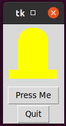

#### 4.3.2 The LEDBarDisplay Widget
The DANDY library contains the class `SymbolDisplay` for displaying ground and power symbols. It also contains the class `LEDBarDisplay` for displaying bars of LEDs. 
<br><br>
Try out the example below. When you run it, you will see a bar of 5 `LEDDisplay` widgets as well as three additional buttons. The first button toggles the LED color, the second button toggles the LED orientation, and the third button is a quit button.

(See file src/examples/LEDBarDemo.py.)

```python

import tkinter as tk
import sys 
sys.path.append ('../widgets') 
import LEDDisplay as ld
import SymbolDisplay as sd
import LEDBarDisplay as lbd

class LEDBarDemo(tk.Tk):
    def __init__(self):
        super().__init__()
        self.lbd1=lbd.LEDBarDisplay(self)
        self.button1=tk.Button(self, text="Change Color", command=self.color_me)
        self.button2=tk.Button(self, text="Change Orientation", \
                               command=self.rotate_me)
        self.button_quit=tk.Button(self, text="Quit", command=self.destroy)

        self.lbd1.pack()
        self.button1.pack()
        self.button2.pack()
        self.button_quit.pack()

        self.color1="blue"
        self.orient1="vertical"
        self.lbd1.set_all_color(self.color1)

        tk.mainloop()

    def color_me(self):
        if (self.color1=="blue"):
            self.color1="purple"
        else:
            self.color1="blue"
        self.lbd1.set_all_color(self.color1)

    def rotate_me(self):
        if (self.orient1=="vertical"):
            self.orient1="horizontal"
        else:
            self.orient1="vertical"
        self.lbd1.set_orientation(self.orient1)
        

if __name__=="__main__":
    mygui=LEDBarDemo()


```
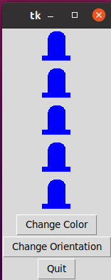

## 5.0 Programming the microcontroller
Files used in section 5:
- microcontr/serialReadMP.py 
- microcontr/serialReadCP.py
- microcontr/serialReadArd.ino
- microcontr/serialWriteMP.py
- microcontr/serialWriteCP.py
- microcontr/serialWriteArd.ino

In section 4, we wrote Python code for the computer, and we used the IDLE IDE. In this section, we will instead write code for the microcontroller. This tutorial has four options:
 - Option A: Raspberry Pi Pico (RPi) and MicroPython 
 - Option B: Raspberry Pi Pico (RPi) and CircuitPython
 - Option C: PSoC6 and MicroPython
 - Option D: Arduino


Follow the option of your choice for this section.

All of the examples in this section have four versions. File names ending in MP are for Option A, file names ending in CP are for option B, file names ending in PSoC are for option C, and file names ending in Ard are for option D. 

Note that all of the example files in the `microcontr` directory contain code for the microcontroller. All of the files in the `examples`, `widgets`, and `utilities` directories, however, contain code for the computer.

### 5.1 Option A: Micropython and RPi
#### 5.1.1 Build the circuit
Connect a button between pin 21 (GP16) and pin 36 (3.3V power)<br>

Refer to the [pinout](https://datasheets.raspberrypi.com/pico/Pico-R3-A4-Pinout.pdf) for the Raspberry Pi Pico (RPi). <br>
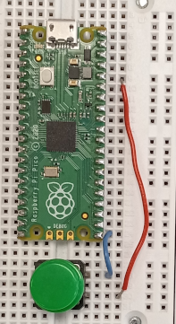

#### 5.1.2 Install MicroPython firmware on the RPi
The RPi does not have a full operating system. Instead, we'll install MicroPython firmware, which contains a Python interpreter specifically for embedded devices. Think of MicroPython firmware as a Python interpreter along with a minimal operating system, that contains just enough instructions to run a Python program. 
<br><br>
Download the latest release of MicroPython from [here](https://micropython.org/download/rp2-pico/).
<br><br>
The RPi has a small button on it labeled `BOOTSEL`. Hold that button down, and use a USB cable to plug the RPi into the computer. Once it is plugged in, you can release the button.
<br><br>
You should now see the RPi drive available (for example, in Windows Explorer). Drag the file that you just downloaded to that drive. 
<br><br>
Disconnect the RPi by unplugging the USB cable. Reconnect the RPi, this time without holding down the `BOOTSEL` button.  

#### 5.1.3 Hello world

Now we're ready to write our first MicroPython program that will run on the RPi. We'll use the Mu IDE, so open it now.
<br><br>
This step requires some libraries for interacting with the hardware, so you can't use IDLE or a text editor unless you manually download those libraries. If you don't want to use Mu, Thonny is another IDE option that has the needed libraries. This tutorial, however, uses Mu.

Click on the `Mode` button and select `RP2040` to tell the Mu IDE that you will be programming in MicroPython. You should now see `RP2040` on the lower right of the MU IDE window.

The middle of the Mu IDE is a text editor where you can enter your code. The section below that is called the [REPL](https://learn.adafruit.com/getting-started-with-raspberry-pi-pico-circuitpython/circuitpython-programming-basics) terminal, short for Read, Evaluate, Print, and Loop.

You can type individual MicroPython instructions in the REPL terminal. They will be evaluated on the microcontroller. If they contain any print statements, the microcontroller will send the message serially via the USB cable, and you will see the result in the REPL terminal.

Since most of our programs will be more than one line, we'll write our instructions in the editor instead of the REPL terminal. After we run our programs, we will still see results of any print statements on the REPL terminal.

Write the following instruction in the editor, and save it as `hello.py`. Next, press the `RUN` button. You should see the message printed in the REPL terminal.
```python
print ("Hello")
```

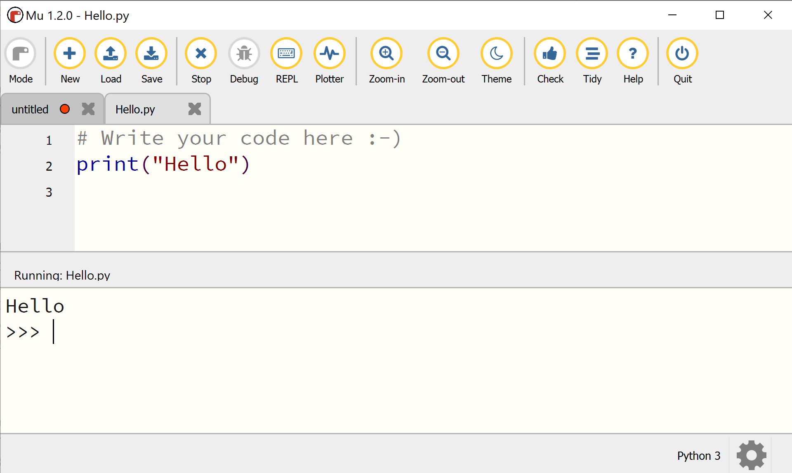


#### 5.1.4  Blinky lights

Now let's write a MicroPython program that uses the pushbutton you wired to the RPi. In this example, when you press down the pushbutton, the internal LED on the RPi will turn on and `T` will be printed in the REPL terminal. When the button is not pressed down, the LED will be off and `F` will be printed. 

Copy the program below into the editor or load the `microcontr/serialWriteMP.py` example program. Then, run it. 

(See file src/mircrocontr/serialWriteMP.py.)


```python
from machine import Pin
import time
print ("hello")

button = Pin(16, Pin.IN, Pin.PULL_DOWN)
led=Pin(25, Pin.OUT)
while True:
    if button.value():
        print("T")
        led.value(True)
    else:
        print("F")
        led.value(False)
    time.sleep(1)
```
The fourth line tells the RPi that we will call GP16 (pin 21) the name `button`. This line also says `button` will be an input. The `Pin.PULL_DOWN` option connects this pin to an internal resistor so that when nothing is connected to it, the pin will be low. 
<br><br>
The fifth line tells the RPi that we will call GP25, the internal LED, the name `led`. This line also says `led` will be an output.
<br><br>When you run this example and hold down the pushbutton wired to the RPi, the program prints `T` and turns on the internal LED. Otherwise it prints `F` and turns off the LED. 
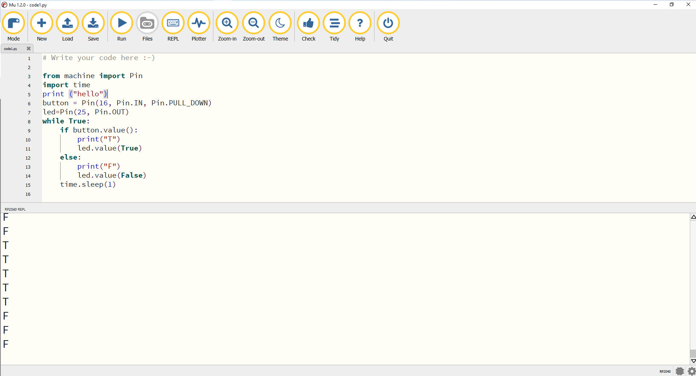

#### 5.1.5 Reading data from the computer
In section 6.0, we will send data from the computer to the microcontroller. To complete this example, we will need to write both Python code for the computer and MicroPython code for the microcontroller. While we're programming the microcontroller, let's write this code. 
<br><br> 
Create a new file in the Mu editor and copy in the code below. Alternatively, load the `microcontr/serialReadMP.py` example file. 

Run it. When you run it, nothing will happen until you send a character from the computer to the microcontroller. If the microcontroller receives a character, the internal LED will blink. We'll complete this example in section 6. 
<br><br>
If you close the Mu IDE, the microcontroller continues to run this code. If you unplug the RPi and plug it back into your computer, the microcontroller continues to run this code.
 
(See file src/microcontr/serialReadMP.py.)

```python
from machine import Pin
import time
import select
import sys
print ("hello")

led=Pin(25, Pin.OUT)
led.value(True)
# setup poll to read USB port
poll_object = select.poll()
poll_object.register(sys.stdin,1)
while True:
    if poll_object.poll(0):
        #read as character
        ch = sys.stdin.read(1)
        print (ch)
        led.value(True)
        time.sleep(0.25)
        led.value(False)
    time.sleep(1)
```


### 5.1 Option B: CircuitPython and the RPi

#### 5.1.1 Build the circuit

Connect a button between pin 21 (GP16) and pin 36 (3.3V power).<br>

Refer to the [pinout](https://datasheets.raspberrypi.com/pico/Pico-R3-A4-Pinout.pdf) for the Raspberry Pi Pico (RPi). <br>


##### 5.1.2 Install CircuitPython on the RPi
The RPi does not have a full operating system. Instead, we'll install CircuitPython firmware, which contains a Python interpreter specifically for embedded devices. Think of CircuitPython firmware as a Python interpreter along with a minimal operating system, that contains just enough instructions to run a Python program.
<br><br>
Download the latest release of CircuitPython from [here](https://circuitpython.org/board/raspberry_pi_pico/).
<br><br>
The RPi has a small button on it labeled `BOOTSEL`. Hold that button down, and use a USB cable to plug the RPi into the computer. Once it is plugged in, you can release the button.
<br><br>
You should now see the RPi drive available (for example, in Windows Explorer). Drag the file that you just downloaded to that drive.
<br><br>
Disconnect the RPi by unplugging the USB cable. Reconnect the RPi, this time without holding down the `BOOTSEL` button.

#### 5.1.3 Hello world

Now we're ready to write our first MicroPython program that will run on the RPi. We'll use the Mu IDE, so open it now. Adafruit has written a nice [CircuitPython tutorial.](https://learn.adafruit.com/getting-started-with-raspberry-pi-pico-circuitpython/overview)

This step requires some libraries for interacting with the hardware, so you can't use IDLE or a text editor unless you manually download those libraries. If you don't want to use Mu, Thonny is another IDE option that has the needed libraries. This tutorial, however, uses Mu.

Click on the `Mode` button and select `CircuitPython` to tell the Mu IDE that you will be programming in CircuitPython. You should now see `CircuitPython` on the lower right of the MU IDE window.

The middle of the Mu IDE is a text editor where you can enter your code. The section below is called the [REPL](https://learn.adafruit.com/getting-started-with-raspberry-pi-pico-circuitpython/circuitpython-programming-basics) terminal, short for Read, Evaluate, Print, and Loop. If you don't see the REPL terminal, press the `Serial` button at the top of the Mu IDE.

You can type individual MicroPython instructions in the REPL terminal. They will be evaluated on the microcontroller. If they contain any print statements, the microcontroller will send the message serially via the USB cable, and you will see the result in the REPL terminal.

Since most of our programs will be more than one line, we'll write our instructions in the editor instead of the REPL terminal. After we run our programs, we will still see results of any print statements on the REPL terminal.

Press the `Load` button at top, and load the file `code.py` from the RPi. This is the program that runs on the RPi. If we put instructions in this file and save, the instructions will run on the RPi. 

Write the following instruction in the editor and save it. You may need to press `Ctrl-S` or `Ctrl-D` to save and run. You should see the message printed in the REPL terminal.


```python
print ("Hello")
```

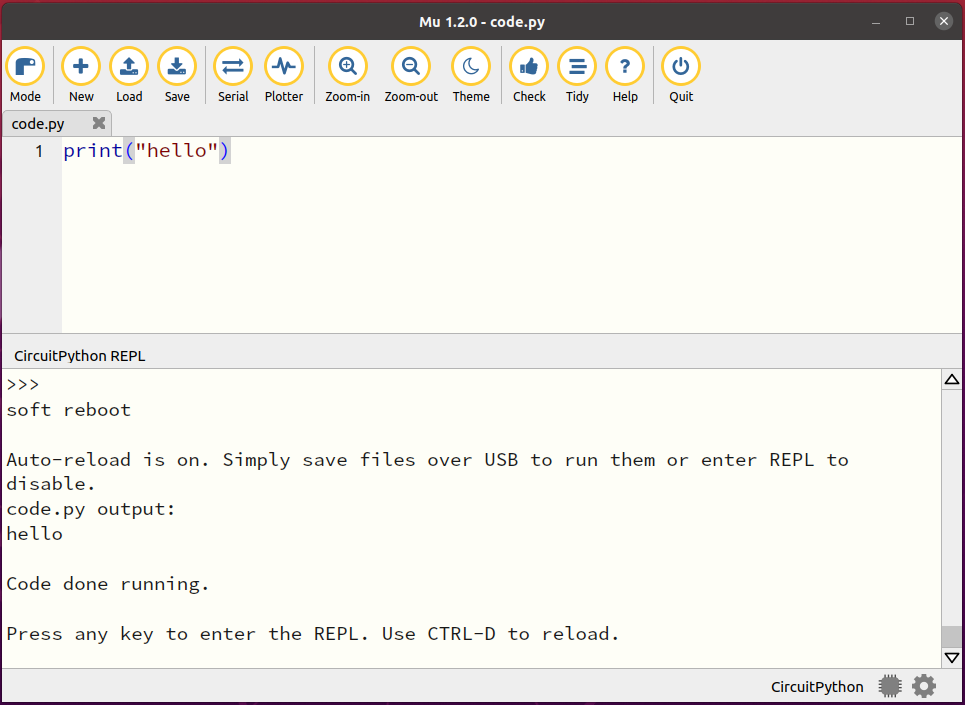


#### 5.1.4 Blinky lights

Now let's write a CircuitPython program that uses the pushbutton you wired to the RPi. In this example, when you press down the pushbutton, the internal LED on the RPi will turn on and `T` will be printed in the REPL terminal. When the button is not pressed down, the LED will be off and `F` will be printed.


Copy the program below into the file `code.py` or load the `microcontr/serialWriteCP.py` example program and save it as `code.py` on the RPi. Then, run it.

(See file src/microcontr/serialWriteCP.py.)

```python

import time
import board
import digitalio

print ("hello")
led=digitalio.DigitalInOut(board.LED)
led.direction=digitalio.Direction.OUTPUT
button=digitalio.DigitalInOut(board.GP16)
button.switch_to_input(pull=digitalio.Pull.DOWN)

while True:
    if (button.value):
        print("T")
        led.value=True
    else:
        print("F")
        led.value=False
    time.sleep(1)

```
Lines 6 and 7 tell the RPi that we will call the internal LED the name `led`, and it will be an output. Lines 8 and 9 tell the RPi that we will call GP16 (pin21) the name `button`, and it will be an input. The `pull=digitalio.Pull.DOWN` instruction connects this pin to an internal resistor so that when nothing is connected to it, the pin will be low.


When you run this example and hold down the pushbutton wired to the RPi, the program prints `T` and turns on the LED. Otherwise it prints `F` and turns off the LED.
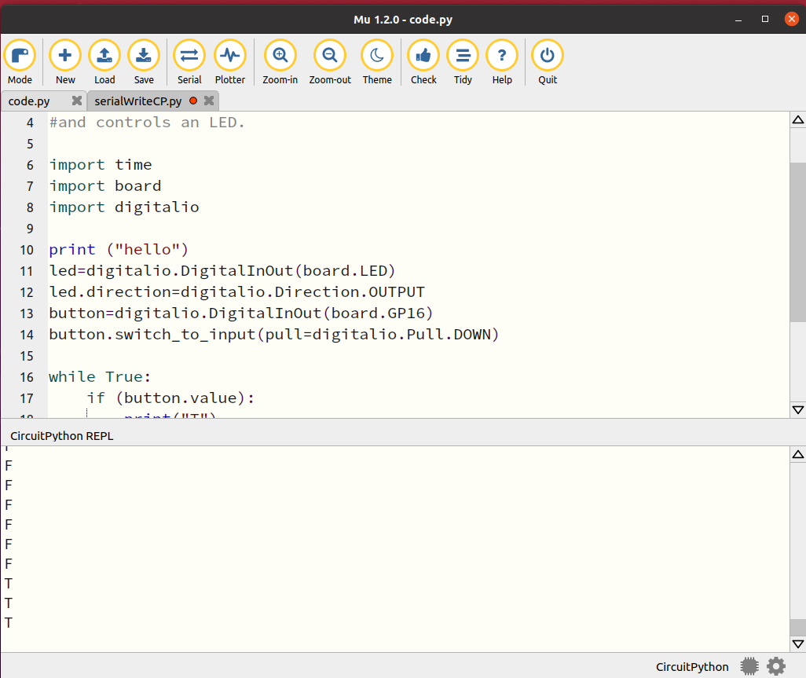

#### 5.1.5 Reading data from the computer

In section 6.0, we will send data from the computer to the microcontroller. To complete this example, we will need to write both Python code for the computer and CircuitPython code for the microcontroller. While we're programming the microcontroller, let's write this code.

When we plug the RPi into the computer and open the Mu IDE, a communication channel is set up between the computer and the RPi. The computer refers to this communication channel by a port name such as `COM1`. We see the communication between the computer and the RPi in the REPL terminal of the Mu IDE. 

If we want to send data from the computer to the RPi using something other than the REPL terminal of the IDE, we run into a problem because the REPL terminal controls all of the communication. We can avoid this problem by setting up a second communication channel. This channel is specifically for communication between the computer and the RPi without using the REPL terminal. The computer will refer to this communication channel with a different port name, such as `COM2`. The port names used may be different on your computer. Windows port names may be `COM3`, `COM4`, and so on, while Linux port names are likely `\dev\ttyACM0` or `\dev\ttyACM`.

To set up this second communication channel, we have to use the `usb_cdc` library in the code we write for the RPi. We also have to write two files and save them on the RPi.

In the Mu IDE, press the `New` button, and save a file named `boot.py` on the RPi. Save the following two lines in that file to let the RPi know that we will be setting up this second communication channel.
```python
import usb_cdc
usb_cdc.enable(data=True)
```

Unplug the RPi, and plug it back in so that the RPi finds this `boot.py` file.

Next, open the file `code.py` that is saved on the RPi and copy in the example below. This example is also found in the `microcontr/serialRead.cp` file of the DANDY library.
 

Run it. When you run it, nothing will happen until you send a character from the computer to the microcontroller. If the microcontroller receives a character, the internal LED will blink. We'll complete this example in section 6.
<br><br>
If you close the Mu IDE, the microcontroller continues to run this code. If you unplug the RPi and plug it back into your computer, the microcontroller continues to run this code.

(See file src/microcontr/serialReadCP.py.)

```python
import time
import board
import digitalio
import supervisor
import usb_cdc

print ("hello")
led=digitalio.DigitalInOut(board.LED)
led.direction=digitalio.Direction.OUTPUT
serial=usb_cdc.data

while True:
    if serial.in_waiting >0:
        ch=serial.read()
        print(ch)
        led.value=True
        time.sleep(0.25)
        led.value=False
        time.sleep(1)

```

For more information on communicating using the usb_cdc library, see the following references which were used in coming up with this example.
[](https://github.com/Neradoc/circuitpython-sample-scripts/blob/main/usb_serial/README.md)
[](https://docs.circuitpython.org/en/latest/shared-bindings/usb_cdc/index.html)


### 5.1 Option C: Micropython and the PSoC6
#### 5.1.1 Build the circuit

The PSoC6 has an internal button and LED, so we don't need to wire any external components. We'll use the button labeled `SW2 USER` in this section. 

#### 5.1.2 Install MicroPython

If you followed the instructions [here](https://www.hackster.io/Infineon_Team/micropython-on-psoc-fcf1d0) or [here](https://ifx-micropython.readthedocs.io/en/latest/psoc6/intro.html), you've already installed MicroPython firmware on the PSoC6 as well as installed the Arduino Lab IDE on your computer. 

Connect a USB cable between the USB port on the PSoC6 labeled `KITPROG3` and computer. Next, open the Arduino Lab IDE.

#### 5.1.3 Hello world

Now we're ready to write our first MicroPython program that will run on the PSoC. We'll use the Arduino Lab IDE, so open it now.
<br><br>
Write the following instruction in the editor, and press the `Run` button. You should see the result in the bottom terminal window.

The print statement is actually evaluated on the micrcocontroller. The resulting message is sent serially via the USB cable to the computer and displayed in the terminal of the Arduino Lab IDE. 

```python
print ("Hello")
```

#### 5.1.4 Blinky lights
Now let's write a MicroPython program that uses the internal pushbutton labeled `SW2 User` near the center of the board. In this example, when you press down the pushbutton, the internal LED will turn on and `T` will be printed. When the button is not pressed down, the LED will be off and `F` will be printed.

Copy the program below into the editor or load the `microcontr/serialWritePSoC.py` example program. Then, run it.

(See file src/mircrocontr/serialWritePSoC.py.)


```python
from machine import Pin
import time
print ("hello")

button = Pin("P0_4", Pin.IN, Pin.PULL_DOWN)
led=Pin("P13_7", Pin.OUT)
while True:
    if button.value():
        print("F")
        led.value(True)
    else:
        print("T")
        led.value(False)
    time.sleep(1)
```
The fourth line tells the PSoC6 that we will call the `SW2 User` pushbutton  (pin P0.4) the name `button`. This line also says `button` will be an input. The `Pin.PULL_DOWN` option connects this pin to an internal resistor so that when nothing is connected to it, the pin will be low.
<br><br>
The fifth line tells the PSoC6 that we will call pin 13.7, the internal LED, the name `led`. This line also says `led` will be an output.
<br><br>When you run this example and hold down the button, the program prints `T` and turns on the internal LED. Otherwise it prints `F` and turns off the LED.

Unlike the RPi, the PSoC6 is active low, so low values are considered 'True' and high values are considered 'False'. 

#### 5.1.5 Reading data from the computer

In section 6.0, we will send data from the computer to the microcontroller. To complete this example, we will need to write both Python code for the computer and MicroPython code for the microcontroller. While we're programming the microcontroller, let's write this code.
<br><br>
Create a new file and copy in the code below, or load the `microcontr/serialReadPSoC.py` example file.

Run it. When you run it, nothing will happen until you send a character from the computer to the microcontroller. If the microcontroller receives a character, the internal LED will blink. We'll complete this example in section 6.
<br><br>
If you close the Arduino Lab IDE, the microcontroller continues to run this code. If you unplug the PSoC6 and plug it back into your computer, the microcontroller continues to run this code.

(See file src/microcontr/serialReadPSoC.py.)

```python
from machine import Pin
import time
import sys
print ("hello")

led=Pin("P13_7", Pin.OUT)
led.value(False)
while True:
    #read as character
    ch = sys.stdin.read(1)
    print (ch)
    led.value(False)
    time.sleep(0.25)
    led.value(True)
    time.sleep(1)

```


### 5.1 Option D: Arduino
#### 5.1.1 Build the circuit
Connect a button between the 3.3V pin and D8. Using the USB cable, plug the Arduino into the computer. 

For the Arduino Uno, refer to the [pinout](https://docs.arduino.cc/hardware/uno-rev3) and the figure below. Other Arduino models will work too, but refer to their pinout for which pins to use.

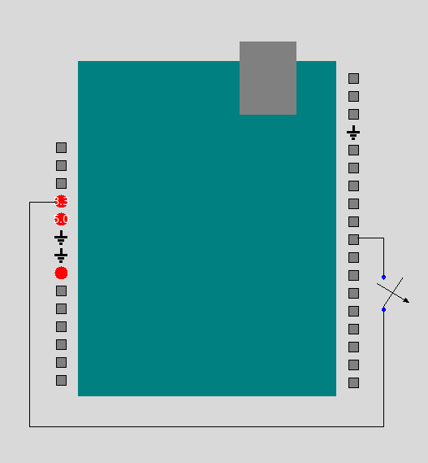

#### 5.1.2 Install Arduino firmware
Arduino hardware comes pre-installed with the instructions needed to run Arduino software. So, we don't need to do anything here.

#### 5.1.3 Hello world

Now we're ready to write our first Arduino program that will run on the Arduino hardware. We'll use the Arduino's IDE, so open it now.
<br><br>
Write the following instruction in the editor, and press the `Upload` button. 


```c++

void setup()
  {
  Serial.begin(115200);
  Serial.println("hi");
  }

void loop()
{
  Serial.println("hello");
}
```

To see the printed characters, open `Serial Monitor` under the `Tools` menu. All of this code is evaluated in on the microcontoller, not the computer. Even print statements are evaluated on the microcontroller. The resulting message is sent via the USB cable to the computer and displayed in the Serial Monitor.  

The Serial Monitor sometimes takes over the resources of the USB serial communication channel with the microcontroller, so you may have to close the Serial Monitor before you upload new code to the Arduino or send other signals from the computer to the Arduino.

To correctly see data on the Serial Monitor, it must be set at the correct baud rate. Click on the baud rate in the lower right corner of the Serial Monitor and select 115200.


#### 5.1.4 Blinky lights

Now let's write an Arduino program that uses the pushbutton you wired to the Arduino hardware. In this example, when you press down the pushbutton, the internal LED will turn on and `T` will be printed. When the button is not pressed down, the LED will be off and `F` will be printed.

Copy the program below into the editor or load the `microcontr/serialWriteArd.ino` example program. Then, upload it.


(See file src/mircrocontr/serialWriteArd.ino.)

```c++

int button=8;
int led=13;
int buttonState=0;
void setup() {  
  Serial.begin(115200);
  Serial.println("hi");  
  pinMode(button, INPUT);
  pinMode(led, OUTPUT);
}

void loop() {
  buttonState=digitalRead(button);
  if (buttonState == HIGH) {
       digitalWrite(led, HIGH);
       Serial.println("T");
     } 
   else {
     digitalWrite(led, LOW);
     Serial.println("F");
   }
   delay(1000);  
}
```
Line 5 tells the Arduino that we will call pin 8 the name `button`. Line 6 tells the Arduino that we will call the internal LED, connected to pin 13, `led`. Line 11 tells the Arduino that `button` is an input, line 12 tells the Arduino that `led` is an output.

<br><br>
When you run this example and hold down the pushbutton wired to the RPi, the program prints `T` and turns on the LED. Otherwise it prints `F` and turns off the LED.


#### 5.1.5 Reading data from the computer
In section 6.0, we will send data from the computer to the microcontroller. To complete this example, we will need to write both Python code for the computer and Arduino code for the Arduino hardware. While we're programming the microcontroller, let's write this code.
<br><br>
Create a new file in the Arduino editor and copy in the code below. Alternatively, load the `microcontr/serailReadArd.ino` example file.

Upload it. When you run it, nothing will happen until you send a character from the computer to the microcontroller. If the microcontroller receives a character, the internal LED will blink. We'll complete this example in section 6.
<br><br>
If you close the Arduino IDE, the microcontroller continues to run this code. If you unplug the Arduino and plug it back into your computer, the microcontroller continues to run this code.

(See file src/microcontr/serialReadArd.ino.)

```c++
int led=13;
char ch;

void setup() {  
  Serial.begin(115200);
  Serial.println("hi");  
  pinMode(led, OUTPUT);
}

void loop() {
  ch=Serial.read();
  if(ch=='Z')
   {Serial.println(ch);
    digitalWrite(led, HIGH);
    delay(250);
    digitalWrite(led,LOW);
   }
  
   delay(1000);  
}
```


## 6.0 Sending characters TO the MICROCONTROLLER from the computer

Files used in 6.0:
- examples/DigitalOut.py
- examples/DigitalOutDisplay.py

Now let's get the computer to talk to the microcontroller. More specifically, in this section, we'll send a character from the computer to the microcontroller. When the microcontroller receives a character, the internal light will blink on and off.
<br><br>
In section 5.1.4, you wrote the necessary code for the microcontroller and ran it. Make sure your microcontroller is still plugged in and running that code. We won't use the pushbutton connected to the microcontroller in this example, so it doesn't matter if it is connected or not. 
<br><br>
Close the Mu, Arduino, or Arduino Lab IDE that you used to program the microcontroller.
<br><br> 
In this section we write Python code for the computer. When we wrote code for the microcontroller, there were different options for the different hardware choices: MicroPython and the RPi, CircuitPython and the RPi, MicroPython and the PSoC6, and Arduino. Examples in this section will apply for any computer with a Python interpreter, whether that computer runs Windows or Linux.

### 6.1 Sending characters to the microcontroller, without a GUI
Let's write the Python code that will run on the computer for this example. Open the IDLE IDE, and copy the code below, and run it. Every second, this program sends the character `Z` from the computer, down the USB cable, to the microcontroller. 
<br><br>
This code needs to know the port of your microcontroller. On a Windows machine, the port is something like `COM1`, but it may be `COM2`, `COM3`, and so on. Look in the Device Manager of the Windows Control Panel to find the appropriate port. On a Linux machine, the port is likely `/dev/ttyACM0` or `/dev/ttyACM1`. Alter the code below so that the correct port is used. 
<br><br>
If you are used CircuitPython to write the microcontroller code (Option B), make sure to use the port for the communication channel that doesn't involve the REPL terminal.

We'll be communicating over a serial channel, using the USB cable. For this type of communication, the sender and receiver must agree on the baud rate, bytesize, and number of stopbits. If you are using the PSoC6 (Option C), replace `STOPBITS_TWO` with `STOPBITS_ONE` near line 17. 
<br><br>

(See file src/examples/DigitalOut.py.)

```python
import serial
import serial.tools.list_ports as port_list
import time

#Set up PORT.
#If you are on Windows, uncomment the next line and adjust as needed.
PORT='COM1'
#If you are on Linux, uncomment the next line and adjust as needed.
#PORT='/dev/ttyACM0'

class DigitalOut():
    baudrate=115200
    serialPort=serial.Serial(port=PORT, baudrate=baudrate, bytesize=8, \
                         timeout=0.1, stopbits=serial.STOPBITS_TWO)
    while True:
        serialPort.write(bytes('80', 'utf-8'))
        print('I wrote Z')
        time.sleep(1) 
    serialPort.close()


if __name__=="__main__":
    example=DigitalOut()
```
When you run the example above, the computer sends a character to the microcontroller every second. The microcontroller is still running code that blinks the LED when it receives a character, so you should see the microcontroller's internal LED blink every second. To verify that it works, replace `time.sleep(1)` with `time.sleep(3)`. Now the computer will send a character every three seconds, and the microcontroller's LED will blink at this slower rate.
<br><br>

You may be able to automatically assign the serial port with the following lines. However, these lines aren't too reliable, so it is better to set `PORT` manually.

```python
ports=list(port_list.comports())
port=(ports[0].device)
print(ports[0].device)
```
Keep in mind that whenever you send serially using the USB cable in this way, you are sending characters. You can send characters like `4` or `3`, but even though these look like integers, they are actually characters. If you are writing software for the receiver, you can include an instruction that, for example, casts the character `4` into an integer if you want to treat it as a number.

### 6.2 Sending characters to the microcontroller, with a GUI

Let's rewrite the Python code in the example above to include a GUI. Try out the example below. 

Make sure to set `PORT` for your machine.

When you run it, you will see a window with a quit button and a second button. When you press that button, the computer sends a character to the microcontroller. Your microcontroller should still be running the same code, so when the microcontroller receives a character, its internal LED will blink.

(See file src/examples/DigitalOutDisplay.py.)

```python
import asyncio
import tkinter as tk
import time
import serial
import serial.tools.list_ports as port_list
import sys

#If you are on Windows, uncomment the next line and adjust as needed.
PORT='COM1'
#If you are on Linux, uncomment the next line and adjust as needed.
#PORT='/dev/ttyACM0'

class DigitalOutDisplay(tk.Tk):
    def __init__(self):
        super().__init__()
        self.button1= tk.Button(self, text="toggle", \
                               command= self.toggle_me)
        self.button_quit=tk.Button(self, text="Quit", command=self.destroy)
        self.button1.pack()
        self.button_quit.pack()

        baudrate=115200
        self.serial_port=serial.Serial(port=PORT, baudrate=baudrate, \
                        bytesize=8, timeout=0.1, stopbits=serial.STOPBITS_TWO)

        tk.mainloop()


    def toggle_me(self):
        out_string='X'
        print('X')
        self.serial_port.write(bytes(out_string,'utf-8'))


if __name__=="__main__":
    mygui=DigitalOutDisplay()
```


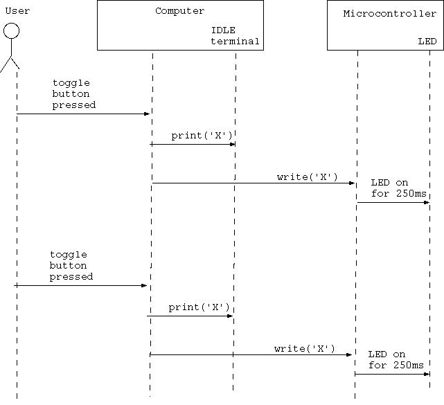

The strategies in section 6 really only work if you are sending single characters and the characters are available whenever the microcontroller tries to read them. If you want to send longer messages to the microcontroller or want to ensure that the microcontroller doesn't block waiting to get information, you need more complicated instructions. See section 10 for more information.

## 7.0 Displaying CHARACTERS sent FROM the MICROCONTROLLER to the computer

Files used in section 7:
- microcontr/serialWriteMP.py
- microcontr/serialWriteCP.py
- microcontr/serialWriteArd.ino
- examples/DigitalIn.py
- examples/DigitalHWShort.py
- examples/DigitalHWLong.py
- widgets/LEDDisplay.py
- utilities/SerialAndGui.py

<br><br>
In this section, we will send data from the microcontroller to the computer. 

More specifically, you should have a pushbutton wired to a microcontroller, and your microcontroller should be connected to the computer by a USB cable. If you aren't pressing the pushbutton, the microcontroller sends the character `F` to the computer. If you are pressing the pushbutton, it sends `T`. We'll go through this example multiple ways. 

Think of the pushbutton like a digital input sensor that can either be in one of two possible states. You could instead replace it with a [tilt switch](https://www.digikey.com/en/products/detail/c-k/RB-220-07A-R/2747176), [limit switch](https://www.digikey.com/en/products/detail/e-switch/SS0750302F035P1A/16018860), or other such type of digital input sensor instead. 

### 7.1 Set up the microcontroller and run the example

You should still have the pushbutton wired to the microcontroller. We'll need it for this example. Now, let's program the microcontroller. Open the Mu or Arduino IDE. Re-open the blinky lights example from section 5.1.3. (See file microcontr/serialWriteMP.py, microcontr/serialWriteCP.py, microcontr/serialWritePSoC.py, or src/microcontr/serialWriteArd.py.)
 We'll use this program once again in this section. Run it, and then close the IDE for your microcontroller. Leave the microcontroller connected to your computer with the USB cable. 
<br><br>

### 7.2 Receiving characters from the microcontroller, no GUI

In the previous section, we wrote code for the microcontroller using the Mu or Arduino IDE. In this section, we will be writing code for the computer using IDLE IDE. 
<br><br> 
Copy the code below or open the example that came with the DANDY library. Make sure to set your port appropriately. 
<br><br>
Run the code. When you are not pressing the pushbutton wired to the microcontroller, it will print `F`. When you are pressing the pushbutton, it will print `T`. 

(See file src/examples/DigitalIn.py.)

```python
#This example reads characters in from the microcontroller to the computer
#and prints the result. Be sure to set the correct port for your machine.

import serial
import serial.tools.list_ports as port_list


#Set up PORT.
#If you are on Windows, uncomment the next line and adjust as needed.
PORT='COM1'
#If you are on Linux, uncomment the next line and adjust as needed.
#PORT='/dev/ttyACM0'

class DigitalIn(): 
    baudrate=115200
    serialPort=serial.Serial(port=PORT, baudrate=baudrate, \
            bytesize=8, timeout=0.1, stopbits=serial.STOPBITS_TWO)
    while True:
        serialString=serialPort.read()
        print(serialString)
    serialPort.close()


if __name__=="__main__":
    example=DigitalIn()

```


### 7.3 Receiving data from the microcontroller, now with widgets and asyncIO
#### 7.3.1 What is asyncio and why do we need it here.
We are using the graphics library Tkinter. Typically, tkinter runs in a loop to continually refresh the graphical user interface. In the previous example, we used a loop to continually read serial data.
The problem is that we want both loops to run continuously and simultaneously. One possible solution would be to put each of these tasks in a different thread. 
We are not quite doing this, but we are doing something quite similar. 
<br><br>
We will be using the asyncIO Python library. This library isn't quite multithreading, but it accomplishes the same task. 
Also, instead of telling Tkinter to loop continually, we will tell it to manually update inside a loop. 
The asyncIO library is new to Python, so make sure you are at least using Python version 3.7.
<br><br> 
More info on asyncIO can be found at [async-io-python](https://realpython.com/async-io-python).
Information on using asyncIO with Tkinter came from [asyncio-and-tkinter](https://stackoverflow.com/questions/47895765/use-asyncio-and-tkinter-or-another-gui-lib-together-without-freezing-the-gui) 

#### 7.3.2 Tkinter and widgets, the short way (recommended)

Make sure the microcontroller is plugged in and still running the previous example.
<br><br>
Run the example below. When you run it, you will see a window with an `LEDDisplay` widget and a quit button. When the pushbutton connected to your microcontroller is held down, the `LEDDisplay` widget will be yellow. Otherwise it will be blue.
<br><br>
Even though this example is short, it has a lot going on. The `DigitalHWShort` class defined in this example is a child of class `SerialAndGui` which is a child of `Tk`. The class `SerialAndGui` comes with the DANDY library, and it is detailed in `src/utilities/SerialAndGui.py`. 
The class `SerialAndGui` is an abstract class. If you run it by itself, you see an empty window which is not useful. Instead, as shown below, you should define a child class and overload the constructor and the `use_serial_data` function.
<br><br>
The `SerialAndGui` class involves three asynchronous tasks: `check_serial_data`, `use_serial_data`, and `updater`. Each is defined in its own function. The `check_serial_data` task reads serially from the USB cable and writes the result to a queue. The `use_serial_data` task reads from the queue and does something with the data it finds. The `updater` task updates the GUI. All of these happen inside loops which appear to happen simultaneously. 
<br><br>
You don't have to write all the code for these tasks every time you want to use them. Instead, you can just define a child class of `SerialAndGui` as shown below.   

(See file src/examples/DigitalHWShort.py.)

```python

import asyncio
import tkinter as tk
import time
import serial
import serial.tools.list_ports as port_list
import sys
sys.path.append('../widgets')
sys.path.append('../utilities')
import LEDDisplay as ld
import SerialAndGui as sg

#Set up PORT.
#If you are on Windows, uncomment the next line and adjust as needed.
PORT='COM1'
#If you are on Linux, uncomment the next line and adjust as needed.
#PORT='/dev/ttyACM0'

class DigitalHWShort(sg.SerialAndGui):
    #Here's the constructor.
    def __init__(self, loop, interval=1/20, port=PORT):
        super().__init__(loop, port=PORT, data_format="char")
        #The line above says run the parent's constructor.
        #The parent's constructor starts the three async tasks:
        #check_serial_data, use_serial_data, and updater.
        #Below, we set up the widgets for a simple GUI
        #and pack them in the window.
        self.led1=ld.LEDDisplay(self)
        self.button_quit=tk.Button(self, text="Quit", \
                                   command=self.close)
        self.led1.pack()
        self.button_quit.pack()

  
    #This async function reads from the queue and uses the data it finds.
    #We're overloading the parent's version of this function.
    async def use_serial_data(self, interval, qIn: asyncio.Queue):
        while True:
            await asyncio.sleep(interval)
            in_string=await qIn.get()
    
            if in_string=="T":
                print("T")
                self.led1.change_LED_color("yellow")
            if in_string=="F":
                print("F")
                self.led1.change_LED_color("blue")


if __name__=="__main__":
    loop=asyncio.get_event_loop()
    example=DigitalHWShort(loop)
    loop.run_forever()
    loop.close()
```
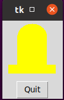
<br><br>

#### 7.3.3 Tkinter and Widgets, the long way
The previous example relied on the `SerialAndGui` class. A lot of the details were swept up into that class. What actually  happened? What if you want to write all the instructions yourself without relying on any parent classes? 
<br><br>
This example accomplishes the same task as the previous example. Before you run it, make sure your microcontroller is still plugged in and running its code. As in the last section, when you run this example, you will see a window with an `LEDDisplay` widget. When the pushbutton connected to the microcontroller is pressed, the `LEDDisplay` is yellow, and otherwise it is blue. 
<br><br>
In this example, you can see the details of how to use asyncIO to both read serially from the USB cable and update the Tkinter GUI. As explained above, it involves three asynchronous tasks, which are detailed in the functions `check_serial_data`, `use_serial_data`, and `updater`. The `DigitalWithHW` class defined below is a child only of `Tk`, so the details of using asyncIO are not hidden in a parent class. You don't need to understand every line of this example, and I recommend using the short example above instead. 

(See file src/examples/DigitalHWLong.py.)

```python


import asyncio
import tkinter as tk
import time
import serial
import serial.tools.list_ports as port_list
import sys
sys.path.append('../widgets')
import LEDDisplay as ld

#Set up PORT.
#If you are on Windows, uncomment the next line and adjust as needed.
PORT='COM1'
#If you are on Linux, uncomment the next line and adjust as needed.
#PORT='/dev/ttyACM0'

class DigitalHWLong(tk.Tk):
    #Here's the constructor for the DigitalWithHW class.
    #DigitalWithHW is a child of class tk.Tk, which opens a window.
    def __init__(self, loop, interval=1/20):
        super().__init__()
        self.loop=loop
        self.protocol("WM_DELETE_WINDOW", self.close)

        #We have three async tasks: check_serial_data, use_serial_data
        #and updater. Each are detailed in their own function.
        self.q=asyncio.Queue()
        self.tasks=[]
        self.tasks.append(loop.create_task \
                          (self.check_serial_data(interval, self.q)))
        self.tasks.append(loop.create_task \
                          (self.use_serial_data(interval, self.q)))
        self.tasks.append(loop.create_task(self.updater(interval)))

        #Set up the widgets for a simple GUI and pack them in the window.
        self.led1=ld.LEDDisplay(self)
        self.button_quit=tk.Button(self, text="Quit", \
                                   command=self.close)
        self.led1.pack()
        self.button_quit.pack()

        #Notice that we don't start Tkinter's main loop here. Instead
        #the function updater will update the GUI.

        
    async def check_serial_data(self, interval, qIn: asyncio.Queue):
        #This async function reads data from the serial port and puts the
        #data in the queue.

        #Set up to read from the serial port.
        baudrate=115200
        serial_port=serial.Serial(port=PORT, baudrate=baudrate, \
                        bytesize=8, timeout=0.1, stopbits=serial.STOPBITS_TWO)
        
        #Read a byte at a time from the serial port.
        #Convert the byte to a string, and put the string in the queue.
        while True:
            await asyncio.sleep(interval)
            serial_byte=serial_port.read()
            serial_string=serial_byte.decode()
            if serial_string != "":
                await qIn.put(serial_string)
                #Uncomment the next line to see what the serial port is getting.
                #print(serial_byte)
        serial_port.close()
        

    async def use_serial_data(self, interval, qIn: asyncio.Queue):
        #This async function reads from the queue and uses the data it finds.
        while True:
            await asyncio.sleep(interval)
            in_string=await qIn.get()
            if in_string=="T":
                print("T")
                self.led1.change_LED_color("yellow")
            if in_string=="F":
                print("F")
                self.led1.change_LED_color("blue")
        

    async def updater(self, interval):
        #This async function manually updates the Tkinter GUI.
        while True:
            self.update()
            await asyncio.sleep(interval)


    def close(self):
        for task in self.tasks:
            task.cancel()
        self.loop.stop()
        self.destroy()


if __name__=="__main__":
    loop=asyncio.get_event_loop()
    example=DigitalHWLong(loop)
    loop.run_forever()
    loop.close()

```


## 8.0 Displaying NUMERICAL DATA sent FROM the MICROCONTROLLER to the computer

Files used in section 8:
- widgets/AnalogInDisplay.py
- widgets/DialDisplay.py
- widgets/SimplePlotDisplay.py
- widgets/SlideDisplay.py
- widgets/TricolorDisplay.py
- widgets/VectorDisplay.py
- examples/AnalogHWShort.py
- examples/singleAInDemo.py
- examples/tripleAInDemo.py
- utilities/SerialAndGui.py
- microcontr/analogToComputerMP.py
- microcontr/analogToComputerCP.py
- microcontr/analogToComputerArd.ino

In this section, we'll detail how to send numerical data from a microcontroller to a computer and display the result in a GUI. In this section, the data will come from a potentiometer wired in to the microcontroller. However, you can directly replace that potentiometer with an analog sensor such as a  [thermistor](https://www.digikey.com/en/products/detail/vishay-beyschlag-draloric-bc-components/NTCLE100E3333JB0/769418) or [force sensor](https://www.digikey.com/en/products/detail/ohmite/FSR07BE/10127625).


### 8.1 DANDY widgets for displaying numerical data, no hardware

The DANDY library contains multiple widgets designed to display numerical data. In this section, we don't use any hardware. Instead, we just try out these widgets. 

#### 8.1.1 Displaying a scalar numerical value

Try out the example below. When you run it, you see a number of widgets. The `Label`, `Button`, and `Scale` widgets are built into Tkinter. The `SlideDisplay`, `DialDisplay`, `TricolorDisplay`, and `SimplePlotDisplay` widgets are from the DANDY library. 
<br><br>
Adjust the `Scale` then press the `Get value` button. You will see the DANDY widgets change appropriately. The `TricolorDisplay` widget is one color below some cutoff value, a second color above another cutoff value, and a third color between those values. 
<br><br>
This example uses Tkinter as well as multiple widgets that come with the DANDY library. It does not use asyncIO because it only needs one loop, for the GUI. 

(See file src/examples/SingleAInDemo.py)

```python

import tkinter as tk
import sys 
sys.path.append('../widgets') 
import DialDisplay as dd 
import SlideDisplay as sd 
import TricolorDisplay as td
import SimplePlotDisplay as spd 

 
class SingleAInDemo:
    def __init__(self):
        self.main_window=tk.Tk()
        self.button_quit=tk.Button(self.main_window, text="Quit", \
                            command=self.main_window.destroy)
        self.button2=tk.Button(self.main_window, text="Get value", \
                            command=self.get_value)
        self.label1=tk.Label(self.main_window, text="Hello")
        self.scale1=tk.Scale(self.main_window, from_=0, to=10, \
                            orient=tk.HORIZONTAL, length=200, resolution=0.1)   
        self.dial1=dd.DialDisplay(self.main_window, \
                            height=100, width=100)
        self.slide1=sd.SlideDisplay(self.main_window, width=100, \
                            height=100)
        self.tric1=td.TricolorDisplay(self.main_window, width=100, \
                            height=100)
        self.plot1=spd.SimplePlotDisplay(self.main_window)
        self.label1.pack()
        self.scale1.pack()
        self.slide1.pack()
        self.dial1.pack()
        self.tric1.pack()
        self.plot1.pack()
        self.button2.pack()
        self.button_quit.pack()
        
        #Main loop
        tk.mainloop()


    def get_value(self):
        slide_message="Value ="+str(self.scale1.get())
        self.label1.config(text=slide_message)
        self.dial1.set_to_value(self.scale1.get())
        self.slide1.set_to_value(self.scale1.get())
        self.tric1.set_to_value(self.scale1.get())
        self.plot1.add_point(self.scale1.get())


if __name__=="__main__":
    mygui=SingleAInDemo()

```

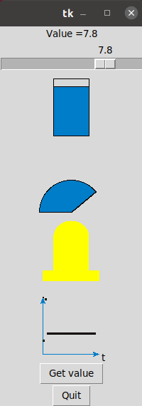

#### 8.1.2 Displaying vector numerical data

Some data, such as velocity, acceleration, and magnetic field at a point, is inherently three dimensional. The DANDY library contains the `VectorDisplay` widget for displaying vector data. Try out the example below.

(See src/examples/tripleAInDemo.py.)

```python

import tkinter as tk
import sys
sys.path.append('../widgets')
import VectorDisplay as vd 

class TripleAInDemo:
    def __init__(self):
        self.main_window=tk.Tk()
        self.button_quit=tk.Button(self.main_window, text="Quit", \
                            command=self.main_window.destroy)
        self.button2=tk.Button(self.main_window, text="Get Value", \
                            command=self.getValue)
        self.label1=tk.Label(self.main_window, text="Hi")
        self. scaleX=tk.Scale(self.main_window, from_=0, to=50, \
                            orient=tk.HORIZONTAL, length=200, resolution=0.1)
        self.scaleY=tk.Scale(self.main_window, from_=0, to=50, \
                            orient=tk.HORIZONTAL, length=200, resolution=0.1)
        self.scaleZ=tk.Scale(self.main_window, from_=0, to=50, \
                            orient=tk.HORIZONTAL, length=200, resolution=0.1)
        self.vector1=vd.VectorDisplay(self.main_window, \
                            height=100, width=200)

        self.label1.pack()
        self.scaleX.pack()
        self.scaleY.pack()
        self.scaleZ.pack()
        self.vector1.pack()
        self.button2.pack()
        self.button_quit.pack()

        #Main loop
        tk.mainloop()


    def getValue(self):
        value_message="X Value="+str(self.scaleX.get())
        self.label1.config(text=value_message)
        self.vector1.set_to_value(self.scaleX.get(), self.scaleY.get(), \
                            self.scaleZ.get())

if __name__=="__main__":
    triple_demo=TripleAInDemo()
```

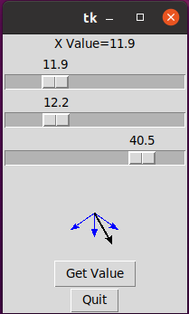
### 8.2 Displaying numerical data, the microcontroller side
In the previous example, we tried out some widgets that come with the DANDY library. In the previous examples, input values came from a `Scale` widget. 

The inputs in this section will come from a potentiometer wired to the microcontroller. Let's set up the hardware and microcontroller code for this example.

Follow the option for the hardware of your choice. 

#### 8.2.1 Option A: Micropython and RPi
##### 8.2.1.1 Build the circuit

Connect a resistor and a potentiometer in series between pin 36 (3.3V power) and pin 38 (GND). Also, add a wire from the node between the resistor and potentiometer to pin 31. Pin 31 is also known as GP26, and it is connected to the internal analog to digital converter ADC0.

If your potentiometer has three pins, make sure to use the middle pin and one of the outer ones.


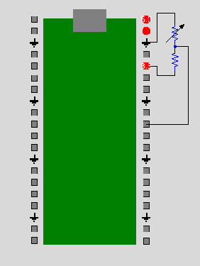

##### 8.2.2.2 Write the microcontroller code

Let's write the code for the microcontroller, so open the Mu IDE.

The microcontroller code below reads an analog value from pin 31, also known as GP26 and ADC0. This value is then written serially to the computer.  

We could just print out the value itself. Instead, here we're a bit smarter. We're printing a message in JSON format that contains the value we read in addition to other pieces of information. 

JSON is a format for writing variable names along with their values. For more information, see [wikipedia](https://en.wikipedia.org/wiki/JSON). 

All elements of the JSON are strings, not integers. While `value` may look like an integer, it really is a string. When we send information serially down the USB cable, we can only send characters, not integers.


Copy the code below into the editor of the Mu IDE or open the example. Run it. As you adjust the potentiometer, values displayed in the REPL terminal of the MU IDE should change.


(See file src/microcontr/analogToComputerMP.py.)

```python
from machine import Pin
from machine import ADC
import time
print ("hello")

adc=ADC(Pin(26 ))

value=0
while True:
    value=adc.read_u16()
    outstring='{\"boardName\":\"RPP1\", \"pinName\":\"ADC0\", \"value\":\"'+str(value)+'\"}'
    print(outstring)
    time.sleep(1)

```

#### 8.2.1 Option B: Circuitpython and the RPiPico

##### 8.2.1.1 Build the circuit

Connect a resistor and a potentiometer in series between pin 36 (3.3V power) and pin 38 (GND). Also, add a wire from the node between the resistor and potentiometer to pin 31. Pin 31 is also known as GP26, and it is connected to the internal analog to digital converter ADC0.

If your potentiometer has three pins, make sure to use the middle pin and one of the outer ones.
 


##### 8.2.2.2 Write the microcontroller code
Let's write the code for the microcontroller, so open the Mu IDE.

The microcontroller code below reads an analog value from pin 31, also known as GP26 and ADC0. This value is then written serially to the computer.

We could just print out the value itself. Instead, here we're a bit smarter. We're printing a message in JSON format that contains the value we read in addition to other pieces of information.

A JSON is just a format for variables names and their values. For more information, see [wikipedia](https://en.wikipedia.org/wiki/JSON).

Open the Mu IDE. Copy and run this code. As you adjust the potentiometer, values displayed in the bottom window of the MU IDE should change.


(See file src/microcontr/analogToComputerCP.py.)

```python
import time
import board
import analogio
 
print ("hello")

adc=analogio.AnalogIn(board.GP26)

value=0
while True:
    value=adc.value
    outstring='{\"boardNumber\":\"1\", \"boardType\":\"RPi\", \"value\":\"'+str(value)+'\"}'
    print(outstring)
    time.sleep(1)
```


#### 8.2.1 Option C: MicroPython and the PSoC

##### 8.2.1.1 Build the circuit
Connect a resistor and a potentiometer in series between VTarg and ground. Also, add a wire from the node between the resistor and potentiometer to pin 10.0. Pin 10.0 is connected to the internal analog to digital converter ADC0.

If your potentiometer has three pins, make sure to use the middle pin and one of the outer ones.


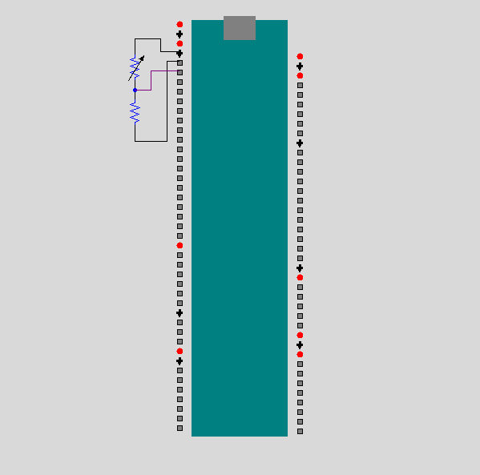

##### 8.2.2. Write the microcontroller code

Let's write the code for the microcontroller, so open the Arduino Lab IDE.

The microcontroller code below reads an analog value pin 10.0, also known as ADC channel 0. This value is then written serially to the computer.

We could just print out the value itself. Instead, here we're a bit smarter. We're printing a message in JSON format that contains the value we read in addition to other pieces of information.

A JSON is just a format for variables names and their values. For more information, see [wikipedia](https://en.wikipedia.org/wiki/JSON).

Open the Arduino Lab IDE. Copy and run this code. As you adjust the potentiometer, values displayed in the terminal at the bottom of the Arduino Lab IDE should change.


(See file src/microcontr/analogToComputerPSoC.py.)

```python
from machine import Pin
from machine import ADC
import time
print ("hello")

adc=ADC(Pin("P10_0"))

value=0
while True:
    value=adc.read_u16()
    outstring='{\"boardNumber\":\"1\", \"boardType\":\"RPi\", \"value\":\"'+str(value)+'\"}'
    print(outstring)
    time.sleep(1)
```


#### 8.2.1 Option D: Arduino

##### 8.2.1.1 Build the circuit
Connect a resistor and a potentiometer in series between 3.3V power and GND. Also add a wire from the node between the resistor and the potentiometer to ADC0. The figure below shows the wiring for the Arduino Uno.

If your potentiometer has three pins, make sure to use the middle pin and one of the outer ones.


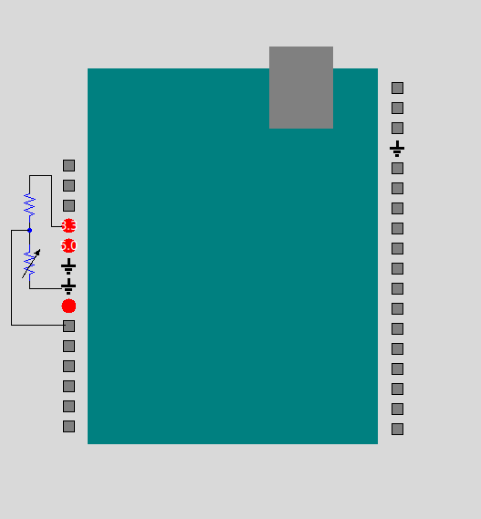

##### 8.2.2.2 Write the microcontroller code

Let's write the code for the microcontroller, so open the Arduino IDE.

The microcontroller code below reads an analog value from the pin ADC0. This value is then written serially to the computer.

We could just print out the value itself. Instead, here we're a bit smarter. We're printing a message in JSON format that contains the value we read in addition to other pieces of information.

A JSON is just a format for variables names and their values. For more information, see [wikipedia](https://en.wikipedia.org/wiki/JSON).

Open the Arduino IDE. Copy and run this code. As you adjust the potentiometer, values displayed in the Serial Monitor should change.


(See file src/microcontr/analogToComputerArd.py.)

```c++
const int analogPin=A0;
int aValue=0;
String out_msg="";

void setup() {  
  Serial.begin(115200);
 // Serial.println("hi");
}

void loop() {
  aValue=analogRead(analogPin); //values will be 0 to 1023
  out_msg="{\"boardNumber\" : \"2\" , \"boardType\" : \"Arduino\" , \"value\" : \"";
  out_msg=out_msg+aValue;
  out_msg=out_msg+"\"}";
  Serial.println(out_msg);
  delay(1000);
}
```


### 8.3 Displaying numerical data, the computer side

Back to writing code for the computer in Python using the IDLE IDE. 
This example reads the data from the microcontroller. It also picks off the part of the json that we're interested in. This example does not use a GUI. We'll add a GUI in the next section.  

Make sure your microcontroller is still plugged in and running the example from the last section.
Also make sure you've closed your Mu or Arduino IDE. Additionally, set port for your computer.

(See file src/examples/ReadInJson.py)

```python
import serial
import serial.tools.list_ports as port_list
import json

#Set up PORT.
#If you are on Windows, uncomment the next line and adjust as needed.
PORT='COM1'
#If you are on Linux, uncomment the next line and adjust as needed.
#PORT='/dev/ttyACM0'


class ReadInJson():
    baudrate=115200
    serialPort=serial.Serial(port=PORT, baudrate=baudrate, \
            bytesize=8, timeout=0.1, stopbits=serial.STOPBITS_TWO)

    while True:
        #Read until you see the two end characters '\r\n'
        serial_string=serialPort.read_until('\r\n')
        #Convert the bytes read into an actual string.
        serial_string=serial_string.decode('utf-8')
        if serial_string!="":
            #Slice off the two end characters
            serial_string=serial_string[:-2]
            #Parse the json and save the result in serial_json
            serial_json=json.loads(serial_string)
            #Pick off the element named "value" of the json
            val=serial_json["value"]
            print(serial_string)
            print(val)

    serialPort.close()

if __name__=="__main__":
    example=ReadInJson()
```
### 8.4 Displaying numerical data, the computer side, now with widgets and asyncIO

Now let's put all the pieces together. The microcontroller reads analog data from the potentiometer and sends that data, in JSON format, to the computer. The code below runs on the computer. It reads that data and displays it using widgets from Tkinter and the DANDY library. The class `AnalogHWShort` defined below is a child of the class `SerialAndGui`. The asyncIO library is needed because we want to both update the GUI and read the serial data in loops, and these loops should appear to the user to happen at the same time. The details of using asyncIO are hidden in the parent's class `SerialAndGui`. 

You should still have the potentiometer wired to the microcontroller. The microcontroller should still be connected to your computer with the USB cable, and it should still be running the same example used in section 8.2.

Make sure to set `PORT` near line 21 for your machine.

Try out the example below. While this example is short, it is not simple. It has a lot going on.  

(See file src/examples/AnalogHWShort.py.)

```python

import asyncio
import tkinter as tk
import time
import json
import serial
import serial.tools.list_ports as port_list
import sys
sys.path.append('../widgets')
sys.path.append('../utilities')
import SerialAndGui as sg
import DialDisplay as dd 
import SlideDisplay as sd 
import TricolorDisplay as td
import SimplePlotDisplay as spd 

#Set up PORT.
#If you are on Windows, uncomment the next line and adjust as needed.
PORT='COM1'
#If you are on Linux, uncomment the next line and adjust as needed.
#PORT='/dev/ttyACM0'


class AnalogHWShort(sg.SerialAndGui):
    #Here's the constructor.
    def __init__(self, loop, interval=1/20, port=PORT):
        super().__init__(loop, port=PORT)
        #The line above says run the parent's constructor.
        #The parent's constructor starts the three async tasks:
        #check_serial_data, use_serial_data, and updater.
        #Below, we set up the widgets for a simple GUI
        #and pack them in the window.
        
        self.button_quit=tk.Button(self, text="Quit", \
                                   command=self.close)
        self.label1=tk.Label(self, text="Hello")
        self.slide1=sd.SlideDisplay(self)
        self.dial1=dd.DialDisplay(self, \
                            height=100, width=100)

        self.tric1=td.TricolorDisplay(self, width=100, \
                            height=100)
        self.plot1=spd.SimplePlotDisplay(self)

        self.label1.pack()
        self.slide1.pack()
        self.dial1.pack()
        self.tric1.pack()
        self.plot1.pack()
        self.button_quit.pack()

  
    #This async function reads from the queue and uses the data it finds.
    #We're overloading the parent's version of this function.
    async def use_serial_data(self, interval, qIn: asyncio.Queue):
        while True:
            await asyncio.sleep(interval)
            #get the string from the queue
            in_string=await qIn.get()
            print(in_string)
            #Parse the json and pick off the element named "value"
            in_json=json.loads(in_string)
            val=in_json["value"]
            val_float=float(val)
            #print(val)
            #Scale val so it is in a reasonable range for display
            scaled_val=val_float/10000.0
            slide_message="Value ="+str(scaled_val)
            self.label1.config(text=slide_message)
            self.dial1.set_to_value(scaled_val)
            self.slide1.set_to_value(scaled_val)
            self.tric1.set_to_value(scaled_val)
            self.plot1.add_point(scaled_val)
            

if __name__=="__main__":
    loop=asyncio.get_event_loop()
    example=AnalogHWShort(loop)
    loop.run_forever()
    loop.close()

``` 


### 8.5 Displaying vector data

In this section we will use a sensor to measure magnetic field and display the result on the computer using the `VectorDisplay` DANDY widget. The sensor communicates with the microcontroller using I2C.

As in past examples, we'll write both software for the microcontroller and software for the computer.   
 
Some substeps are different for the different microcontroller options, so follow the option for the hardware you are using.

#### 8.5.1 The Hall effect sensor

We will use the [TLE493D-W2B6](https://www.infineon.com/cms/en/product/evaluation-boards/s2go_3d_tli493dw2bw-a0/) [Hall Effect](https://eng.libretexts.org/Bookshelves/Electrical_Engineering/Electro-Optics/Direct_Energy_(Mitofsky)/05%3A_Hall_Effect) magnetic field sensor. 

Magnetic field intensity at a point is inherently a vector quantity, and this sensor measures the X, Y, and Z components of the magnetic field. It also measures temperature, which we won't use but may be useful in other applications to calibrate more accurately. 

Each component of the magnetic field is read with twelve bit accuracy. However, those twelve bits are split up between two eight bit memory registers. The figure below illustrates how the data is stored in the sensor's memory registers. For example, the eight most significant bits of the X component of the magnetic field are stored in register 0, and the four least significant bits of the X component of the magnetic field are stored in register 4. 

More information is available in the sensor's [user's manual](https://www.infineon.com/dgdl/Infineon-TLI_493D-W2BW-UserManual-v01_10-EN.pdf?fileId=5546d46273a5366f0173be229e1b1512). This [Arduino example](https://community.infineon.com/t5/Knowledge-Base-Articles/XENSIV-TLI493D-W2BW-I2C-interface-example-KBA237409/ta-p/437707) was also used as a reference. 

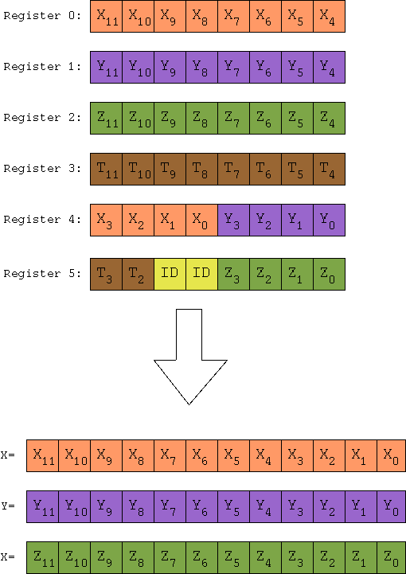


This sensor communicates with the microcontroller using I2C, a standard protocol for connecting sensors or other related devices. For more information on this protocol, see Adafruit's [I2C tutorial](https://learn.adafruit.com/working-with-i2c-devices/overview?gclid=Cj0KCQjw6KunBhDxARIsAKFUGs8a1IfnOsOuboUUTYSDkMfGUpKmnPyXHH_ypoh6JR9ak4MTL3FhwXUaArUxEALw_wcB). 

I2C communication requires four wires: 3.3V power, ground, Serial DAta (SDA) which carries the data, and Serial CLock (SCL) for a timing signal. 

To generate a magnetic field, put a refridgerator magnet near the sensor.


#### 8.5.2 Option A: Vector example, microcontroller side
In this section, we wire up the sensor and write the code for the microcontroller.  This section assumes you are using the RPi and MicroPython.

##### 8.5.2.1 Wire up the sensor
As shown in the figure below, connect 3V3 on the sensor to pin 36 on the RPi. Connect GND on the sensor to pin 38 on the RPi. Connect SCL on the sensor to pin 22 on the RPi, and connect SDA on the sensor to pin 21 on the RPi. 

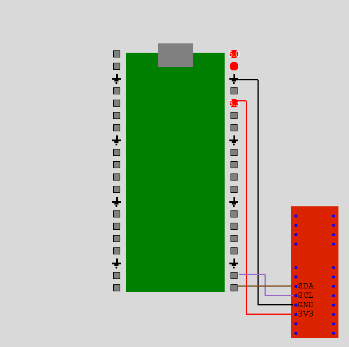
##### 8.5.2.2. Write the microcontroller code
Now let's write the code for the microcontroller, so open up the Mu IDE. 

This code reads the X, Y, and Z components of the magnetic field from the sensor. Next, it puts these quantities into a string in JSON format. Then, using the `print` instruction, it sends this JSON to the computer over the USB cable.

Open up the example below, and upload it to the microcontroller.

To generate a nonzero magnetic field, put a small refridgerator magnet near the sensor. Try to get the magnet within a few millimeters of the integrated circuit chip at the top of the sensor.

This [MicroPython i2c tutorial](https://www.digikey.com/en/maker/projects/raspberry-pi-pico-rp2040-i2c-example-with-micropython-and-cc/47d0c922b79342779cdbd4b37b7eb7e2) was used as a reference. 

(See file src/microcontr/magnetMP.py.)
```python
from machine import I2C, Pin, SoftI2C
import time
i2c=I2C(0, sda=Pin(16), scl=Pin(17))
ADDRESS=0x35

#Scan to find I2C devices.
devices=i2c.scan()
if devices:
    for d in devices:
        print(hex(d))
else:
    print("No I2C devices found")

#We set up the configuration register 0x10 for communication.
#More specifically, We set bit DT to 0 indicating we want to measure temperature.
#We set bit AM to 0 indicating we want to measure BZ.
#We set bits TRIG to 01 to triger on read before first most significant bit.
#We set bits X2 and TL_mag to 000 for more sensitivity and no temperature correction.
#We set bit CP to 1 for odd parity.
#To do all this, we write the bytes 0x11 and 0x91.
msg=bytearray()
msg.append(0x11)
msg2=bytearray()
msg.append(0x91)
i2c.writeto_mem(ADDRESS, 0x10, msg)
i2c.writeto_mem(ADDRESS, 0x10, msg2)

while True:
    #Read 7 registers from the i2c bus
    data=i2c.readfrom(ADDRESS, 7)

    #Start with the X component of the magnetic field.
    #Pick off each of the three hexadecimal bytes. Reassemble them so the result is an integer.
    X_first_hex=int(data[0]/16)
    X_second_hex=data[0]%16
    X_third_hex=int(data[4]/16)
    BX=X_first_hex*256+X_second_hex*16+X_third_hex
    #Values are in 2's complement. If we get a value between 2058 and 4096, the number is actually negative.  
    #The if statement converts it to a signed value. 
    if BX>2048:
        BX=-1*(4096-BX)
    
    #Do the same for the Y component of the magnetic field. 
    Y_first_hex=int(data[1]/16)
    Y_second_hex=data[1]%16
    Y_third_hex=data[4]%16
    BY=Y_first_hex*256+Y_second_hex*16+Y_third_hex
    if BY>2048:
        BY=-1*(4096-BY)
    
    #Do the same for the Z component of the magnetic field.
    Z_first_hex=int(data[2]/16)
    Z_second_hex=data[2]%16
    Z_third_hex=data[5]%16
    BZ=Z_first_hex*256+Z_second_hex*16+Z_third_hex
    if BZ>2048:
        BZ=-1*(4096-BZ)

    #Assemble a string in JSON format containing BX, BY, and BZ, and print it.
    msgString="{\"BX\":\""
    msgString=msgString+str(BX)
    msgString=msgString+"\",\"BY\":\""
    msgString=msgString+str(BY)
    msgString=msgString+"\",\"BZ\":\""
    msgString=msgString+str(BZ)
    msgString=msgString+"\"}"
    print(msgString)

    time.sleep(1)

```

Let's look at some lines more closely. 

The line `i2c=I2C(0, sda=Pin(16), scl=Pin(17))` creates the I2C object. This example in MicroPython for the RPi and the example in MicroPython for the PSoC are identical to each other except for the syntax of this line. This line uses a hardware i2c connection. 

The `devices=i2c.scan()` line looks for I2C devices connected to the microcontroller. If one is found, its address is printed. This sensor has address 0x35. So, if the microcontroller finds the sensor on the I2C bus, this value is printed. (Numbers beginning with 0x are given in hexadecimal.)

Two `writeto_mem` instructions are used before the `while` loop. To use the sensor, we need to configure it. To do so, we write the values 0x11 and 0x91 into register 0x10. For more information, see  the sensor's [user's manual](https://www.infineon.com/dgdl/Infineon-TLI_493D-W2BW-UserManual-v01_10-EN.pdf?fileId=5546d46273a5366f0173be229e1b1512) or this [Arduino example](https://community.infineon.com/t5/Knowledge-Base-Articles/XENSIV-TLI493D-W2BW-I2C-interface-example-KBA237409/ta-p/437707).

The first four bits of register 0 contain the four most significant bits of the X component of the magnetic field. These four bits can be represented in one hexadecimal digit or a decimal number between 0 and 15. The line `X_first_hex=int(data[0]/16)` identifies these bits and converts the result to an integer from 0 to 15. The last four bits of register 0 contain the middle four bits of the X component of the magnetic field. The line `X_second_hex=data[0]%16` identifies these bits. The first four bits of register 4 contain the four least significant bits of the X component of the magnetic field. The line `X_third_hex=int(data[4]/16)` identifies these bits. These three sets of bits are assembled into `BX`, which is an integer representing the X component of the magnetic field. This value, however, is in 2's complement. Values below 2048 are positive while values above 2048 are negative. The line `if BX>2048: BX=-1 * (4096-BX)` converts the two's complement value to a signed value. 

The same strategy is repeated for the Y and Z components of the magnetic field too. The values are then assembled inot  a string named `msgString` in JSON format. Using the `print` instruction, this string is then sent to the computer serially over the USB cable.    


#### 8.5.2 Option B: Vector example, microcontroller side
In this section, we wire up the sensor and write the code for the microcontroller.  This section assumes you are using the RPi and CircuitPython.


##### 8.5.2.1 Wire up the sensor

As shown in the figure below, connect 3V3 on the sensor to pin 36 on the RPi. Connect GND on the sensor to pin 38 on the RPi. Connect SCL on the sensor to pin 22 on the RPi, and connect SDA on the sensor to pin 21 on the RPi.


##### 8.5.2.2. Write the microcontroller code

Now let's write the code for the microcontroller, so open up the Mu IDE. 

This code reads the X, Y, and Z components of the magnetic field from the sensor. Next, it puts these quantities into a string in JSON format. Then, using the `print` instruction, it sends this JSON to the computer over the USB cable.

Open up the example below, and upload it to the microcontroller.

To generate a nonzero magnetic field, put a small refridgerator magnet near the sensor. Try to get the magnet within a few millimeters of the integrated circuit chip at the top of the sensor.

This [tutorial on CircuityPython and i2c](https://learn.adafruit.com/circuitpython-essentials/circuitpython-i2c) and [discussion on CircuitPython and i2c](https://stackoverflow.com/questions/69803934/trouble-using-i2c-in-circuitpython-working-micropython-example) were used as references.

(See file src/microcontr/magnetCP.py.)

```python
import busio
import time
i2c=busio.I2C(board.GP17, board.GP16)
ADDRESS=0x35
data=bytearray(7)

#Scan to find I2C devices.
while not i2c.try_lock():
        pass
devices=i2c.scan()
if len(devices)>0:
    for d in devices:
        print(hex(d))
else:
    print("No I2C devices found")


#We set up the configuration register 0x10 for communication.
#More specifically, We set bit DT to 0 indicating we want to measure temperature.
#We set bit AM to 0 indicating we want to measure BZ.
#We set bits TRIG to 01 to triger on read before first most significant bit.
#We set bits X2 and TL_mag to 000 for more sensitivity and no temperature correction.
#We set bit CP to 1 for odd parity.
#To do all this, we write the bytes 0x11 and 0x91.
msg=bytearray()
msg.append(0x10)
msg.append(0x11)
msg2=bytearray()
msg2.append(0x10)
msg.append(0x91)

i2c.writeto(ADDRESS, msg)
time.sleep(0.01)
i2c.writeto(ADDRESS, msg2)
time.sleep(0.01)


while True:
    #Read 7 registers from the i2c bus
    i2c.writeto(ADDRESS, bytes([0x00]))
    time.sleep(0.01)
    i2c.readfrom_into(ADDRESS, data)

    #Start with the X component of the magnetic field.
    #Pick off each of the three hexadecimal bytes. Reassemble them so the result is an integer.
    X_first_hex=int(data[0]/16)
    X_second_hex=data[0]%16
    X_third_hex=int(data[4]/16)
    BX=X_first_hex*256+X_second_hex*16+X_third_hex
    #Values are in 2's complement. If we get a value between 2058 and 4096, the number is actually negative.
    #The if statement converts it to a signed value.
    if BX>2048:
        BX=-1*(4096-BX)

    #Do the same for the Y component of the magnetic field.
    Y_first_hex=int(data[1]/16)
    Y_second_hex=data[1]%16
    Y_third_hex=data[4]%16
    BY=Y_first_hex*256+Y_second_hex*16+Y_third_hex
    if BY>2048:
        BY=-1*(4096-BY)

    #Do the same for the Z component of the magnetic field.
    Z_first_hex=int(data[2]/16)
    Z_second_hex=data[2]%16
    Z_third_hex=data[5]%16
    BZ=Z_first_hex*256+Z_second_hex*16+Z_third_hex
    if BZ>2048:
        BZ=-1*(4096-BZ)

    #Assemble a string in JSON format containing BX, BY, and BZ, and print it.
    msgString="{\"BX\":\""
    msgString=msgString+str(BX)
    msgString=msgString+"\",\"BY\":\""
    msgString=msgString+str(BY)
    msgString=msgString+"\",\"BZ\":\""
    msgString=msgString+str(BZ)
    msgString=msgString+"\"}"
    print(msgString)

    time.sleep(1)

```
Let's look at some lines more closely.


The line `i2c=busio.I2C(board.GP17, board.GP16)` creates the I2C object. This line uses a hardware i2c connection.

The `devices=i2c.scan()` line looks for I2C devices connected to the microcontroller. If one is found, its address is printed. This sensor has address 0x35. So, if the microcontroller finds the sensor on the I2C bus, this value is printed. (Numbers beginning with 0x are given in hexadecimal.)

Two `writeto` instructions are used before the `while` loop. To use the sensor, we need to configure it. To do so, we write the values 0x11 and 0x91 into register 0x10. For more information, see  the sensor's [user's manual](https://www.infineon.com/dgdl/Infineon-TLI_493D-W2BW-UserManual-v01_10-EN.pdf?fileId=5546d46273a5366f0173be229e1b1512) or this [Arduino example](https://community.infineon.com/t5/Knowledge-Base-Articles/XENSIV-TLI493D-W2BW-I2C-interface-example-KBA237409/ta-p/437707).

The first four bits of register 0 contain the four most significant bits of the X component of the magnetic field. These four bits can be represented in one hexadecimal digit or a decimal number between 0 and 15. The line `X_first_hex=int(data[0]/16)` identifies these bits and converts the result to an integer from 0 to 15. The last four bits of register 0 contain the middle four bits of the X component of the magnetic field. The line `X_second_hex=data[0]%16` identifies these bits. The first four bits of register 4 contain the four least significant bits of the X component of the magnetic field. The line `X_third_hex=int(data[4]/16)` identifies these bits. These three sets of bits are assembled into `BX`, which is an integer representing the X component of the magnetic field. This value, however, is in 2's complement. Values below 2048 are positive while values above 2048 are negative. The line `if BX>2048: BX=-1 * (4096-BX)` converts the two's complement value to a signed value.

The same strategy is repeated for the Y and Z components of the magnetic field too. The values are then assembled inot  a string named `msgString` in JSON format. Using the `print` instruction, this string is then sent to the computer serially over the USB cable.


#### 8.5.2 Option C: Vector example, microcontroller side
In this section, we wire up the sensor and write the code for the microcontroller.  This section assumes you are using the PSoC6 and MicroPython.


##### 8.5.2.1 Wire up the sensor
As shown in the figure below, connect 3V3 on the sensor to power on the PSoC. Connect GND on the sensor to GND on the PSoC. Connect SCL on the sensor to 6.0 on the PSoC, and connect pin SDA on the sensor to 6.1 on the PSoC.


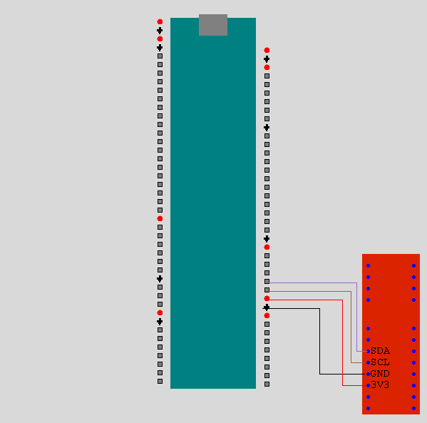


##### 8.5.2.2 Write the microcontroller code
Now let's write the code for the microcontroller, so open up the ArduinoLab IDE.

This code reads the X, Y, and Z components of the magnetic field from the sensor. Next, it puts these quantities into a string in JSON format. Then, using the `print` instruction, it sends this JSON to the computer over the USB cable.

Open up the example below, and upload it to the microcontroller.

To generate a nonzero magnetic field, put a small refridgerator magnet near the sensor. Try to get the magnet within a few millimeters of the integrated circuit chip at the top of the sensor.

This [MicroPython i2c tutorial](https://www.digikey.com/en/maker/projects/raspberry-pi-pico-rp2040-i2c-example-with-micropython-and-cc/47d0c922b79342779cdbd4b37b7eb7e2) and this [MicroPython PSoC page](https://github.com/Infineon/micropython/blob/ports-psoc6-ifx/docs/psoc6/quickref.rst) were used as references.


(See file src/microcontr/magnetPSoC.py)

```python 
from machine import I2C, Pin, SoftI2C
import time
#The hardware i2c didn't work reliably for me, so use the software i2c library.
i2c=SoftI2C(scl="P6_0", sda="P6_1")
ADDRESS=0x35

#Scan to find I2C devices.
devices=i2c.scan()
if devices:
    for d in devices:
        print(hex(d))
else:
    print("No I2C devices found")

#We set up the configuration register 0x10 for communication.
#More specifically, We set bit DT to 0 indicating we want to measure temperature.
#We set bit AM to 0 indicating we want to measure BZ.
#We set bits TRIG to 01 to triger on read before first most significant bit.
#We set bits X2 and TL_mag to 000 for more sensitivity and no temperature correction.
#We set bit CP to 1 for odd parity.
#To do all this, we write the bytes 0x11 and 0x91.
msg=bytearray()
msg.append(0x11)
msg2=bytearray()
msg.append(0x91)
i2c.writeto_mem(ADDRESS, 0x10, msg)
i2c.writeto_mem(ADDRESS, 0x10, msg2)


while True:
    #Read 7 registers from the i2c bus
    data=i2c.readfrom(ADDRESS, 7)

    #Start with the X component of the magnetic field.
    #Pick off each of the three hexadecimal bytes. Reassemble them so the result is an integer.
    X_first_hex=int(data[0]/16)
    X_second_hex=data[0]%16
    X_third_hex=int(data[4]/16)
    BX=X_first_hex*256+X_second_hex*16+X_third_hex
    #Values are in 2's complement. If we get a value between 2058 and 4096, the number is actually negative.  
    #The if statement converts it to a signed value. 
    if BX>2048:
        BX=-1*(4096-BX)
    
    #Do the same for the Y component of the magnetic field. 
    Y_first_hex=int(data[1]/16)
    Y_second_hex=data[1]%16
    Y_third_hex=data[4]%16
    BY=Y_first_hex*256+Y_second_hex*16+Y_third_hex
    if BY>2048:
        BY=-1*(4096-BY)
    
    #Do the same for the Z component of the magnetic field.
    Z_first_hex=int(data[2]/16)
    Z_second_hex=data[2]%16
    Z_third_hex=data[5]%16
    BZ=Z_first_hex*256+Z_second_hex*16+Z_third_hex
    if BZ>2048:
        BZ=-1*(4096-BZ)

    #Assemble a string in JSON format containing BX, BY, and BZ, and print it.
    msgString="{\"BX\":\""
    msgString=msgString+str(BX)
    msgString=msgString+"\",\"BY\":\""
    msgString=msgString+str(BY)
    msgString=msgString+"\",\"BZ\":\""
    msgString=msgString+str(BZ)
    msgString=msgString+"\"}"
    print(msgString)

    time.sleep(1)


```

Let's look at some lines more closely.

The line `i2c=SoftI2C(scl="P6_0", sda="P6_1")` creates the I2C object. This example in MicroPython for the PSoC and the example in MicroPython for the RPi are identical to each other except for the syntax of this line. This line uses a software i2c connection because the hardware i2c connection was not acting reliably.

The `devices=i2c.scan()` line looks for I2C devices connected to the microcontroller. If one is found, its address is printed. This sensor has address 0x35. So, if the microcontroller finds the sensor on the I2C bus, this value is printed. (Numbers beginning with 0x are given in hexadecimal.)

Two `writeto_mem` instructions are used before the `while` loop. To use the sensor, we need to configure it. To do so, we write the values 0x11 and 0x91 into register 0x10. For more information, see  the sensor's [user's manual](https://www.infineon.com/dgdl/Infineon-TLI_493D-W2BW-UserManual-v01_10-EN.pdf?fileId=5546d46273a5366f0173be229e1b1512) or this [Arduino example](https://community.infineon.com/t5/Knowledge-Base-Articles/XENSIV-TLI493D-W2BW-I2C-interface-example-KBA237409/ta-p/437707).

The first four bits of register 0 contain the four most significant bits of the X component of the magnetic field. These four bits can be represented in one hexadecimal digit or a decimal number between 0 and 15. The line `X_first_hex=int(data[0]/16)` identifies these bits and converts the result to an integer from 0 to 15. The last four bits of register 0 contain the middle four bits of the X component of the magnetic field. The line `X_second_hex=data[0]%16` identifies these bits. The first four bits of register 4 contain the four least significant bits of the X component of the magnetic field. The line `X_third_hex=int(data[4]/16)` identifies these bits. These three sets of bits are assembled into `BX`, which is an integer representing the X component of the magnetic field. This value, however, is in 2's complement. Values below 2048 are positive while values above 2048 are negative. The line `if BX>2048: BX=-1 * (4096-BX)` converts the two's complement value to a signed value.

The same strategy is repeated for the Y and Z components of the magnetic field too. The values are then assembled inot  a string named `msgString` in JSON format. Using the `print` instruction, this string is then sent to the computer serially over the USB cable.


#### 8.5.2 Option D: Vector example, microcontroller side
In this section, we wire up the sensor and write the code for the microcontroller. This section assumes you are using an Arduino.


##### 8.5.2.1 Wire up the sensor
Connect 3V3 on the sensor to 3.3V on the Arduino. Connect GND on the sensor to GND on the Arduino. Connect SCL on the sensor to SCL on the Arduino, and connect SDA on the sensor to SDA on the Arduino. The figure below shows the wiring for an Arduino Uno.


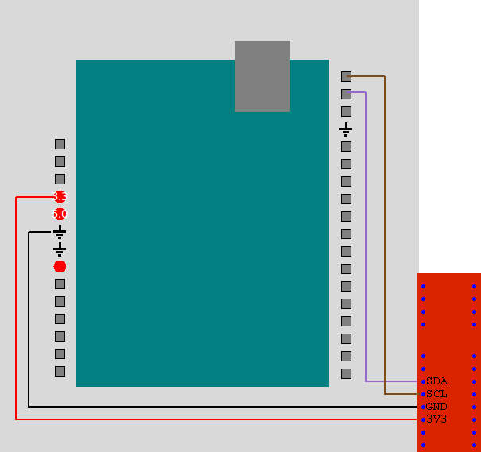
##### 8.5.2.2 Write the microcontroller code 

Now let's write the code for the microcontroller, so open up the Arduino IDE.

This code reads the X, Y, and Z components of the magnetic field from the sensor. Next, it puts these quantities into a string in JSON format. Then, using the `print` instruction, it sends this JSON to the computer over the USB cable.

Open up the example below, and upload it to the microcontroller.

To generate a nonzero magnetic field, put a small refridgerator magnet near the sensor. Try to get the magnet within a few millimeters of the integrated circuit chip at the top of the sensor.

This [Arduino example for the sensor](https://community.infineon.com/t5/Knowledge-Base-Articles/XENSIV-TLI493D-W2BW-I2C-interface-example-KBA237409/ta-p/437707) was used as a reference. 

(See file src/microcontr/magnetArd.ino)

```c++
#include <Wire.h>
#define ADDRESS 0x35 //Addreass of the sensor on the I2C bus

int16_t BX=0;
int16_t BY=0;
int16_t BZ=0;
int16_t T=0;
void setup() {
   Serial.begin(115200);
   //Setup I2C for talking to the sensor
   Wire.begin();
   Wire.beginTransmission(ADDRESS);
   //Here we set up the configuration register 10.
   //We set bit DT to 0 indicating we want to measure temperature.
   //We set bit AM to 0 indicating we want to measure BZ.
   //We set bits TRIG to 01 to triger on read before first most significant bit.
   //We set bits X2 and TL_mag to 000 for more sensitivity and no temperature correction.
   //We set bit CP to 1 for odd parity.
   Wire.write(0x10);
   Wire.write(0b00010001); 
   Wire.write(0b10010001); 
   Wire.endTransmission();
 }

void loop () {
  int X_first_hex, X_second_hex, X_third_hex, BX;
  int Y_first_hex, Y_second_hex, Y_third_hex, BY;
  int Z_first_hex, Z_second_hex, Z_third_hex, BZ;
  
  //Read in the first seven registers from the sensor which contain the magnetic values.
  uint8_t buf[7];
  Wire.requestFrom(ADDRESS, 7);
  for (uint8_t i = 0; i < 7; i++) {
    buf[i] = Wire.read();
  }

  //Start with the X component of the magnetic field. Pick off each of the three
  //hexadecimal bytes. Reassemble them so the result is an itneger. 
  X_first_hex=int(buf[0]/16);
  X_second_hex=buf[0]%16;
  X_third_hex=int(buf[4]/16);
  BX=X_first_hex*256+X_second_hex*16+X_third_hex;
  //The if statement converts it to a signed value.
  if (BX>2048)
    {BX=-1*(4096-BX);}

  //Do the same for the Y component of the magnetic field.
  Y_first_hex=int(buf[1]/16);
  Y_second_hex=buf[1]%16;
  Y_third_hex=buf[4]%16;
  BY=Y_first_hex*256+Y_second_hex*16+Y_third_hex;
  if (BY>2048)
    {BY=-1*(4096-BY);}

  //Do the same for the Z component of the magnetic field. 
  Z_first_hex=int(buf[2]/16);
  Z_second_hex=buf[2]%16;
  Z_third_hex=buf[5]%16;
  BZ=Z_first_hex*256+Z_second_hex*16+Z_third_hex;
  if (BZ>2048)
    {BZ=-1*(4096-BZ);}

  //Assemble a string in JSON format containing BX, BY, and BZ, and print it.
  Serial.print("\{\"BX\":\"");
  Serial.print(BX);
  Serial.print("\",\"BY\":\"");
  Serial.print(BY);
  Serial.print("\",\"BZ\":\"");
  Serial.print(BZ);
  Serial.println("\"\}");
  delay(500);  
}

```

Let's look at some lines more closely. 

The Wire library is used to facility i2c communication. To use the sensor, we need to configure it.  To do so, we write the values 0x11 and 0x91 into register 0x10. For more information, see  the sensor's [user's manual](https://www.infineon.com/dgdl/Infineon-TLI_493D-W2BW-UserManual-v01_10-EN.pdf?fileId=5546d46273a5366f0173be229e1b1512) or this [Arduino example](https://community.infineon.com/t5/Knowledge-Base-Articles/XENSIV-TLI493D-W2BW-I2C-interface-example-KBA237409/ta-p/437707). We write these values inside the `setup` function. 

The first four bits of register 0 contain the four most significant bits of the X component of the magnetic field. These four bits can be represented in one hexadecimal digit or a decimal number between 0 and 15. The line `X_first_hex=int(buf[0]/16)` identifies these bits and converts the result to an integer from 0 to 15. The last four bits of register 0 contain the middle four bits of the X component of the magnetic field. The line `X_second_hex=buf[0]%16` identifies these bits. The first four bits of register 4 contain the four least significant bits of the X component of the magnetic field. The line `X_third_hex=int(buf[4]/16)` identifies these bits. These three sets of bits are assembled into `BX`, which is an integer representing the X component of the magnetic field. This value, however, is in 2's complement. Values below 2048 are positive while values above 2048 are negative. The lines `if (BX>2048) {BX=-1 * (4096-BX);}` convert the two's complement value to a signed value.

The same strategy is repeated for the Y and Z components of the magnetic field too. The values are then assembled inot  a string named `msgString` in JSON format. Using the `print` instruction, this string is then sent to the computer serially over the USB cable.


#### 8.5.3 Vector example, computer side

Now let's write the code that will run on the computer and display the data from the magnetic field sensor. Close your Mu or Arduino IDE. Open the IDLE IDE to write Python code for the computer.

This example sets up a GUI with a `VectorDisplay` widget as well as a quit button. The microcontroller sends the X, Y, and Z values of the magnetic field to the computer packaged in a JSON. This example reads the information sent by the microcontroller, picks off the components of the data, and displays the magnetic field as a vector using the `VectorDisplay` widget.

This example uses asyncIO to simultaneously read the data and update the GUI. The `MagnetDemo` class of this example is a child of class `SerialAndGUI`. The class `SerialAndGUI` uses three tasks: `check_serial_data`, `use_serial_data`, and `updater`. Here, we just overload the `use_serial_data` function so that it is specific for this example.  

Run this example. To generate a nonzero magnetic field, put a small refridgerator magnet near the sensor. Try to get the magnet within a few millimeters of the integrated circuit chip at the top of the sensor.  

(See file src/examples/MagnetDemo.py.)

```python

import asyncio
import tkinter as tk
import time
import json
import serial
import serial.tools.list_ports as port_list
import sys
sys.path.append('../widgets')
sys.path.append('../utilities')
import SerialAndGui as sg
import VectorDisplay as vd


#Set up PORT.
#If you are on Windows, uncomment the next line and adjust as needed.
PORT='COM1'
#If you are on Linux, uncomment the next line and adjust as needed.
#PORT='/dev/ttyACM0'

class MagnetDemo(sg.SerialAndGui):
     def __init__(self, loop, interval=1/20, port=PORT):
        super().__init__(loop, port=PORT)
        self.button_quit=tk.Button(self, text="Quit", \
                                   command=self.close)
        self.vector1=vd.VectorDisplay(self, height=100, width=200)

        self.vector1.pack()
        self.button_quit.pack()


     #This async function reads from the queue and uses the data it finds.
     #We're overloading the parent's version of this function.
     async def use_serial_data(self, interval, qIn: asyncio.Queue):
        while True:
            await asyncio.sleep(interval*10)
            #get the string from the queue
            in_string=await qIn.get()
            print(in_string)
            #Parse the json and pick off the element named "value"
            in_json=json.loads(in_string)
            stringX=in_json["BX"]
            valueX=float(stringX)
            stringY=in_json["BY"]
            valueY=float(stringY)
            stringZ=in_json["BZ"]
            valueZ=float(stringZ)
            #TO DO: Rescale values so they are in a good range to display
            self.vector1.set_to_value(valueX, valueY, valueZ)
            

if __name__=="__main__":
    loop=asyncio.get_event_loop()
    example=MagnetDemo(loop)
    loop.run_forever()
    loop.close()
```

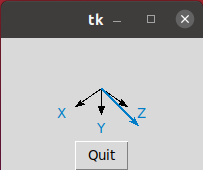


## 9.0 Widgets that look like microcontrollers

Files used in section 9:
 - examples/MCDemo.py
 - examples/MCDemo2.py 
 - widgets/MCDisplay.py
 - widgets/RPiPicoDisplay.py
 - widgets/AUnoDisplay.py
 - widgets/AMKRDisplay.py
 - widgets/ANanoEveryDisplay.py
 - widgets/PSoCDisplay.py 
 - microcontr/serialWriteMP.py
 - microcontr/serialWriteCP.py
 - microcontr/serialWritePSoC.py
 - microcontr/serialWriteArd.ino
 - microcontr/analogToComputerMP.py
 - microcontr/analogToComputerCP.py
 - microcontr/analogToComputerPSoC.py
 - microcontr/analogToComputerArd.ino

The DANDY library contains five widgets that look like specific microcontrollers. First we show how to use these widgets without any hardware. Next we show how to use them with one microcontroller attached, and finally we show how to use them with two microcontrollers connected to the computer.


#### 9.1 Microcontroller widgets, example with no hardware
This example demonstrates the widgets that look like microcontrollers. This section does not use hardware.  The file `MCDisplay.py` is a parent class. The files `RPiPicoDisplay.py`, `AUnoDisplay.py`, `AMKRDisplay.py`, `ANanoEveryDisplay.py`, and `PSoCDisplay.py` are child classes that look like the RPi, Arduino Uno, Arduino MKR1010, Arduino Nano Every, and PSoC microcontrollers respectfully. These child classes have access to member functions of the parent.

When you run this example, you will see a widget that looks like the RPi. Pin 6 shows a `LEDDisplay` widget, and pin 21 shows a button. Additionally, a `toggle` button is at the bottom of the screen. If you press either the button near bin 31 or the toggle button, the `LEDDisplay` changes color.

The `set_led` function of line 39 displays the `LEDDisplay` widget near pin 6. Other member functions display `SlideDisplay`, `DialDisplay`, or `TricolorDisplay` widgets near individual pins.

When you run the example, you see a widget that looks like the RPi. To see widgets that look like the other microcontrollers, comment out between lines 28-32. Next, uncomment one of lines, corresponding to one of the microcontrollers. Save, and rerun the example.

(See file src/examples/MCDemo.py.)
 
```python

import tkinter as tk
import sys  
sys.path.append('../widgets') 
import MCDisplay as mcd  
import RPiPicoDisplay as rpp
import SymbolDisplay as sd
import AUnoDisplay as aud
import ANanoEveryDisplay as aned
import AMKRDisplay as amd
import PSoCDisplay as cd

class MCDemo(tk.Tk):
    def __init__(self):
        super().__init__()
        self.button_quit=tk.Button(self, text="Quit", \
                                   command=self.destroy) 
        self.button2=tk.Button(self, text="Toggle",\
                               command=self.go_button)
        self.mc1=rpp.RPiPicoDisplay(self)
        #self.mc1=aud.AUnoDisplay(self)
        #self.mc1=aned.ANanoEveryDisplay(self)
        #self.mc1=amd.AMKRDisplay(self)
        #self.mc1=cd.PSoCDisplay(self)
           
        self.mc1.pack()
        self.button2.pack()
        self.button_quit.pack()

        #Let's add an LED at pin 6
        self.mc1.set_led(6)

        #Let's add a button at pin 21
        self.button3=self.mc1.set_button(21)
        self.button3.bind('<ButtonPress>',self.go_button2)
        
        #Run tkinter's main loop
        tk.mainloop()


    #When the toggle button is pressed, we follow the instructions in go_button.
    def go_button(self):
        pin_loc=6
        if(self.mc1.get_led_color(pin_loc)=="yellow"):
            self.mc1.set_led_color(pin_loc, "blue")
        else:
            self.mc1.set_led_color(pin_loc, "yellow")


    #When the button at pin 21 is pressed, we follow instructions in go_button2.
    #I need an extra input here for some reason.
    def go_button2(self, x):
        pin_loc=6
        if(self.mc1.get_led_color(pin_loc)=="yellow"):
            self.mc1.set_led_color(pin_loc, "blue")
        else:
            self.mc1.set_led_color(pin_loc, "yellow")
        
        
if __name__=="__main__":
    mygui=MCDemo()
```

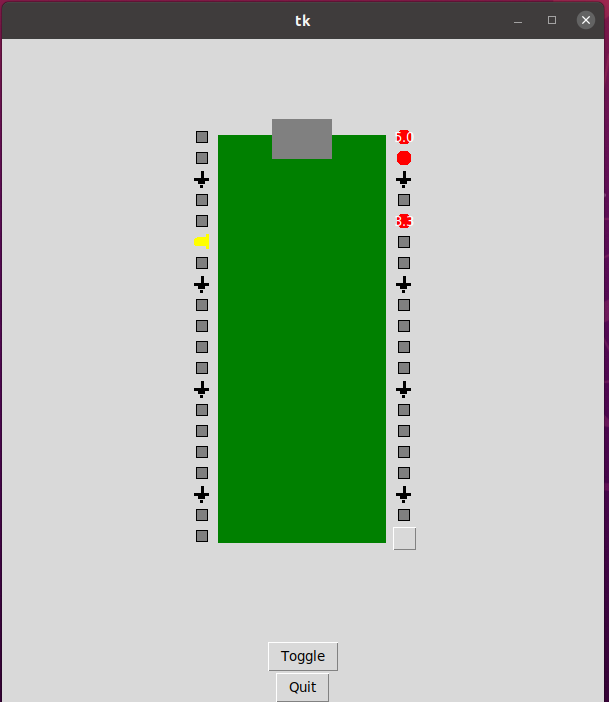


#### 9.2 Microcontroller widgets, example with hardware

Follow the instructions in section 5.1.1 to wire a pushbutton to your micrcontroller, and use a USB cable to plug your micrcontroller into the computer. Upload the `serialWriteMP.py`, `serialWriteCP.py`, `serialWritePSoC.py`, or `serialWriteArd.ino` example used in section 5.1.4 to that microcontroller. When the user presses the pushbutton, `T` is sent serially to the computer. When the pushbutton is not pressed, `F` is sent.

Next, we'll program the computer to respond to the character received. Close the Arduino or Mu IDE. Open the IDLE IDE. Copy the example below or load the file `examples/MCDemo2Short.py` that came with the DANDY library. Set `PORT` at the top of the example for your machine.

When you run this example, you will see a widget that looks like a RPi microcontroller. The line which creates the widget, `self.mc1=rpp.RPiPicoDisplay(self)`, can be replaced with a line to create one of the widgets for the other microcontrollers instead if desired. 

Run the example on the computer. Press the pushbutton attached to the microcontroller. You should see the color of the `LEDDisplay` widget near pin 21 cahnge. 

This example uses the asyncIO library. The `MCDemo2Short` class defined in this example is a child of the `SerialAndGui` class defined in the file `src/utilities/SerialAndGui.py`. The `MCDemo2Short` class redefines the parent's `use_serial_data` member function. The file `MCDemo2Long.py` contains the same example without relying on the `SerialAndGui` parent class.


(See file src/examples/MCDemo2Short.py.)
```python

import asyncio
import tkinter as tk
import time
import serial
import serial.tools.list_ports as port_list
import sys
sys.path.append('../widgets')
sys.path.append('../utilities')
import LEDDisplay as ld
import SerialAndGui as sg
import RPiPicoDisplay as rpp  

#Set up PORT.
#If you are on Windows, uncomment the next line and adjust as needed.
PORT='COM1'
#If you are on Linux, uncomment the next line and adjust as needed.
#PORT='/dev/ttyACM0'

#Button is wired to pin 21
BUTTON_NO=21

class MCDemo2Short(sg.SerialAndGui):
    #Here's the constructor.
    def __init__(self, loop, interval=1/20):
        super().__init__(loop, port=PORT, data_format="char")
        #The line above says run the parent's constructor.
        #The parent's constructor starts the three async tasks:
        #check_serial_data, use_serial_data, and updater.
        #Below, we set up the widgets for the GUI
        #and pack them in the window.
 
        self.button_quit=tk.Button(self, text="Quit", command=self.close)
        self.mc1=rpp.RPiPicoDisplay(self)
        self.mc1.set_led(BUTTON_NO)
        self.mc1.pack()
        self.button_quit.pack()

  
    
    async def use_serial_data(self, interval, qIn: asyncio.Queue):
    #This async function reads from the queue and uses the data it finds.
    #We're overloading the parent's version of this function.
       while True:
            await asyncio.sleep(interval)
            in_string=await qIn.get()
            if in_string=="T":
                print("T")
                self.mc1.set_led_color(BUTTON_NO, "yellow")
            if in_string=="F":
                print("F")
                self.mc1.set_led_color(BUTTON_NO, "blue")  
 


if __name__=="__main__":
    loop=asyncio.get_event_loop()
    example=MCDemo2Short(loop)
    loop.run_forever()
    loop.close()
```


#### 9.3 Example with two microcontrollers

A computer keeps track of devices attached by USB connections, such as microcontrollers, by assigning them a port. If you plug two microcontrollers into your computer, the computer will be able to distinguish which one it is reading from or writing to by that port. This example demonstrates reading and displaying sensor data from two microcontrollers. 

This example uses DANDY widgets that look like microcontrollers. In a previous example, we used `LEDDisplay` widgets near individual pins of these widgets that look like microcontrollers to display the status of the pins. In this example, we use `SlideDisplay` and `DialDisplay` widgets near pins to indicate the voltage across a potentiometer.

Additionally, in this example, we don't have to know ahead of time which types of microcontrollers will be used. Data is sent from the microcontrollers to the computer in JSON format, and one element of the JSON contains the type of microcontroller used. 

Let's get started.
##### 9.3.1 Example with two microcontrollers, the microcontroller side
Follow the instructions in section 8.2 to set up two microcontrollers. More specifically, construct the voltage divider circuit containing the resistor and potentiometer that connects to one of the analog input pins. Additionally, program the microcontroller with the example from section 8.2, found in `microcontr/analogToComputerMP.py`, `microcontr/analogToComputerCP.py`, `micorcontr/analogToComputerPSoC.py`, or `microcontr/analogToComputerArd.ino`.


##### 9.3.2 Example with two microcontrollers, the computer side

Now let's write the Python program for the computer that displays the widgets. Open the IDLE IDE and copy the code below or load the example from the file `src/examples/twoMCv2.py`. Set the ports for your two microcontrollers at the top of the code. 

This example uses the asyncIO library. It involves four tasks: `check_serial_dataA`, `check_serial_dataB`, `use_serial_data`, and `updater`. In example with one microcontroller, the details of the use of asyncIO were hidden in the parent class `SerialAndGui`. That technique won't work here because we have a fourth task, so the details of the use of asyncIO are included in this example.

When you first run this example, you will see two widgets that look like the Arduino Nano Every microcontroller. The microcontrollers are sending infromation to the computer in JSON format, and one element of the JSON, `boardType`, contains the microcontroller type. For the first messages received, this example identifies the board type and changes the widget to look like that particular microcontroller. This example is set up to recognize only Arduino Nano Everys, RPis, and Arduino Unos, but other microcontroller types with avaialble widgets could be included too. 

The `set_slide` member function is used to display a `SlideDisplay` widget near one pin of a microcontroller widget. The `set_dial` member function is used to display a `DialDisplay` widget near one pin of the other microcontroller widget.

Try out the example.

(See file src/examples/twoMCv2.py.)
```python
import asyncio
import tkinter as tk
import time
import json
import serial
import serial.tools.list_ports as port_list
import sys
sys.path.append('../widgets')
sys.path.append('../utilities')
import SerialAndGui as sg
import DialDisplay as dd
import RPiPicoDisplay as rpp
import AUnoDisplay as aud
import ANanoEveryDisplay as ane

#Set up your ports. 
#If you are on Windows, uncomment the next lines and adjust as needed.
PORTA='COM1'
PORTB='COM2'
#If you are on Linux, uncomment the next lines and adjust as needed.
#PORTA='/dev/ttyACM0'
#PORTB='/dev/ttyACM1'


class TwoMCv2(tk.Tk):
    def __init__(self, loop, interval=1/20):
        super().__init__()
        self.__loop=loop
        self.__portA=PORTA
        self.__portB=PORTB
        self.protocol("WM_DELETE_WINDOW", self.close)


        #We have four async tasks: check_serial_dataA,
        #check_serial_dataB, and use_serial_data
        #and updater. Each are detailed in their own function.
        self.q=asyncio.Queue()
        self.tasks=[]
        self.tasks.append(loop.create_task \
                          (self.check_serial_dataA(interval, self.q)))
        self.tasks.append(loop.create_task \
                          (self.check_serial_dataB(interval, self.q)))
        self.tasks.append(loop.create_task \
                          (self.use_serial_data(interval, self.q)))
        self.tasks.append(loop.create_task(self.updater(interval)))
        self.button_quit=tk.Button(self, text="Quit", \
                                   command=self.close)
        #Let's start with widgets for the Arduino Nano Every
        self.mc1=ane.ANanoEveryDisplay(self)
        self.mc2=ane.ANanoEveryDisplay(self)
        self.slide1=self.mc1.set_slide(7)
        self.dial1=self.mc2.set_dial(7)

        self.mc1.pack(side='left')
        self.mc2.pack(side='right')
        self.button_quit.pack(side='bottom')        


    async def use_serial_data(self, interval, qIn: asyncio.Queue):
        #Here we want to collect a few jsons and then set
        #The board widget appropriately.
        boardOneSet=1
        boardTwoSet=1
        for i in range (10):
            #Pick off board number and type
            in_string=await qIn.get()
            print(in_string)
            in_json=json.loads(in_string)
            board_read=in_json["boardNumber"]
            board_type=in_json["boardType"]
            if board_read=="1":
                if boardOneSet>0:
                    #Set widget for board one
                    self.mc1.pack_forget()
                    if(board_type=="Arduino"):
                        self.mc1=aud.AUnoDisplay(self)
                        self.slide1=mc1.set_slide(8)
                    if(board_type=="RPi"):
                        self.mc1=rpp.RPiPicoDisplay(self)
                        self.slide1=self.mc1.set_slide(31)
                    if(board_type=="NanoEvery"):
                        self.mc1=rpp.RPiPicoDisplay(self)
                        self.slide1=self.mc1.set_slide(7)
                    boardOneSet=0
                    self.mc1.pack(side='left')
            if board_read=="2":
                if boardTwoSet>0:
                    #Set widget for board two
                    self.mc2.pack_forget()
                    if(board_type=="Arduino"):
                        self.mc2=aud.AUnoDisplay(self)
                        self.dial1=self.mc2.set_dial(9)
                    if(board_type=="RPi"):
                        self.mc2=rpp.RPiPicoDisplay(self)
                        self.dial1=self.mc2.set_dial(31)
                    if(board_type=="NanoEvery"):
                        self.mc2=rpp.RPiPicoDisplay(self)
                        self.dial1=self.mc2.set_dial(7)
                    boardTwoSet=0
                    self.mc2.pack(side='right')

        while True:
            await asyncio.sleep(interval)
            #get the string from the queue
            in_string=await qIn.get()
            print(in_string)
            #Parse the json and pick off the element named "value"
            in_json=json.loads(in_string)
            
            board_read=in_json["boardNumber"]
            print(board_read)
            val=in_json["value"]
            val_float=float(val)
            print(val_float)
            if(board_read=="1"):
                scaled_value=val_float/6000
                self.slide1.set_to_value(scaled_value)
            else:
                scaled_value=val_float/256
                self.dial1.set_to_value(scaled_value)


    async def check_serial_dataA(self, interval, qIn: asyncio.Queue):
        #This async function reads data from the serial port and puts the
        #data in the queue.

        baudrate=115200
        serial_port=serial.Serial(port=self.__portA, baudrate=baudrate, \
                        bytesize=8, timeout=0.1, stopbits=serial.STOPBITS_TWO)
        
        #Read a byte at a time from the serial port.
        #Convert the byte to a string, and put the string in the queue.
        print('checking A')
        while True:
            await asyncio.sleep(interval)
            #Read until you see the two end characters '\r\n'.
            serial_byte=serial_port.read_until('\r\n')
            #Convert the bytes read into a string
            serial_string=serial_byte.decode()
            #Slice off the two end characters
            serial_string=serial_string[:-2]
            if serial_string != "":
                await qIn.put(serial_string)
                #Uncomment the next line to see what the serial port is getting.
                #print(serial_byte)
        serial_port.close()
        


    async def check_serial_dataB(self, interval, qIn: asyncio.Queue):
        #This async function reads data from the serial port and puts the
        #data in the queue.

        baudrate=115200
        serial_port=serial.Serial(port=self.__portB, baudrate=baudrate, \
                        bytesize=8, timeout=0.1, stopbits=serial.STOPBITS_TWO)
        
        #Read a byte at a time from the serial port.
        #Convert the byte to a string, and put the string in the queue.
        print('checking B')
        while True:
            
            await asyncio.sleep(interval)
            #Read until you see the two end characters '\r\n'.
            serial_byte=serial_port.read_until('\r\n')
            #Convert the bytes read into a string
            serial_string=serial_byte.decode()
            #Slice off the two end characters

            serial_string=serial_string[:-2]
            if serial_string != "":
                await qIn.put(serial_string)
                #Uncomment the next line to see what the serial port is getting.
                #print(serial_byte)
        serial_port.close()
        

    async def updater(self, interval):
        #This async function manually updates the Tkinter GUI.
        while True:
            self.update()
            await asyncio.sleep(interval)


    def close(self):
        for task in self.tasks:
            task.cancel()
        self.__loop.stop()
        self.destroy()


if __name__=="__main__":
    loop=asyncio.get_event_loop()
    example=TwoMCv2(loop)
    loop.run_forever()
    loop.close()
```


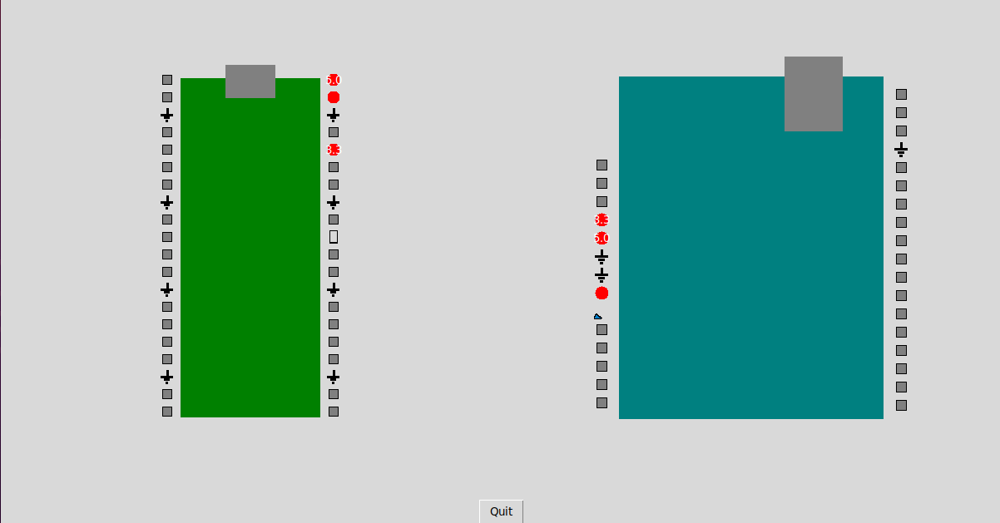


## 10.0 Widgets for ANALOG or PWM OUTPUT
In this section, we demonstrate a widget that is useful when sending values other than individual characters out of the computer.
This strategy will allow us to control motors or other actuators. More specifically, in the example of section 10.3, we will send a floating point value from the computer to a microcontroller and use this number to set a motor's rotation speed.


### 10.1 KnobDisplay widget without hardware

DANDY also includes a `KnobDisplay` widget. Try out the example below. It contains a `KnobDisplay` widget, a `SlideDisplay` widget, and a quit button. Put your cursor over the `KnobDisplay` widget and click the left or right mouse button to dial the knob. You will see the `SlideDisplay` widget change. This example relies on the KnobDisplay widget detailed in the file `src/widgets/KnobDisplay.py`.

In this example, we don't run Tkinter's main loop. Instead, we run the function `updater` which we define ourselves, and this function manually updates Tkinter's loop.

(See file src/examples/KnobDemo.py.) 

```python
import tkinter as tk
import sys
sys.path.append('../widgets') 
import KnobDisplay as kd 
import SlideDisplay as sd
import time

class KnobDemo(tk.Tk):
    def __init__(self):
        super().__init__()
        self.canvasK=tk.Canvas(self, height=300, width=300)
        self.button_quit=tk.Button(self, text="Quit", \
                            command=self.destroy)
        self.slide1=sd.SlideDisplay(self, width=100, \
                            height=100)
        self.knob1=kd.KnobDisplay(self.canvasK, width=100, height=100)

        self.value=5
        self.canvasK.pack()
        self.knob1.pack()
        self.slide1.pack()
        self.button_quit.pack()

        #We don't run Tkinter's main loop. Instead, we run the function
        #updater, which we define below. That function manually updates
        #the Tkinter loop.
        self.updater()


    def updater(self):
        while True:
            time.sleep(0.1)
	    print(self.value)
            self.value=self.knob1.get_angle()
            self.slide1.set_to_value(10*self.value)    
            self.update()
            

if __name__=="__main__":
    mygui=KnobDemo()

```
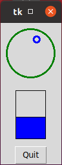

### 10.2 Microcontrollers and motors

In this section, we'll control a small servo motor directly using Pulse Width Modulation (PWM) instructions.

Instead of getting sensor data in to a microcontroller, in this section we send signals out of the microcontroller to control an actuator. More specifically, we use the microcontroller to control the rotation rate of a small servo motor. 

In the next section, 10.3, we'll send signals from the computer, overthe USB cable to the microcontroller, and to the connected motor to control the rotation rate of the motor. 

Most motors require a significant amount of power and are used to deliver a significant amount of torque to a load. However, we'll be using a small servo motor that can be powered directly from the microcontroller and does not need any separate power management. For this reason, the torque it can provide is limited. 

Often, the easiest way to control a motor using a microcontroller is to use a library written specifically for the task. For example, open libraries are available for controlling [servos with Arduino](https://docs.arduino.cc/learn/electronics/servo-motors) and [servos with the RPi and CircuitPython](https://learn.adafruit.com/use-dc-stepper-servo-motor-solenoid-rp2040-pico/servo-motors). 

In this section, however, we do not use an external library. Instead, we directly use PWM signals. This approach allows us to have more control of the instructions run by the microcontroller. Information on PWM and the RPi in MicroPython came from [https://microcontrollerslab.com/servo-motor-raspberry-pi-pico-micropython/](https://microcontrollerslab.com/servo-motor-raspberry-pi-pico-micropython/). Information on PWM and the RPi in CircuitPython came from [https://learn.adafruit.com/using-servos-with-circuitpython/low-level-servo-control](https://learn.adafruit.com/using-servos-with-circuitpython/low-level-servo-control). Information on PWM and Arduino came from [https://forum.arduino.cc/t/creating-your-own-pwm-to-control-a-servo/129869/8](https://forum.arduino.cc/t/creating-your-own-pwm-to-control-a-servo/129869/8).

We will control the motors by PWM. The PWM signals are periodic with some pulse width and some frequency. The pulse width sets the desired rotation angle for the servo. The examples below use a PWM frequency of 50Hz. While PWM frequency influences rotation speed to some extent, it is not used here to control rotation speed. The servo motors operate so quickly that changing the PWM frequency is not a useful way to control motor speed for our purposes here. 

Motor rotation speed will be controlled by the number of steps and the time of delays between steps instead. Suppose we want to rotate the motor shaft between an angle of ten degrees and 100 degrees. We will accomplish this rotation by breaking it up into a number of steps, and we will delay a fixed time between the steps. The motor will take three times as much time to accomplish this rotation, for example, if we go between these angles in 90 steps with a 10ms delay between each step than if we go between these angles in 30 steps with a 10ms delay between each step. In the examples below, we will have a variable number of steps involved with a fixed time between these steps. Therefore, if we set our motor to take fewer steps all else equal, it will rotate faster. 

#### 10.2.1 Option A: Spin the motor at different frequencies

In this section, we use the RPi microcontroller and code it in MicroPython. Connect the motor to the RPi as shown below.  

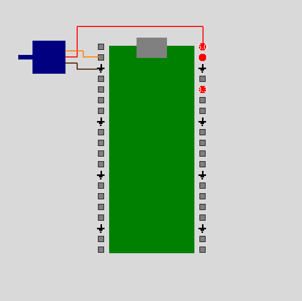

Next, let's write code for the microcontroller that spins the motor at different rates.  Open the Mu IDE, copy over the code below, and try it out.

(See file src/microcontr/motor1MP.py.)

```python

from time import sleep
from machine import Pin, PWM

pwm = PWM(Pin(1))
pwm.freq(50)

for i in range(5):
    steps=20*i+20   #Set number of steps.
    #Rotate forward
    for position in range(1000,9000,steps):
        pwm.duty_u16(position)
        sleep(0.01)
    #rotate back
    for position in range(9000,1000,-1*steps):
        pwm.duty_u16(position)
        sleep(0.01)


```
This example rotates the motor. Each of the five times through the outer for loop, the motor spins at a different speed. In each of theses times through the loop, the motor spins to a fixed location forward then back.

As explained in section 10.2, the rotation speed is actually controlled by the number of steps in the motor rotation because there is a 10ms delay between each steps. While the command `pwm.freq()` sets the pwm frequency, this command was not used for controlling the motor rotation speed because it was just too fast to be observable. The number of steps was used instead because it allowed for slower speeds which are observable.


#### 10.2.1 Option B: Spin the motor at different frequencies


In this section, we use the RPi microcontroller and code it in CircuitPython. Connect the motor to the RPi as shown below.


Next, let's write code for the microcontroller that spins the motor at different rates. Open the Mu IDE, copy over the code below, and try it out.

(See file src/microcontr/motor1CP.py.)

```python
import board
import pwmio
import time
import digitalio

led=digitalio.DigitalInOut(board.LED)
led.direction=digitalio.Direction.OUTPUT
pwm = pwmio.PWMOut(board.GP1, frequency=50)
steps=50

for i in range (5):
    print('hey')
    steps = 20*i+10
    #Spin forward
    led.value=True
    for j in range(steps):
        duty_cyc=1.0*j/(steps);
        pwm.duty_cycle=int(65535.0*duty_cyc/10.0)
        time.sleep(0.150)
    #Spin reverse 
    led.value=False
    for j in range(steps):
        duty_cyc=(1-(1.0*j/(steps)))
        pwm.duty_cycle=int(65535.0*duty_cyc/10.0)
        time.sleep(0.150)

```

This example rotates the motor. Each of the five times through the outer for loop, the motor spins at a different speed. In each of theses times through the loop, the motor spins to a fixed location forward then back.

As explained in section 10.2, the rotation speed is actually controlled by the number of steps in the motor rotation because there is a 150ms delay between each steps. While the PWM frequency is set to 50Hz in the constructor, PWM frequency is not used for controlling the motor rotation speed because it was just too fast to be observable. The number of steps was used instead because it allowed for slower speeds which are observable.


#### 10.2.1 Option C: Spin the motor at different frequencies

In this section, we use the PSoC and code it in MicroPython. Connect the motor to the PSoC as shown below. The brown wire of the motor is connected to any ground pin of the PSoC. The red wire of the motor is connected to the VDD pin of the PSoC, and the yellow wire of the motor is connected to pin 6.1 of the PSoC. 

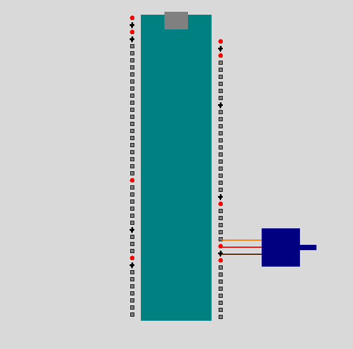

Next, let's write code for the microcontroller that spins the motor at different rates. Open the ArduinoLab IDE, copy over the code below, and try it out.


(See file src/microcontr/motor1PSoC.py.)
```python
from time import sleep
from machine import Pin, PWM
pwm = PWM('P6_1', freq=50, duty_u16=2000, invert=0)

for i in range(5):
    steps=20*i+20   #Set number of steps.
    #Rotate forward
    for position in range(1000,9000,steps):
        pwm.duty_u16(position)
        sleep(0.01)
    #rotate back
    for position in range(9000,1000,-1*steps):
        pwm.duty_u16(position)
        sleep(0.01)
        
pwm.deinit()

```
This example rotates the motor. Each of the five times through the for loop, the motor spins at a different speed. In each of theses times through the loop, the motor spins to a fixed location forward then back.

As explained in section 10.2, the rotation speed is actually controlled by the number of steps in the motor rotation because there is a 10ms delay between each steps. While the command `pwm.freq()` sets the pwm frequency, this command was not used for controlling the speed because it was just too fast to be observable. The number of steps was used instead because it allowed for slower speeds which are observable.

During testing, I tried using pin 6.0 instead of pin 6.1 for the motor control wire. However, that did not work, and I'm not sure why.

Except for the syntax of the PWM constructor, this example is the same asin 10.2.1 Option A. When using the PSoC, use the four input constructor as shown here. 

#### 10.2.1 Option D: Spin the motor at different frequencies

In this section, we use the Arduino. Connect the motor to the Arduino. The figure below shows wiring for the Arduino Uno. 

Next, let's write code for the microcontroller that spins the motor at different rates. Open the Arduino IDE, copy over the code below, and try it out.

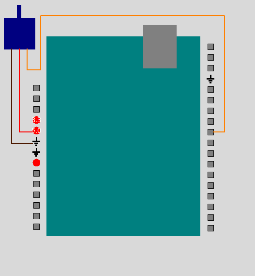

This [Arduino servo tutorial](https://forum.arduino.cc/t/creating-your-own-pwm-to-control-a-servo/129869/8) was used as a reference.

(See file src/microcontr/motor1Ard.ino.)
```c++
int servo = 9;
int led=13; 

    
void setup() { 
  pinMode(servo, OUTPUT); 
  pinMode(led, OUTPUT);
  //Steps represents the steps taken to go between two angles 180 degrees apart.
  double steps=50;
  //We're bit banging PWM as opposed to using a library or any built in pwm functions. 
  //We're using signals with a period of 1500 microseconds which corresponds to a frequency of 667Hz.
  int pulse_period_us=1500;
  double pulse_high_us=0.0; 
  for (int ii=1;ii<5;ii++)
    {
     //The variable ii sets the number of steps, and hence speed of going between the angles. 
     steps=20*ii+10;
     //Spin forward     
     digitalWrite(led, HIGH);
     for ( int j = 0; j < steps; j++){
        //The variable jj sweeps from 0 to steps, and keeps track of which step we are on. 
        //The 1.0 is needed in the next line to ensure double computation, not int.
        pulse_high_us=1.0*pulse_period_us*j/steps;
          digitalWrite(servo, HIGH);
          delayMicroseconds(pulse_high_us);    
          digitalWrite(servo, LOW);
          delayMicroseconds(pulse_period_us-pulse_high_us);
          delay(150); //delay 0.15 seconds between steps
     }//close the for over j
      
     //Spin backwards.
     digitalWrite(led, LOW);
     delay(1000);
     for(int j=0; j< steps; j++) {
       pulse_high_us=1.0*pulse_period_us*j/steps;
       digitalWrite(servo, HIGH);
       delayMicroseconds(pulse_period_us-pulse_high_us);
       digitalWrite(servo, LOW);
       delayMicroseconds(pulse_high_us);
       delay(150);
    }//close the for over j
 } //close the for over ii
}//close the setup 
 
 
void loop() {
 
}
```

This example rotates the motor. Each of the five times through the for loop, the motor spins at a different speed. In each of theses times through the loop, the motor spins to a fixed location forward then back.

As explained in section 10.2, the rotation speed is actually controlled by the number of steps in the motor rotation because there is a 150ms delay between each steps. 

Arduino has both servo libraries and pwm functions. However, in this example, we take a simpler approach. We directly send pulses at a fixed frequency, 1/(1500 microseconds)=667Hz. The duty cycle of these pulses determines the motor's angle. 

We don't use the pulse frequency to control motor speed because it is too fast for our purposes. Instead, the number of steps used determines the motor rotation speed, which allows for slower and more observable speeds. 


### 10.3 Microcontrollers, motors, and asyncio

In this example, we send a signal from the computer to the microcontroller, and this signal controls the speed of the motor. 

We run into an issue we also encountered in Section 7.3. We want the microcontroller to simultaneously do two things. First, we want it to communicate with the computer, and second we want it to control the motor. 

In Section 7.3, we ran into this problem on the computer. Here we're running in to this problem on the microcontroller. In Section 7.3, we solved this problem using asyncIO. The MicroPython and CircuitPython also have asyncIO instructions, so we'll use the same technique here. Arduino does not have asyncIO instructions. 

The microcontrollers we're using don't have an operating system with a scheduler, and most microcontrollers only have one processor. For these reasons, we can't run multiple threads or multiple processes. The asyncIO functionality, however, allow us to run multiple tasks in a way that seems simultaneous.  

[This site](https://www.digikey.com/en/maker/projects/getting-started-with-asyncio-in-micropython-raspberry-pi-pico/110b4243a2f544b6af60411a85f0437c) contains a nice example of using asyncIO in MicroPython, and it was used as a reference. This [tutorial on CircuitPython and ayncIO](https://learn.adafruit.com/cooperative-multitasking-in-circuitpython-with-asyncio/overview)  was used as a reference too.

This example involves both writing Python code for the computer as well as writing code for the microcontroller. When you run the Python code on the computer, you see a KnobDisplay widget and a button. If you dial the knob then press the button, a corresponding value is transmitted via the USB cable to the microcontroller. This value sets the number of steps, and hence the speed, of the motor attached to the microcontroller. 


#### 10.3.1 Option A: Microcontroller code, now with asyncIO
Let's start by writing the microcontroller code for this example. In this section, we write MicroPython code for the RPi. Open the Mu IDE and copy the example below.

As in the example of section 7.3, this example uses asyncIO and multiple tasks. The use of asyncIO allows the microcontroller to appear to work on multiple tasks simultaneously.  

This program has three asynchronous tasks. The first task is called `spin_motor`, and as the name implies, it spins the motor forward and back between fixed endpoints. It takes one input parameter, which represents the number of steps to accomplish this rotation. There is a fixed delay between each step. Therefore a large number of steps corresponds to a slower motor rotation speed.

The second task, named `check_serial_data`, reads information sent on the USB bus. Information is always sent as characters, and this task reads one character at a time. Once a character is read, it is put in a deque. In the example of section 7.3, information was put in a queue. A deque is a double ended queue. A deque is used instead of a queue because MicroPython contains a deque class in the collections package, but it does not contain a queue class. [Queue classes](https://github.com/peterhinch/micropython-async/blob/master/v3/primitives/queue.py) have been written for MicroPython, but they are not packaged with the langauge. Information on the deque class can be found in the [MicroPython documentation](https://docs.micropython.org/en/latest/library/collections.html) and  [MicropPython source packages](https://github.com/micropython/micropython-lib/blob/master/python-stdlib/collections-deque/collections/deque.py).   

The third task is named `use_serial_data`. This task takes characters off the deque, reassembles them, and casts them into floating point numbers. It assumes the messages sent from the computer end in the character `X` to make data processing easier. The values from the computer range from 0.0 to 10.0. These are scaled by 10 to represent the number of steps the motor takes as it turns back and forth between fixed points. As explained above, a larger number of steps corresponds to a slower rotation speed. 

The `use_serial_data` and `check_serial_data` tasks could have been combined in to one. However, splitting them up illustrates the advantages of asyncIO. The microcontroller can continue to read data from the USB bus and process it even if the motor is still in motion. 

When you first start this example, the motor spins forward and back once. At this point, it is waiting for messages from the computer before anything else happens. We will continue this example in section 10.3.2. 


(See file src/microcontr/Motor2MP.py.)
```python

from time import sleep
from machine import Pin, PWM
import sys
import uasyncio as asyncio
import collections
import select

# Settings and globals
pwm = PWM(Pin(1))
led=Pin(25, Pin.OUT)
led.value(False)
pwm.freq(50)
steps=50
# setup poll to read USB port
poll_object = select.poll()
poll_object.register(sys.stdin,1)

#Set up a global deque that can store up to 100 elements
q=()
bigq=collections.deque(q, 100)


# The use_serial_data task reads from the deque and uses what it finds to change the motor spin speed.
#Pick stuff off from the deque until you get 'X'. Then, reassemble the number you found.
#Then, spin the motor at that speed.
#The advantage of splitting up the check_serial_data and use_serial_data tasks is that
#the microcontroller can continue to read, even if the motor is still spinning.
async def use_serial_data():
    print('Started use_serial_data task')
    val='Z'
    steps=50
    tempMessage=''
    tempNum=0.0
    while True:
        #Check if the deque is not empty
        if bigq: 
            #Pop stuff off the deque.     
            val= bigq.popleft()
            #If val is not X, it is part of a number. 
            if val != 'X':
                #Concatenate the values you read into a string.
                tempMessage=tempMessage+val
                led.value(True)
            #If val is X, you've reached the end of the number.  
            else:
                #The first character is garbage. Drop it.
                tempMessage=tempMessage[-1:] 
                #print(tempMessage)
                #Cast the bytes you received to a float.
                tempNum=float(tempMessage)
                #print(tempNum)
                led.value(False)
                #We read in floating point values 0.0 to 10.0.
                #We multiply by 10 and cast to integer so the motor steps vary 0 to 100.
                steps=int(tempNum*10) 
                print(steps)
                #Reset some variables so we are ready to for the next number.
                tempMessage=''
                tempNum=0
                val='Z'
                await spin_motor(steps)
        await asyncio.sleep(.2)

# The check_serial_data task reads serially from USB and puts what it finds in the deque.
#Read a character at a time and shove it in the deque.
#Assume the transmitter ends each message with 'X'.
async def check_serial_data():
    print('Started check_serial_data task')
    ch='X'
    while True:
        await asyncio.sleep(.2)
        #read as character and put in queue
        if poll_object.poll(0):
            ch =  sys.stdin.read(1)
            print (ch)
            bigq.append(ch)


# The spin_motor task spins the motor at the desired speed.
#Note, it is really the number of steps and delays between each step that set the speed,
#not the actual pwm frequency. This task spins the motor forward and back.
async def spin_motor(mySteps):
    print('Started spin_motor task')
    #Rotate forward
    print(mySteps)
    for position in range(1000,9000,mySteps):
        pwm.duty_u16(position)
        await asyncio.sleep(0.1)
    #rotate back
    for position in range(9000,1000,-1*mySteps):
        pwm.duty_u16(position)
        await asyncio.sleep(0.1)
    await asyncio.sleep(0.1)
    #print('z')


##Define the main function.
async def main():
    print("Hello")
    # Start the three tasks and immediately return
    asyncio.create_task(use_serial_data())
    asyncio.create_task(check_serial_data())
    asyncio.create_task(spin_motor(steps))

    await check_serial_data()


#Run the main loop
asyncio.run(main())
```


#### 10.3.1 Option B: Microcontroller code, now with asyncIO

Let's start by writing the microcontroller code for this example. In this section, we write CircuitPython code for the RPi. Open the Mu IDE and copy the example below.

This example requires two additional libraries which must be installed separately, `asyncio` and `adafruit_ticks`. You can install them manually by putting them in a `lib` directory on the RPi. Alternatively, you can use the `circup` tool following this [circup reference](https://learn.adafruit.com/keep-your-circuitpython-libraries-on-devices-up-to-date-with-circup). For more information on asyncIO, see [adafruit's tutorial on asyncIO](https://learn.adafruit.com/cooperative-multitasking-in-circuitpython-with-asyncio/overview).

As in the example of section 7.3, this example uses asyncIO and multiple tasks. The use of asyncIO allows the microcontroller to appear to work on multiple tasks simultaneously.

This program has three asynchronous tasks. The first task is called `spin_motor`, and as the name implies, it spins the motor forward and back between fixed endpoints. It takes one input parameter, whcih represents the number of steps to accomplish this rotation. There is a fixed delay between each step. Therefore a large number of steps corresponds to a slower motor rotation speed.

The second task, named `check_serial_data`, reads information sent on the USB bus. Information is always sent as characters, and this task reads one character at a time. Once a character is read, it is put in a deque. In the example of section 7.3, information was put in a queue. A deque is a double ended queue. A deque is used instead of a queue because CircuitPython contains a deque class in the collections package, but it does not contain a queue class. Information on the deque class can be found in the [CircuitPython documentation](https://docs.circuitpython.org/en/latest/docs/library/collections.html).

The third task is named `use_serial_data`. This task takes characters off the deque, reassembles them, and casts them into floating point numbers. It assumes the messages sent from the computer end in the character `X` to make data processing easier. The values from the computer range from 0.0 to 10.0. These are scaled by 10 to represent the number of steps the motor takes as it turns back and forth between fixed points. As explained above, a larger number of steps corresponds to a slower rotation speed.

The `use_serial_data` and `check_serial_data` tasks could have been combined in to one. However, splitting them up illustrates the advantages of asyncIO. The microcontroller can continue to read data from the USB bus and process it even if the motor is still in motion.

When you first start this example, the motor spins forward and back once. At this point, it is waiting for messages from the computer before anything else happens. We will continue this example in section 10.3.2.


```python
import board
import pwmio
import time
import digitalio
import sys
import asyncio
import collections
import select

# Settings and globals
led=digitalio.DigitalInOut(board.LED)
led.direction=digitalio.Direction.OUTPUT
pwm = pwmio.PWMOut(board.GP1, frequency=50)
led.value=False
steps=50
# setup poll to read USB port
poll_object = select.poll()
poll_object.register(sys.stdin,1)

#Set up a global deque that can store up to 100 elements
q=()
bigq=collections.deque(q, 100)

# The use_serial_data task reads from the deque and uses what it finds to change the motor spin speed.
#Pick stuff off from the deque until you get 'X'. Then, reassemble the number you found.
#Then, spin the motor at that speed.
#The advantage of splitting up the check_serial_data and use_serial_data tasks is that
#the microcontroller can continue to read, even if the motor is still spinning.
async def use_serial_data():
    print('Started use_serial_data task')
    val='Z'
    steps=50
    tempMessage=''
    tempNum=0.0
    while True:
        #Check if the deque is not empty
        if bigq:
            #Pop stuff off the deque.
            val= bigq.popleft()
            #If val is not X, it is part of a number.
            if val != 'X':
                #Concatenate the values you read into a string.
                tempMessage=tempMessage+val
                led.value=True
            #If val is X, you've reached the end of the number.
            else:
                #The first character is garbage. Drop it.
                tempMessage=tempMessage[-1:]
                #print(tempMessage)
                #Cast the bytes you received to a float.
                tempNum=float(tempMessage)
                #print(tempNum)
                led.value=False
                #We read in floating point values 0.0 to 10.0.
                #We multiply by 10 and cast to integer so the motor steps vary 0 to 100.
                steps=int(tempNum*10)
                print(steps)
                #Reset some variables so we are ready to for the next number.
                tempMessage=''
                tempNum=0
                val='Z'
                await spin_motor(steps)
        await asyncio.sleep(.2)


# The check_serial_data task reads serially from USB and puts what it finds in the deque.
#Read a character at a time and shove it in the deque.
#Assume the transmitter ends each message with 'X'.
async def check_serial_data():
    print('Started check_serial_data task')
    ch='X'
    while True:
        await asyncio.sleep(.2)
        #read as character and put in queue
        if poll_object.poll(0):
            ch =  sys.stdin.read(1)
            print (ch)
            bigq.append(ch)


# The spin_motor task spins the motor at the desired speed.
#Note, it is really the number of steps and delays between each step that set the speed,
#not the actual pwm frequency. This task spins the motor forward and back.
async def spin_motor(mySteps):
    print('Started spin_motor task')
    #Rotate forward
    print(mySteps)
    for j in range(mySteps):
        duty_cyc=1.0*j/(steps);
        pwm.duty_cycle=int(65535.0*duty_cyc/10.0)
        time.sleep(0.150)

    #rotate back
    for j in range(steps):
        duty_cyc=(1-(1.0*j/(steps)))
        pwm.duty_cycle=int(65535.0*duty_cyc/10.0)
        time.sleep(0.150)
    await asyncio.sleep(0.1)
    #print('z')


##Define the main function.
async def main():
    print("Hello")
    # Start the three tasks and immediately return
    asyncio.create_task(use_serial_data())
    asyncio.create_task(check_serial_data())
    asyncio.create_task(spin_motor(steps))
    
    await check_serial_data()


#Run the main loop
asyncio.run(main())

```
#### 10.3.1 Option C: Microcontroller code, now with asyncIO
This example is incomplete.

#### 10.3.1 Option D: Microcontroller code, now with asyncIO

The Arduino language does not have asyncIO functions. 

#### 10.3.2 Sending motor controls from the computer
In this section, we write the Python code that runs on the computer for this example. Close the Mu, ArduinoLab, or Arduino IDE, and open the IDLE IDE. This code will send numerical values from the computer, over the USB cable, to the microcontroller. 

This code is simpler than the microcontroller code.  We only need one loop, for the GUI, so there is no need for asyncIO instructions here. 

When you run this example, you see two buttons and a knob. To turn the knob, put your cursor on it and click with either the left or right mouse button. When you click the top button, a float representing the knob value is both printed and sent serially down the USB cableto the microcontroller. The bottom button is a quit button.

All messages sent via USB end in the character `X` to identify the end of the message. 

Let's test this example out. Make sure the motor controller is still wired to your microcontroller, and make sure your microcontroller is connected to your computer with a USB cable.  Open the Mu, ArduinoLab, or Arduino IDE and run the example of section 10.3.1. Close the Mu, ArduinoLab, or Arduino IDE. Open IDLE and run the example below. 

Dial the knob by putting your cursor on it and clicking the right or left mouse button. Then, press the top button above the knob to send a corresponding float value from the computer to the microcontroller. This knob varies from 0.0 to 10.0. It is used to control the number of steps the servo motor takes in travelling between one angle and another. Because there is a fixed time delay between each step, this knob essentially controls the motor speed. As explained above, this strategy is used to control motor rotation speed instead of directly using PWM frequency because it allows for slower motor rotation speeds which are more observable. 

(See file src/examples/MotorControl.py.)

```python

import tkinter as tk
import time
import serial
import serial.tools.list_ports as port_list
import sys
sys.path.append('../widgets') 
import KnobDisplay as kd


#If you are on Windows, uncomment the next line and adjust as needed.
PORT='COM1'
#If you are on Linux, uncomment the next line and adjust as needed.
#PORT='/dev/ttyACM0'

class MotorControl(tk.Tk):
    def __init__(self):
        super().__init__()
        self.canvasK=tk.Canvas(self, height=300, width=300)
        self.offset=5
        self.value=0
        baudrate=115200
        self.serial_port=serial.Serial(port=PORT, baudrate=baudrate, \
                    bytesize=8, timeout=0.1, stopbits=serial.STOPBITS_TWO)

        self.button1= tk.Button(self, text="Send Value", command=self.toggle_me)
        self.knob1=kd.KnobDisplay(self.canvasK, width=100, height=100)
        self.button_quit=tk.Button(self, text="Quit", command=self.destroy)
        
        self.button1.pack()
        self.canvasK.pack()
        self.knob1.pack()
        self.button_quit.pack()

        #We don't run Tkinter's main loop. Instead, we run the function
        #updater, which we define below. That function manually updates
        #the Tkinter loop.
        self.updater()
        

    def toggle_me(self):
        message=str(self.value)
        message=message+'X'
        byteMessage=bytes(message, 'utf-8')
        print(byteMessage)
        self.serial_port.write(byteMessage)
        self.update()


    def updater(self):
        #This function manually updates the GUI repeatedly in a loop.
        while True:
            time.sleep(.1)
            self.value=self.offset+self.knob1.get_angle()
            self.update()

if __name__=="__main__":
    mygui=MotorControl()
```

## 11.0 Glossary

 
| Terms and Abbreviations| Definition |
| ---------------------- | ------------------------------------------------------------ |
| Ain | Abbreviation (in file names) for analog input |
| API | Application programming interface |
| Ard | Abbreviation (in file names) for Arduino |
| asyncIO | Asynchronous input output, a strategy for executing two tasks almost simultaneously |
| baud rate | Speed that information is sent in bits per second | 
| CP  | Abbreviation (in file names) for CircuitPython |
| deque | Double ended queue |
| Git | A version control tool |
| GUI | Graphical user interface |
| IDE | Integrated development environment |
| JSON | JavaScript Object Notation, a format for sending data |
| LED | Light emitting diode |
| MP | Abbreviation (in file names) for MicroPython |
| Mu | The IDE used to program the Raspberry Pi microcontroller |
| pip | The Python Package Index, a repository for Python libraries |
| port | How an operating system keeps track of a hardware connection |
| PSoC6 | The Infineon microcontroller CY8CPROTO-062-4343W kit |  
| PWM | Pulse width modulation |
| REPL | Read, evaluate, print, loop. The terminal window in the Mu IDE |
| RPi | Raspberry Pi Pico microcontroller |
| Tkinter | A Python library for making graphical user interfaces |

