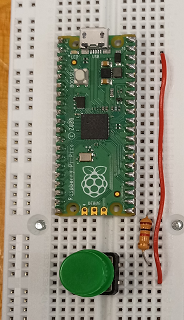

# Data Acquisition aNd DisplaY

## 1.0 Introduction

### 1.1 Audience 
This guide is intended for,
 - New Engineering students with python background
 - Engineers willing to learn new way to perform data acquisition using python language
 - People no prior experiece with python
 - People with python in their computer at version 3.7. 
 


### 1.2 What is Dandy?
I plan to write a set of reusable python examples or a library of python functions to help display sensor data in a graphical user interface (GUI).

#### 1.2.1 What am I building?
Here's a typical hardware setup. A sensor is connected to a microcontroller. The microcontroller sends the sensor data to a laptop either over USB or Bluetooth. Data is displayed in a GUI on the laptop, perhaps numerically, as a needle rotating in a dial, or on a chart plot. 

All of these steps can be implemented using existing open software, but some steps are easier than others. For example, Arduino makes writing the microcontroller software easy, and Tkinter and Qt are user-friendly libraries for writing GUIs. Where are the challenges in writing the software? First, the code for the microcontroller and the code for the GUI on the laptop are typically written in different languages. Multiple languages are not a problem for an experienced coder, but they are an obstacle for a novice or a hobbyist. Second, libraries for writing GUI software typically have reusable widgets like buttons and sliders, but they don't have ones made specifically for handling inputs from analog sensors. Third, the software on the laptop has to both continually read from the sensors and continually update the GUI. These should appear to the user to happen simultaneously, without either task blocking the other. 

#### 1.2.2 The goal 
Of this project is not to show a new application of sensors. Instead, it is to make writing software for this typical setup easier. More specifically, I plan to write a set of reusable examples that show how to solve the problems described above. These examples will use MicroPython for the microcontroller code and Python for laptop code. The GUI will be written using Tkinter and will show example reusable widgets for displaying the analog sensor data. 

#### 1.2.3 Who is this project for?
This project has tutorials and widgets to help you connect sensors, a microcontroller, and a computer. It aims to simplify the step of writing Python code for displaying the sensor data.

Here's who this project is not for ... This library is intended to be used by Python programmers. If you haven't programmed before or haven't programmed in Python, this library isn't for you. This library is intended to help you connect your hardware and your computer quickly but in an unpolished way. It doesn't involve real time operating systems. Also, it isn't for highly customizable and polished products. You'll want more developed tools for that task.

## 2.0 Installation

### 2.1 Check python version

If you do not know what verison you have, you can execute the below command in the cmd line

 ```python
 py --version
 ```
 
### 2.2 GitHub Dandy
 
 Download Dandy repository, open the command prompt and execute the command of below.
 
 ```python
 git clone https://github.com/amitofsk/dandy.git
 ```
 
### 2.3 Install the pyserial library

In the command line execute
```python
pip install pyserial
```


## 3.0 Displaying Didital Inputs

### 3.1 What Tkinter is?
Tkinter is a set of libraries for making graphical user interfaces that comes with python.

### 3.2 Tkinter widgets 

```python
import tkinter as tk

# We re defining a class named DigitalNoHW here.
class DigitalNoHW:

# The function __init__ is the constructor for the class.
    def __init__(self):
        self.main_window=tk.Tk()
        self.button_quit=tk.Button(self.main_window, text="Quit", \
                            command=self.main_window.destroy)
        self.button_quit.pack()
        tk.mainloop()

# Here is our main function which creates an object of class DigitalNoHW.
if __name__=="__main__":
    mygui=DigitalNoHW()

```
Run the code of above, you will see a window with a working quick button.

(TODO Andy, put pictures)

```python
import tkinter as tk

# We re defining a class named DigitalNoHW here.
class DigitalNoHW:

# The function __init__ is the constructor for the class.
    def __init__(self):
        self.main_window=tk.Tk()
        self.button_quit=tk.Button(self.main_window, text="Quit", \
                            command=self.main_window.destroy)
        self.button2=tk.Button(self.main_window, text="Toggle", \
                            command=self.main_window.getValue)
        self.button_quit.pack()
        self.button2.pack()
        tk.mainloop()
    def getValue(self):
        print ("Comming soon")
        
# Here is our main function which creates an object of class DigitalNoHW.
if __name__=="__main__":
    mygui=DigitalNoHW()
```

(TODO Andy, put pictures)

Run the code of above and you will see two button in a window, when you press the Toggle button you will see the message Comming Soon in the command line.

### 3.3 Dandy Widgets
Until, we have only using python with the tkinter library, now we are using the widgets of the Dandy library

```python
import tkinter as tk
import sys
sys.path.append ('../widgets') 
import LEDDisplay as ld

# We re defining a class named DigitalNoHW here.
class DigitalNoHW:

# The function __init__ is the constructor for the class.
    def __init__(self):
        self.main_window=tk.Tk()
        self.button_quit=tk.Button(self.main_window, text="Quit", \
                            command=self.main_window.destroy)
        self.button2=tk.Button(self.main_window, text="Toggle", \
                            command=self.main_window.getValue)
        self.led1.LEDDisplay(self.main_window)
        self.button_quit.pack()
        self.button2.pack()
        self.led1.pack()
        tk.mainloop()
        
    def getValue(self):
        if (self.led1.get_color()=='yellow'):
             self.led1.change_LED_color ("blue")
        elif (self.led1.get_color()=='blue'):
             self.led1.change_LED_color ("yellow")
# Here is our main function which creates an object of class DigitalNoHW.
if __name__=="__main__":
    mygui=DigitalNoHW()
```

When executing the code of above, you will two button & an LED and when you press the Toggle button the LED color changes.

(TODO Andy, put pictures)

### 3.4 Hardware: LED, button, Microcontroller

#### 3.4.1 Solder headers on Micrpcontroller (if needed)
(TODO Andy, put pictures) If there are not headers on the RPi then they can be soldered.


#### 3.4.2 Option A: Micropython and RPiPico
##### 3.4.2.1 Build the circuit
Connect a button and a resistor between GP16 & 5V (pin 39) <br>
Connect a resistor and LED between GP19 & GND

Here is the link of the circuit https://datasheets.raspberrypi.com/pico/Pico-R3-A4-Pinout.pdf <br>

##### 3.4.2.2 Installation

**Steps**
1. Download the latest release from https://micropython.org/download/rp2-pico/
2. Hold the botton down and plug in the Rpi by using the USB cable
3. In windows explorer should see now the Rpi Drive available 
4. In windows explorer drag the file you just downloaded to that drive
5. Unplug the USB cable, without plugging the button in (BOOTSEL)
6. In this example we are using MU Integrated Development Environment (IDE), download it from this website codewith.mu/en/download . Thonny could also be used instead of MU.
7. Open the MU editor, select Micropython and the Raspberry PiPico (it may ask for this option or select the Mode button)

##### 3.4.2.3 Blinky lights

**Steps**
1. In the python file in the MU editor, print hello

```python
print ("Hello")
```

2. Run the file to make sure it works
3. We are ready to use the push button you wired earlier


```python
from machine import Pin
import time
print ("hello")

button = Pin(16, Pin.IN, Pin.PULL_DOWN)
led=Pin(25, Pin.OUT)
while True:
    if button.value():
        print("T")
        led.value(True)
    else:
        print("F")
        led.value(False)
    time.sleep(1)
```
The fifth line tells the RPPico that we will call pin GP25, the built in LED, the name led. This line also says GP25 will be a digital output.  <br><br>
The fourth line tells the RPPico that we will call pin GP16, which is also called pin 21 in the pinout diagram, button. This line also say as GP16 will be a digital input. 
The Pin.PULL_DOWN option connects the pin to an internal resistor so that when nothing is connected to it, the pin will be low.   
4. Run the code of step 3, when you hold down the button it will print T otherwise it prints F.


#### 3.4.2 Option B: Circuitpython and RPiPico
##### 3.4.2.1 Build the circuit
##### 3.4.2.2 Installation

**Steps**
1. Download the latest release from https://circuitpython.org/board/raspberry_pi_pico/
2. Hold the botton down and plug in the Rpi by using the USB cable
3. In windows explorer should see now the Rpi Drive available 
4. In windows explorer drag the file you just downloaded to that drive
5. Unplug the USB cable, without plugging the button in (BOOTSEL)
6. In this example we are using MU Integrated Development Environment (IDE), download it from this website codewith.mu/en/download . Thonny could also be used instead of MU.
7. Open the MU editor, select Circuitpython and the Raspberry PiPico (it may ask for this option or select the Mode button)

##### 3.4.2.3 Blinky lights

**Steps**
1. In the python file in the MU editor, print hello

```python
print ("Hello")
```

2. Run the file to make sure it works
3. We are ready to use the push button you wired earlier


```python
import time
import board
import digitalio

print ("hello")
led=DigitalInOut(board.LED)
led.direction=digitalio.Direction.OUTPUT
button=DigitalInOut(board.GP16)
button.direction=digitalio.Direction.INPUT
while True:
    if button.value():
        print("T")
        led.value(True)
    else:
        print("F")
        led.value(False)
    time.sleep(1)
```
The fifth line tells the RPPico that we will call pin GP25, the built in LED, the name led. This line also says GP25 will be a digital output.  <br><br>
The fourth line tells the RPPico that we will call pin GP16, which is also called pin 21 in the pinout diagram, button. This line also say as GP16 will be a digital input. 
The Pin.PULL_DOWN option connects the pin to an internal resistor so that when nothing is connected to it, the pin will be low.  
Reference: https://learn.adafruit.com/getting-started-with-raspberry-pi-pico-circuitpython/traffic-light-and-pedestrian-crossing  
4. Run the code of step 3, when you hold down the button it will print T otherwise it prints F.


#### 3.4.2 Option C: Micropython& CY8CPROTO
#### 3.4.2.1 Build the circuit
##### 3.4.2.2 Installation
##### 3.4.2.3 Blinky lights
#### 3.4.2 Option D: Arduino
#### 3.4.2.1 Build the circuit
##### 3.4.2.2 Installation
##### 3.4.2.3 Blinky lights

Follow the instructions provided by Thonny link thru the Use digital inputs and outputs.

### 3.5 Sending data serially from the microcontroller to the computer.
1. Close the MU editor. 
2. Open IDLE or your favourite text editor.
3. Copy or type the following example. We will run this code on the computer, not the microcontroller.
```python
import serial
import serial.tools.list_ports as port_list

print('Hello')
ports=list(port_list.comports())
port=(ports[0].device)
print(ports[0].device)
#If you are on Windows and get an error saying port not found, try the next line.
#port='COM1'
#If you are on Linux and get an error saying port not found, try the next line.
#port='/dev/ttyACM0'
baudrate=115200
serialPort=serial.Serial(port=port, baudrate=baudrate, bytesize=8, timeout=0.1, stopbits=serial.STOPBITS_TWO)
while True:
    serialString=serialPort.read()
    print(serialString)
serialPort.close()
```
4. Run this code. You should see output that contains the characters T and F.
### 3.6 Sending data, now with widgets and asyncio
#### 3.6.1 What is asyncio and why do we need it here.
Tkinter is the graphics library. Typically, tkinter runs in a loop to continually refresh the graphical user interface. In the previous example, we used a loop to continually read serially.
The problem is we want both loops to run continuously in parallel. One possible solution would be to put each of these tasks in different threads. 
We are not quite doing this, but we are doing something quite similar. 
<br><br>
We will be using the asyncio python library. This library isn't quite multithreadding, but it accomplishes the same task. 
Also, instead of telling tkinter to loop continually, we will tell it to manually update inside a loop. 
The asyncIO library is new to python, so make sure you are at least using version 3.7 of python.
<br><br> 
More info on asyncIO can be found at https://realpython.com/async-io-python.
Information on using asyncIO with tkinter came from https://stackoverflow.com/questions/47895765/use-asyncio-and-tkinter-or-another-gui-lib-together-without-freezing-the-gui 

#### 3.6.2 A first example using tkinter widgets

Make sure the microcontroller is plugged in and still running the previous example.
<br><br>
Run this example. You will see a small icon and a quit button.
When you press the pushbutton on the circuit connected to the microcontroller, the small icon will change.

```python
#Read the instructions in Dandy.md. 
#Before running this program, upload the serialRead.py to your microcontroller.
#When this runs, you will see a small icon and a quit button.
#When you press the pushbutton on the circuit connected to the microcontroller, 
#the small icon will change.

#Information on asyncIO came from:
#https://realpython.com/async-io-python
#Information on getting tkinter and asyncio to work together came from:
#https://stackoverflow.com/questions/47895765/use-asyncio-and-tkinter-or-another-gui-lib-together-without-freezing-the-gui-lib-together-without-freezing-the-gui-lib-together-without-freezing-the


import asyncio
import tkinter as tk
import itertools as it
import time
import serial
import serial.tools.list_ports as port_list

class DigDisplay(tk.Tk):
    #Here's the constructor for the class DigDisplay.
    #This is a child of tk.Tk which opens a window.
    def __init__(self, loop, interval=1/40):
        super().__init__()
        self.loop=loop
        self.protocol("WM_DELETE_WINDOW", self.close)
        self.q=asyncio.Queue()
        self.tasks=[]
        #We'll have three async tasks, named checkdigin, consumeQueue, and updater.
        #Each of these are detailed in their own function.
        self.tasks.append(loop.create_task(self.checkdigin(1/20,self.q)))
        self.tasks.append(loop.create_task(self.consumeQueue(1/20, self.q)))
        self.tasks.append(loop.create_task(self.updater(interval)))
        #Set up the widgets and pack them into the window.
        self.digBit=1
        self.buttonQuit=tk.Button(self, text="Quit", command=self.close)
        self.smileOn=tk.PhotoImage(file='./smileOn.png')
        self.smileOff=tk.PhotoImage(file='./smileOff.png')
        self.label1=tk.Label(self, image=self.smileOn)
        self.label1.pack()
        self.buttonQuit.pack()


    async def checkdigin(self, interval, qIn:asyncio.Queue):
        #This asyncio function reads from the serial port and writes to the queue if it finds T or F.
        ports=list(port_list.comports())
        print(ports[0].device)
        port=ports[0].device
        #If you are on windows and you get an error saying it can't find the port, try the line below.
        #port='COM6'
        #If you are on linux and you get an error saying it can't find the port, try the line below.
        #port='/dev/ttyACM0'
        baudrate=115200
        serialPort=serial.Serial(port=port, baudrate=baudrate, bytesize=8, timeout=0.1, stopbits=serial.STOPBITS_TWO)
        imax=10000
        for ii in range(imax):
            await asyncio.sleep(interval)
            serialByte=serialPort.read()
            serialInt=int.from_bytes(serialByte, "big")
            if serialInt != 0:
                await qIn.put(serialByte)
                print(serialByte)
        serialPort.close()
        

    async def consumeQueue(self, interval, qIn: asyncio.Queue):
        #This asyncio function reads from the queue and sets the appropriate picture if necessary
        while True:
            await asyncio.sleep(interval)
            i=await qIn.get()
            #The character T has ascii value 84. The character F has 
            #ascii value 70. We're actually reading in individual bytes.
            #The next line converts bytes to integers.
            intval=int.from_bytes(i, "big")
            print(intval)
            if intval==84:
                print("Found T")
                self.label1.configure(image=self.smileOn)
            if intval==70:
                print("Found F")
                self.label1.configure(image=self.smileOff)
                


    async def updater(self, interval):
        #This async function manually updates the tkinter GUI.
        while True:
            self.update()
            await asyncio.sleep(interval)

    def close(self):
        for task in self.tasks:
            task.cancel()
        self.loop.stop()
        self.destroy()
        
        
if __name__=="__main__":
    loop=asyncio.get_event_loop()
    app=DigDisplay(loop)
    loop.run_forever()
    loop.close()
```

#### 3.6.3 A second example using tkinter and Dandy widgets


## 2.0 Analog Sensors