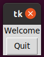

# Data Acquisition aNd DisplaY

## 1.0 Introduction
### 1.1 What is DANDY?
DANDY is a set of reuseable python examples and a library of python functions to help display sensor data in a graphical user interface (GUI).

### 1.2 What are we building?
Here's a typical hardware setup. A sensor is connected to a microcontroller. The microcontroller sends the sensor data to a computer either over USB or wirelessly. Data is displayed in a GUI on the laptop, perhaps numerically, as a needle rotating in a dial, using a slider, or on a chart plot.
<br><br>
All of these steps can be implemented using existing open software, but some steps are easier than others. For example, Arduino makes writing the microcontroller software easy, and Tkinter and Qt are user-friendly libraries for writing GUIs. Where are the challenges in writing the software? First, the code for the microcontroller and the code for the GUI on the laptop are typically written in different languages. Multiple languages are not a problem for an experienced coder, but they are an obstacle for a novice or a hobbyist. Second, libraries for writing GUI software typically have reusable widgets like buttons and sliders, but they don't have ones made specifically for handling inputs from analog sensors. Third, the software on the laptop has to both continually read from the sensors and continually update the GUI. These should appear to the user to happen simultaneously, without either task blocking the other.
<br><br> 
This project addresses all of these challenges. The goal of this project is not to show a new application of a sensor. Instead, it is to make writing software for this typical setup easier. 


### 1.3 Who is this tutorial for?

This guide is intended for:
 - Students interested in learning about sensor hardware, microcontroller programming,  and writing GUI software.
 - Engineers who want to learn a new way to perform data acquisition using the Python language. 
 - People with at least a little Python coding experience. For example, you should know how to write functions in Python, and you should know what classes and objects are. 
<br><br>
This guide is NOT for you if:
 - You have not programmed before.
 - You want to acquire sensor data with precise timing. In this project, data collection happens with an inexpensive microcontroller without a real time operating system.
 - You want to collect data using elaborate equipment. This project involves small discte sensors.  


## 2.0 Instal software and gather supplies

### 2.1 Check your Python installation

This tutorial requires at least Python version 3.7. If you do not know what verison you have, use the following command on the command line.

 ```python
 py --version
 ```
Python comes with a minimalist Integrated Developement Environment (IDE) named IDLE. This tutorial assumes you will use IDLE to write Python code that will be run on the computer. However, you can use another IDE such as Pycharm or Thonny if you prefer, or you can use your favorite text editor.    
 
### 2.2 Install the pyserial library 

In the command line, execute
```python
pip install pyserial
```


### 2.3 Download the DANDY library.

Change to the directory that you want work in. Then, use the following command in the command line to download the DANDY repository from github. 
 
 ```python
 git clone https://github.com/amitofsk/dandy.git
 ```
 
### 2.4 Download and install the MU IDE
This tutorial will involve both writing Python code for a computer as well as writing Micropython, Circuitpython, or Arduino code for a microcontroller. We'll write Python code for the computer using the IDLE IDE. We'll write Micropython or Circuitpyton code for the microcontroller using the MU IDE. However, you can use other IDE's for the microcontroller programming, such as Thonny, if you prefer. If you are using an Arduino microcontroller, Arduino has its own IDE.
<br><br>
One advantage of using a different IDE for the computer code and the microcontroller code is that the IDE will remind you which hardware you are programming for. 
<br><br>
Download the MU IDE from https://codewith.mu/en/download. Install it. 

### 2.4 Supplies needed
Coming soon ...


## 3.0 Displaying Digital Inputs
Hardware used in section 3:
- Small Protoboard
- Three buttons
- Wire, resistors
- USB cable to connect your microcontroller
- Microcontroller
  - Options A and B: Raspberry Pi Pico
  - Option C: CY8CProto
  - Option D: Arduino
<br><br>

Files used in section 3:
- widgets/LEDDisplay.py
- widgets/LEDBarDisplay.py
- widgets/SymbolDisplay.py (maybe?)
- utilities/SerialAndGui.py
- examples/DigitalNoHW.py
- examples/DigitalHWShort.py
- examples/DigitalWithHW
- examples/ButtonGUI.py
- examples/ButtonPicGUI.py
### 3.1 What Tkinter is?
Tk is a cross-platform set of tools for writing graphical user interfaces (GUIs). Tkinter is a python's version of the library for making GUIs, and it comes preinstalled with python. 
<br><br>
Tkinter has lots of built in widgets including labels, buttons, scales, and spinboxes. For a nice list along with the API reference, see https://tkdocs.com/pyref/. 

### 3.2 Tkinter widgets 
Let's write our first GUI program using Python and Tkinter. In this example, we use two Tkinter widgets: Label and Button. The pack function puts the widget into the window. 
<br><br>
Try out the example below. You should see a window with a label and a working quit button. If you downloaded the DANDY library, these examples are in the src/examples directory.

```python
import tkinter as tk

#Define the ButtonGUI class, which is a child of Tk.
class ButtonGUI(tk.Tk):
    # The function __init__ is the constructor for the class.
    def __init__(self):
        super().__init__()
        self.label1=tk.Label(self, text="Welcome")
        self.button_quit=tk.Button(self, text="Quit", \
                            command=self.destroy)
        #We pack widgets to put them in the window.
        self.label1.pack()
        self.button_quit.pack()
        tk.mainloop()

# Here is our main function which creates an object of class ButtonGUI.
if __name__=="__main__":
    mygui=ButtonGUI()
```

<br><br><br>
Let's try another example to get more familiar with Tkinter. This example will have a label which shows an image, a quit button, and a second button. If you press that button, the label toggles between two images. Here we write our own function, named toggle_me, that is executed when the button is pressed. 
<br><br> Try out this example too.
```python
import tkinter as tk

class ButtonPicGUI(tk.Tk):
    def __init__(self):
        super().__init__()
        self.smileOn=tk.PhotoImage(file='./smileOn.png')
        self.smileOff=tk.PhotoImage(file='./smileOff.png')
        self.image_number=0

        #This label contains a PhotoImage instead of text.
        self.label1=tk.Label(self, image=self.smileOn)
        #When button1 is pressed, the instructions in the function
        #toggle_me are followed. We define this function below.
        self.button1=tk.Button(self, text="Press Me", \
                               command=self.toggle_me)
        self.button_quit=tk.Button(self, text="Quit", \
                                   command=self.destroy)

        self.label1.pack()
        self.button1.pack()
        self.button_quit.pack()

        tk.mainloop()

        
    #Here we define the toggle_me function
    def toggle_me(self):
        if self.image_number==0:
            self.label1.configure(image=self.smileOff)
            self.image_number=1
        else:
            self.label1.configure(image=self.smileOn)
            self.image_number=0


if __name__=="__main__":
    mygui=ButtonPicGUI()
```


### 3.3 DANDY widgets for digital inputs
Our examples so far have used widgets that are part of the Tkinter library that comes with Python. The DANDY library, which you just installed, has additional widgets. These widgets are related to data acquisition. The next example uses the DANDY widget LEDDisplay. When you run it, you will see two buttons and an image of an LED. When you press the button, the LED color changes. Try it out.
<br><br>
You may need to change the third line to point to the location of the widgets folder of the DANDY library that you downloaded. This example is also available in the examples folder of the DANDY library. If you open that version, Python should find the widgets folder correctly.


```python

import tkinter as tk
import sys
#We need to import the file for the LEDDisplay widget
#You may need to change the next line so it points to the correct directory.
sys.path.append('../widgets')
import LEDDisplay as ld

class DigitalNoHW(tk.Tk):
    def __init__(self):
        super().__init__()
        #The class LEDDisplay is defined in the file ../widgets/LEDDisplay.py
        self.led1=ld.LEDDisplay(self)
        self.button1=tk.Button(self, text="Press Me", \
                               command=self.toggle_me)
        self.button_quit=tk.Button(self, text="Quit", \
                                   command=self.destroy)

        self.led1.pack()
        self.button1.pack()
        self.button_quit.pack()

        tk.mainloop()

        
    #Here we define the toggle_me function
    def toggle_me(self):
        if(self.led1.get_color()=="yellow"):
            self.led1.change_LED_color("blue")
        else:  
            self.led1.change_LED_color("yellow")


if __name__=="__main__":
    mygui=DigitalNoHW()
```


### 3.4 Hardware: LED, button, Microcontroller

#### 3.4.1 Solder headers on Micrpcontroller (if needed)
(TODO Andy, put pictures) If there are not headers on the RPi then they can be soldered.


#### 3.4.2 Option A: Micropython and RPiPico
##### 3.4.2.1 Build the circuit
Connect a button and a resistor between GP16 & 5V (pin 39) <br>
Connect a resistor and LED between GP19 & GND

Here is the link of the circuit https://datasheets.raspberrypi.com/pico/Pico-R3-A4-Pinout.pdf <br>

##### 3.4.2.2 Installation

**Steps**
1. Download the latest release from https://micropython.org/download/rp2-pico/
2. Hold the botton down and plug in the Rpi by using the USB cable
3. In windows explorer should see now the Rpi Drive available 
4. In windows explorer drag the file you just downloaded to that drive
5. Unplug the USB cable, without plugging the button in (BOOTSEL)
6. In this example we are using MU Integrated Development Environment (IDE), download it from this website codewith.mu/en/download . Thonny could also be used instead of MU.
7. Open the MU editor, select Micropython and the Raspberry PiPico (it may ask for this option or select the Mode button)

##### 3.4.2.3 Blinky lights

**Steps**
1. In the python file in the MU editor, print hello

```python
print ("Hello")
```

2. Run the file to make sure it works
3. We are ready to use the push button you wired earlier


```python
from machine import Pin
import time
print ("hello")

button = Pin(16, Pin.IN, Pin.PULL_DOWN)
led=Pin(25, Pin.OUT)
while True:
    if button.value():
        print("T")
        led.value(True)
    else:
        print("F")
        led.value(False)
    time.sleep(1)
```
The fifth line tells the RPPico that we will call pin GP25, the built in LED, the name led. This line also says GP25 will be a digital output.  <br><br>
The fourth line tells the RPPico that we will call pin GP16, which is also called pin 21 in the pinout diagram, button. This line also say as GP16 will be a digital input. 
The Pin.PULL_DOWN option connects the pin to an internal resistor so that when nothing is connected to it, the pin will be low.   
4. Run the code of step 3, when you hold down the button it will print T otherwise it prints F.


#### 3.4.2 Option B: Circuitpython and RPiPico
##### 3.4.2.1 Build the circuit
##### 3.4.2.2 Installation

**Steps**
1. Download the latest release from https://circuitpython.org/board/raspberry_pi_pico/
2. Hold the botton down and plug in the Rpi by using the USB cable
3. In windows explorer should see now the Rpi Drive available 
4. In windows explorer drag the file you just downloaded to that drive
5. Unplug the USB cable, without plugging the button in (BOOTSEL)
6. In this example we are using MU Integrated Development Environment (IDE), download it from this website codewith.mu/en/download . Thonny could also be used instead of MU.
7. Open the MU editor, select Circuitpython and the Raspberry PiPico (it may ask for this option or select the Mode button)

##### 3.4.2.3 Blinky lights

**Steps**
1. In the python file in the MU editor, print hello

```python
print ("Hello")
```

2. Run the file to make sure it works
3. We are ready to use the push button you wired earlier


```python
import time
import board
import digitalio

print ("hello")
led=DigitalInOut(board.LED)
led.direction=digitalio.Direction.OUTPUT
button=DigitalInOut(board.GP16)
button.direction=digitalio.Direction.INPUT
while True:
    if button.value():
        print("T")
        led.value(True)
    else:
        print("F")
        led.value(False)
    time.sleep(1)
```
The fifth line tells the RPPico that we will call pin GP25, the built in LED, the name led. This line also says GP25 will be a digital output.  <br><br>
The fourth line tells the RPPico that we will call pin GP16, which is also called pin 21 in the pinout diagram, button. This line also say as GP16 will be a digital input. 
The Pin.PULL_DOWN option connects the pin to an internal resistor so that when nothing is connected to it, the pin will be low.  
Reference: https://learn.adafruit.com/getting-started-with-raspberry-pi-pico-circuitpython/traffic-light-and-pedestrian-crossing  
4. Run the code of step 3, when you hold down the button it will print T otherwise it prints F.


#### 3.4.2 Option C: Micropython& CY8CPROTO
#### 3.4.2.1 Build the circuit
##### 3.4.2.2 Installation
##### 3.4.2.3 Blinky lights
#### 3.4.2 Option D: Arduino
#### 3.4.2.1 Build the circuit
##### 3.4.2.2 Installation
##### 3.4.2.3 Blinky lights

Follow the instructions provided by Thonny link thru the Use digital inputs and outputs.

### 3.5 Displaying digital data from the microcontroller on the computer
1. Close the MU editor. 
2. Open IDLE or your favourite text editor.
3. Copy or type the following example. We will run this code on the computer, not the microcontroller.
```python
import serial
import serial.tools.list_ports as port_list

print('Hello')
ports=list(port_list.comports())
port=(ports[0].device)
print(ports[0].device)
#If you are on Windows and get an error saying port not found, try the next line.
#port='COM1'
#If you are on Linux and get an error saying port not found, try the next line.
#port='/dev/ttyACM0'
baudrate=115200
serialPort=serial.Serial(port=port, baudrate=baudrate, bytesize=8, timeout=0.1, stopbits=serial.STOPBITS_TWO)
while True:
    serialString=serialPort.read()
    print(serialString)
serialPort.close()
```
4. Run this code. You should see output that contains the characters T and F.
### 3.6 Sending data, now with widgets and asyncio
#### 3.6.1 What is asyncio and why do we need it here.
Tkinter is the graphics library. Typically, tkinter runs in a loop to continually refresh the graphical user interface. In the previous example, we used a loop to continually read serially.
The problem is that we want both loops to run continuously and simultaneously. One possible solution would be to put each of these tasks in different threads. 
We are not quite doing this, but we are doing something quite similar. 
<br><br>
We will be using the asyncIO python library. This library isn't quite multithreadding, but it accomplishes the same task. 
Also, instead of telling tkinter to loop continually, we will tell it to manually update inside a loop. 
The asyncIO library is new to python, so make sure you are at least using Python version 3.7.
<br><br> 
More info on asyncIO can be found at https://realpython.com/async-io-python.
Information on using asyncIO with tkinter came from https://stackoverflow.com/questions/47895765/use-asyncio-and-tkinter-or-another-gui-lib-together-without-freezing-the-gui 

#### 3.6.2 Tkinter and Widgets, the short (and recommended) way

Make sure the microcontroller is plugged in and still running the previous example.
<br><br>
Run the example below. When you run it, you will see a window with an LEDDisplay widget and a quit button. When the pushbutton connected to your microcontroller is held down, the LEDDisplay widget will be yellow. Otherwise it will be blue.
<br><br>
Even though this example is short, it has a lot going on. The DigitalHWShort class defined in this example is a child of class SerialAndGui which is a child of Tk. The class SerialAndGui comes with the DANDY library, and it is detailed in ../utilities/SerialAndGui.py. 
The class SerialAndGui is an abstract class. If you run it by itself, you see an empty window which is not useful. Instead, as shown below, you should define a child class and overload the constructor and the use_serial_data function.
<br><br>
The SerialAndGui class involves three asynchronous tasks: check_serial_data, use_serial_data, and updater. Each is defined in its own function. The check_serial_data task reads from the serial port and writes the result to a queue. The use_serial_data task reads from the queue and does something with the data it finds. The updater task updates the GUI. All of these happen inside loops which appear to happen simultaneously. 
<br><br>
You don't have to write all the code for these tasks every time you want to use them. Instead, you can just define a child class of SerialAndGui as shown below.   

```python
import asyncio
import tkinter as tk
import time
import serial
import serial.tools.list_ports as port_list
import sys
sys.path.append('../widgets')
sys.path.append('../utilities')
import LEDDisplay as ld
import SerialAndGui as sg

class DigitalHWShort(sg.SerialAndGui):
    #Here's the constructor.
    def __init__(self, loop, interval=1/20):
        super().__init__(loop)
        #The line above says run the parent's constructor.
        #The parent's constructor starts the three async tasks:
        #check_serial_data, use_serial_data, and updater.
        #Below, we set up the widgets for a simple GUI
        #and pack them in the window.
        self.led1=ld.LEDDisplay(self)
        self.button_quit=tk.Button(self, text="Quit", \
                                   command=self.close)
        self.led1.pack()
        self.button_quit.pack()

  
    #This async function reads from the queue and uses the data it finds.
    #We're overloading the parent's version of this function.
    async def use_serial_data(self, interval, qIn: asyncio.Queue):
        while True:
            await asyncio.sleep(interval)
            in_string=await qIn.get()

            if in_string=="T":
                print("T")
                self.led1.change_LED_color("yellow")
            if in_string=="F":
               print("F")
               self.led1.change_LED_color("blue")


if __name__=="__main__":
    loop=asyncio.get_event_loop()
    example=DigitalHWShort(loop)
    loop.run_forever()
    loop.close()
```

<br><br>
(TODO: Fix the whole port naming issue... It should be an input here somewhere)

#### 3.6.3 Tkinter and Widgets, the long way
The previous example relied on the SerialAndGui class. A lot of the details were swept up into that class. What if you want to write all the instructions yourself? 
<br><br>
This example accomplishes the same task as the previous example. Before you run it, make sure your microcontroller is still plugged in and running its code. When you run this example, you will see a window with an LEDDisplay widget. When the pushbutton connected to the microcontroller is pressed, the LEDDisplay is yellow, and otherwise it is blue. 
<br><br>
In this example, you can see the details of how to use asyncIO to both read from the serial port and update the Tkinter GUI. As explained above, it involves three asynchronous tasks, which are detailed in the functions check_serial_data, use_serial_data, and updater. The DigitalWithHW class defined below is a child only of Tk, so the details of using asyncIO are not hidden in a parent class. You don't need to understand every line of this example, and I recommend using the short example above instead. 

```python

import asyncio
import tkinter as tk
import time
import serial
import serial.tools.list_ports as port_list
import sys
sys.path.append('../widgets')
import LEDDisplay as ld

class DigitalWithHW(tk.Tk):
    #Here's the constructor for the DigitalWithHW class.
    #DigitalWithHW is a child of class tk.Tk, which opens a window.
    def __init__(self, loop, interval=1/20):
        super().__init__()
        self.loop=loop
        self.protocol("WM_DELETE_WINDOW", self.close)

        #We have three async tasks: check_serial_data, use_serial_data
        #and updater. Each are detailed in their own function.
        self.q=asyncio.Queue()
        self.tasks=[]
        self.tasks.append(loop.create_task \
                          (self.check_serial_data(interval, self.q)))
        self.tasks.append(loop.create_task \
                          (self.use_serial_data(interval, self.q)))
        self.tasks.append(loop.create_task(self.updater(interval)))

        #Set up the widgets for a simple GUI and pack them in the window.
        self.led1=ld.LEDDisplay(self)
        self.button_quit=tk.Button(self, text="Quit", \
                                   command=self.close)
        self.led1.pack()
        self.button_quit.pack()

        #Notice that we don't start Tkinter's main loop here. Instead
        #the function updater will update the GUI.

        
    async def check_serial_data(self, interval, qIn: asyncio.Queue):
        #This async function reads data from the serial port and puts the
        #data in the queue.

        #Set up to read from the serial port.
        ports=list(port_list.comports())
        print(ports[0].device)
        port=ports[0].device
        #If you are on windows and you get an error saying it can't find the port, try the line below.
        #port='COM1'
        #If you are on linux and you get an error saying it can't find the port, try the line below.
        port='/dev/ttyACM0'
        baudrate=115200
        serial_port=serial.Serial(port=port, baudrate=baudrate, bytesize=8, timeout=0.1, stopbits=serial.STOPBITS_TWO)
        
        #Read a byte at a time from the serial port.
        #Convert the byte to a string, and put the string in the queue.
        
        #TODO: Move setting port to very top...That step is needed.
        #In linux, I had to set port manually here.
        while True:
            await asyncio.sleep(interval)
            serial_byte=serial_port.read()
            serial_string=serial_byte.decode()
            if serial_string != "":
                await qIn.put(serial_string)
                #Uncomment the next line to see what the serial port is getting.
                #print(serial_byte)
        serial_port.close()
        

    async def use_serial_data(self, interval, qIn: asyncio.Queue):
        #This async function reads from the queue and uses the data it finds.
        while True:
            await asyncio.sleep(interval)
            in_string=await qIn.get()
            if in_string=="T":
                print("T")
                self.led1.change_LED_color("yellow")
            if in_string=="F":
                print("F")
                self.led1.change_LED_color("blue")
        

    async def updater(self, interval):
        #This async function manually updates the Tkinter GUI.
        while True:
            self.update()
            await asyncio.sleep(interval)


    def close(self):
        for task in self.tasks:
            task.cancel()
        self.loop.stop()
        self.destroy()


if __name__=="__main__":
    loop=asyncio.get_event_loop()
    example=DigitalWithHW(loop)
    loop.run_forever()
    loop.close()

```


(TODO: separate the serial setup into its own function... the port should be an input)
#### 3.6.4 An example with the LEDBarDisplay widget
Add another digital example here that involves three buttons, the LEDDisplay widget, and making a class that is a child of SerialAndGui...

## 4.0 Displaying analog inputs

### 4.1 DANDY widgets for analog inputs

### 4.2 Hardware: Potentiometers, sensors, and a Microcontroller

#### 4.2.1 Option A: Micropython and RPiPico
##### 4.2.1.1 Build the circuit
##### 4.2.2.2 Write the microcontroller code

#### 4.2.1 Option B: Circuitpython and the RPiPico
#### 4.2.1 Option C: Micropython and the CY8CPROTO
#### 4.2.1 Option D: Arduino

#### 4.3 Displaying analog data from the microcontroller on the computer
#### 4.4 Displaying analog data, now with widgets and asyncio
#### 4.5 Displaying vector data
## 5.0 Additional DANDY widgets

### 5.1 Examples with the microcontroller-like widgets...
