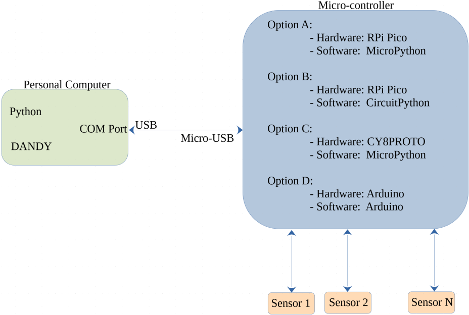
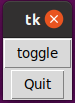

# Data Acquisition aNd DisplaY

## 1.0 Introduction
### 1.1 What is DANDY?
[`DANDY`](https://github.com/amitofsk/dandy) is a set of reuseable python examples and a library of python functions to help display sensor data in a graphical user interface (GUI).

### 1.2 What are we building?
Here's a typical hardware setup. A sensor is connected to a microcontroller. The microcontroller sends the sensor data to a computer either over USB or wirelessly. Data is displayed in a GUI on the laptop, perhaps numerically, as a needle rotating in a dial, using a slider, or on a chart plot.
<br><br>
All of these steps can be implemented using existing open software, but some steps are easier than others. For example, Arduino makes writing the microcontroller software easy, and Tkinter and Qt are user-friendly libraries for writing GUIs. Where are the challenges in writing the software? First, the code for the microcontroller and the code for the GUI on the laptop are typically written in different languages. Multiple languages are not a problem for an experienced coder, but they are an obstacle for a novice or a hobbyist. Second, libraries for writing GUI software typically have reusable widgets like buttons and sliders, but they don't have ones made specifically for handling inputs from analog sensors. Third, the software on the laptop has to both continually read from the sensors and continually update the GUI. These should appear to the user to happen simultaneously, without either task blocking the other.
<br><br> 
This project addresses all of these challenges. The goal of this project is not to show a new application of a sensor. Instead, it is to simplify writing software for this typical setup easier. 



### 1.3 Who is this tutorial for?

This guide is intended for:
 - Students interested in learning about sensor hardware, microcontroller programming,  and writing GUI software.
 - Engineers who want to learn a new way to perform data acquisition using the Python language. 
 - People with at least a little Python coding experience. For example, you should know how to write functions in Python, and you should know what classes and objects are. 
<br><br>

This guide is NOT for you if:
 - You have not programmed before.
 - You want a plug-and-play solution. This is a software library, so you will have to program.
 - You want to acquire sensor data with precise timing. In this project, data collection happens with an inexpensive microcontroller without a real time operating system.
 - You want to collect data using elaborate equipment. This project involves small discte sensors.  
## 2.0 Gather hardware supplies
Hardware used:
- Small Protoboard and wires
- Buttons that fit in the protoboard
- Resistors (300 $\Omega$ - 1k $\Omega$ ) 
- Potentiometer
- USB cable to connect your microcontroller
- Microcontroller
  - Options A and B: Raspberry Pi Pico
  - Option C: CY8CProto
  - Option D: Arduino

You will need to plug your microcontroller into a protoboard. If your microcontroller did not come with headers pre-installed, solder them on now.

The picture below shoes a Raspberry Pi Pico (RPi) without and with headers.


## 3.0 Install software

### 3.1 Check your Python installation

This tutorial requires at least Python version 3.7. It has been tested on both Windows and Linux systems.
<br><br>
If you do not have Python, you can download the latest version from [`Python's website`](https://www.python.org/downloads/).
<br><br>
If you do not know what version you have, run the command below in a command line terminal. On a Windows machine, use a Windows PowerShell window as the terminal.

 ```python
 py --version
 ```
Python comes with a minimalist Integrated Developement Environment (IDE) named IDLE. This tutorial assumes you will use IDLE to write Python code that will be run on the computer. However, you can use another IDE such as PyCharm or Thonny if you prefer, or you can use your favorite text editor.


### 3.3 Install the pyserial library 
In the terminal, execute
```python
pip install pyserial
```


 
### 3.4 Download the DANDY library.
The next step is to download the DANDY library from github. Github is a website that hosts tons of open source software projects. 
<br><br>
This step requires git. Git comes with Linux operating systems. If you are on a Windows machine, you may have to install it. Git can be downloaded from [`Git's website`](https://git-scm.com). Once you install it, open a GitBash terminal.  
<br><br>
Change to the directory that you want work in. Then, use the following command in the terminal to download the DANDY repository from github. 
 ```python
 git clone https://github.com/amitofsk/dandy.git
 ```
### 3.5 Install the Mu IDE or the Arduino IDE
This tutorial will involve both writing Python code for a computer as well as writing Micropython, Circuitpython, or Arduino code for a microcontroller. We'll write Python code for the computer using the IDLE Integrated Development Environment (IDE). We'll write Micropython or Circuitpyton code for the microcontroller using the Mu IDE. However, you can use other IDE's for the microcontroller programming, such as Thonny, if you prefer. If you are using an Arduino microcontroller, Arduino has its own IDE.
<br><br>
One advantage of using a different IDE for the computer code and the microcontroller code is that the IDE will remind you which hardware you are programming for. 
<br><br>
If you will be using MicroPython or CircuitPython for the microcontroller, download and install the Mu IDE from [`CodeWithMU`](https://codewith.mu/en/download). If you will be using Arduino, download and install the [`Arduino IDE`](https://www.arduino.cc/en/software/). 

(TODO: Add instructions for infineon ide.)


## 4.0 GUI Programming
Files used in section 4:
- widgets/LEDDisplay.py
- widgets/LEDBarDisplay.py (coming soon)
- widgets/SymbolDisplay.py (coming soon)
- examples/ButtonGUI.py
- examples/ButtonPicGUI.py
- examples/DigitalNoHW.py
- examples/smileOn.png
- examples/smileOff.png

### 4.1 What Tkinter is?
Tk is a cross-platform set of tools for writing graphical user interfaces (GUIs). Tkinter is Python's version of the library, and it comes preinstalled with Python. 
<br><br>
Tkinter contains many widgets including labels, buttons, scales, and spinboxes. For a nice list along with the API reference, see [`tkdocs`](https://tkdocs.com/pyref/). 

### 4.2 Tkinter widgets

#### 4.2.1 Example with a quit button 
Let's write our first GUI program using Python and Tkinter. We're writing code to run on the computer, not the microcontroller, in this section, so use the IDLE IDE. In this example, we use two Tkinter widgets: `Label` and `Button`. The `pack` function puts a widget into a window. 
<br><br>
Try out the example below. You should see a window with a label and a working quit button. 

If you downloaded the `DANDY` library, examples are in the `src/examples` directory. (See file src/examples/ButtonGUI.py.)

```python
import tkinter as tk

#Define the ButtonGUI class, which is a child of Tk.
class ButtonGUI(tk.Tk):
    # The function __init__ is the constructor for the class.
    def __init__(self):
        super().__init__()
        self.label1=tk.Label(self, text="Welcome")
        self.button_quit=tk.Button(self, text="Quit", \
                            command=self.destroy)
        #We pack widgets to put them in the window.
        self.label1.pack()
        self.button_quit.pack()
        tk.mainloop()

# Here is our main function which creates an object of class ButtonGUI.
if __name__=="__main__":
    mygui=ButtonGUI()
```

<br><br><br>
####4.2.2 Example with two buttons

Let's try another example to get more familiar with Tkinter. This example will have two `Buttons` and a `Label` which shows a `PhotoImage`. If you press one of the buttons, the label toggles between two images. Here we write our own function, named `toggle_me`, that is executed when the button is pressed. 
<br><br> 
Either make sure the images smileOn.png and smileOff.png are in the same directory as the example, or alter the code below to point to their location. This example and the images are also in the `example` directory of the `DANDY` library you downloaded. 
<br><br>
Try out this example too.
<br><br>
(See file src/examples/ButtonPicGUI.py.)
```python
import tkinter as tk

class ButtonPicGUI(tk.Tk):
    def __init__(self):
        super().__init__()
        self.smileOn=tk.PhotoImage(file='./smileOn.png')
        self.smileOff=tk.PhotoImage(file='./smileOff.png')
        self.image_number=0

        #This label contains a PhotoImage instead of text.
        self.label1=tk.Label(self, image=self.smileOn)
        #When button1 is pressed, the instructions in the function
        #toggle_me are followed. We define this function below.
        self.button1=tk.Button(self, text="Press Me", \
                               command=self.toggle_me)
        self.button_quit=tk.Button(self, text="Quit", \
                                   command=self.destroy)

        self.label1.pack()
        self.button1.pack()
        self.button_quit.pack()

        tk.mainloop()

        
    #Here we define the toggle_me function
    def toggle_me(self):
        if self.image_number==0:
            self.label1.configure(image=self.smileOff)
            self.image_number=1
        else:
            self.label1.configure(image=self.smileOn)
            self.image_number=0


if __name__=="__main__":
    mygui=ButtonPicGUI()
```


### 4.3 DANDY widgets for digital inputs

#### 4.3.1 The LEDDisplay widget

Our examples so far have used widgets that are part of the Tkinter library that comes with Python. The `DANDY` library, which you just installed, has additional widgets. These widgets are related to data acquisition. The next example uses the `DANDY` widget `LEDDisplay`. When you run it, you will see two buttons and an image of an LED. When you press the button, the LED color changes. Try it out.
<br><br>
You may need to change the third line to point to the location of the widgets folder of the `DANDY` library that you downloaded. This example is also available in the examples folder of the `DANDY` library. If you open that version, Python should find the widgets folder correctly.

(See file src/examples/DigitalNoHW.py.)

```python

import tkinter as tk
import sys
#We need to import the file for the LEDDisplay widget
#You may need to change the next line so it points to the correct directory.
sys.path.append('../widgets')
import LEDDisplay as ld

class DigitalNoHW(tk.Tk):
    def __init__(self):
        super().__init__()
        #The class LEDDisplay is defined in the file ../widgets/LEDDisplay.py
        self.led1=ld.LEDDisplay(self)
        self.button1=tk.Button(self, text="Press Me", \
                               command=self.toggle_me)
        self.button_quit=tk.Button(self, text="Quit", \
                                   command=self.destroy)

        self.led1.pack()
        self.button1.pack()
        self.button_quit.pack()

        tk.mainloop()

        
    #Here we define the toggle_me function
    def toggle_me(self):
        if(self.led1.get_color()=="yellow"):
            self.led1.change_LED_color("blue")
        else:  
            self.led1.change_LED_color("yellow")


if __name__=="__main__":
    mygui=DigitalNoHW()
```


#### 4.3.2 The LEDBarDisplay Widget
The DANDY library also contains the class `SymbolDisplay` for displaying ground and power symbols. It also contains the class `LEDBarDisplay` for displaying bars of LEDs. 
<br><br>
Try out the example below. When you run it, you will see a bar of 5 `LEDDisplay` widgets as well as three additional buttons. The first button toggles the LED color, the second button toggles the LED orientation, and the third button is a quit button.

(See file src/examples/LEDBarDemo.py.)

```python

import tkinter as tk
import sys 
sys.path.append ('../widgets') 
import LEDDisplay as ld
import SymbolDisplay as sd
import LEDBarDisplay as lbd

class LEDBarDemo(tk.Tk):
    def __init__(self):
        super().__init__()
        self.lbd1=lbd.LEDBarDisplay(self)
        self.button1=tk.Button(self, text="Change Color", command=self.color_me)
        self.button2=tk.Button(self, text="Change Orientation", \
                               command=self.rotate_me)
        self.button_quit=tk.Button(self, text="Quit", command=self.destroy)

        self.lbd1.pack()
        self.button1.pack()
        self.button2.pack()
        self.button_quit.pack()

        self.color1="blue"
        self.orient1="vertical"
        self.lbd1.set_all_color(self.color1)

        tk.mainloop()

    def color_me(self):
        if (self.color1=="blue"):
            self.color1="purple"
        else:
            self.color1="blue"
        self.lbd1.set_all_color(self.color1)

    def rotate_me(self):
        if (self.orient1=="vertical"):
            self.orient1="horizontal"
        else:
            self.orient1="vertical"
        self.lbd1.set_orientation(self.orient1)
        

if __name__=="__main__":
    mygui=LEDBarDemo()


```


## 5.0 Programming the microcontroller
Files used in section 5:
- microcontr/serialReadMP.py 
- microcontr/serialReadCP.py
- microcontr/serialReadArd.py
- microcontr/serialWriteMP.py
- microcontr/serialWriteCP.py
- microcontr/serialWriteArd.py

<br><br>
In section 4, we wrote Python code for the computer, and we used the IDLE IDE. In this section, we will instead write code for the microcontroller. This tutorial has four options:
 - Option A: Raspberry Pi Pico (RPi) and MicroPython 
 - Option B: Raspberry Pi Pico (RPi) and CircuitPython
 - Option C: Cy8cproto and MicroPython
 - Option D: Arduino
Follow the option of your choice for this section.

All of the examples in this section have three versions. The one with MP in its file name is the MicroPython version, the one with CP in its files name is the CircuitPython version, and the one with Ard in its file name is the Arduino version. 

### 5.1 Option A: Micropython and RPi
#### 5.1.1 Build the circuit
Connect a button between pin 21 (GP16) and pin 36 (3.3V power)<br>

Here is the [pinout](https://datasheets.raspberrypi.com/pico/Pico-R3-A4-Pinout.pdf) of the Raspberry Pi Pico (RPi). <br>


#### 5.1.2 Install MicroPython on the RPi
The RPi does not have a full operating system. Instead, we'll install MicroPython, which is a Python interpreter specifically for embedded devices. Think of MicroPython as a Python interpreter along with a minimal operating system, that contains just enough instructions to run a Python program. 
<br><br>
Download the latest release of MicroPython from [here](https://micropython.org/download/rp2-pico/).
<br><br>
The RPi has a small button on it labeled `BOOTSEL`. Hold that button down, and use a USB cable to plug the RPi into the computer. Once it is plugged in, you can release the button.
<br><br>
You should now see the RPi drive available (for example, in Windows Explorer). Drag the file that you just downloaded to that drive. 
<br><br>
Disconnect the RPi by unplugging the USB cable. Reconnect the RPi, this time without holding down the `BOOTSEL` button.  


#### 5.1.3  Blinky lights
Now we're ready to write our first MicroPython program that will run on the RPi. We'll use the Mu IDE, so open it now.
<br><br>
This step requires some libraries for interacting with the hardware, so you can't use IDLE or a text editor unless you manually download those libraries. If you don't want to use Mu, Thonny is another IDE option that has the needed libraries. This tutorial, however, uses Mu.
<br><br>
Write the following instruction in the editor, and press the `Run` button. You should see the result on the bottom of the Mu window.
```python
print ("Hello")
```

Now let's write a MicroPython program that uses the pushbutton you wired to the RPi. Copy the program below into the editor, and run it. 
(See file src/mircrocontr/serialWriteMP.py.)


```python
from machine import Pin
import time
print ("hello")

button = Pin(16, Pin.IN, Pin.PULL_DOWN)
led=Pin(25, Pin.OUT)
while True:
    if button.value():
        print("T")
        led.value(True)
    else:
        print("F")
        led.value(False)
    time.sleep(1)
```
The fourth line tells the RPi that we will call GP16 (pin 21) the name `button`. This line also says `button` will be an input. The `Pin.PULL_DOWN` option connects this pin to an internal resistor so that when nothing is connected to it, the pin will be low. 
<br><br>
The fifth line tells the RPi that we will call GP25, the internal LED, the name `led`. This line also says `led` will be an output.
<br><br>When you run this example and hold down the pushbutton wired to the RPi, the program prints `T`. Otherwise it prints `F`. 


#### 5.1.4 Reading data from the computer
In section 6.0, we will send data from the computer to the micrcontroller. To complete this example, we will need to write both Python code for the computer and MicroPython code for the microcontroller. While we're programming the microcontroller, let's write this code. 
<br><br> 
Copy the code below into the Mu editor, save it, and run it. When you run it, nothing will happen until you send a character from the computer to the micrcontroller. If the microcontroller receives a character, the internal LED will blink. We'll complete this example in section 6. 
<br><br>
If you close the Mu IDE, the microcontroller continues to run this code. If you unplug the RPi and plug it back into your computer, the microcontroller continues to run this code.
 
(See file src/microcontr/serialReadMP.py.)

```python
from machine import Pin
import time
import select
import sys
print ("hello")

led=Pin(25, Pin.OUT)
led.value(True)
# setup poll to read USB port
poll_object = select.poll()
poll_object.register(sys.stdin,1)
while True:
    if poll_object.poll(0):
        #read as character
        ch = sys.stdin.read(1)
        print (ch)
        led.value(True)
        time.sleep(0.25)
        led.value(False)
    time.sleep(1)
```


### 5.1 Option B: CircuitPython and the RPi

#### 5.1.1 Build the circuit

Connect a button between pin 21 (GP16) and pin 36 (3.3V power).<br>

Here is the [pinout](https://datasheets.raspberrypi.com/pico/Pico-R3-A4-Pinout.pdf) of the Raspberry Pi Pico (RPi). <br>


##### 5.1.2 Install CircuitPython on the RPi
The RPi does not have a full operating system. Instead, we'll install CircuitPython, which is a Python interpreter specifically for embedded devices. Think of CircuitPython as a Python interpreter along with a minimal operating system, that contains just enough instructions to run a Python program.
<br><br>
Download the latest release of CircuitPython from [here](https://circuitpython.org/board/raspberry_pi_pico/).
<br><br>
The RPi has a small button on it labeled `BOOTSEL`. Hold that button down, and use a USB cable to plug the RPi into the computer. Once it is plugged in, you can release the button.
<br><br>
You should now see the RPi drive available (for example, in Windows Explorer). Drag the file that you just downloaded to that drive.
<br><br>
Disconnect the RPi by unplugging the USB cable. Reconnect the RPi, this time without holding down the `BOOTSEL` button.


#### 5.1.3 Blinky lights

Now we're ready to write our first CircuitPython program that will run on the RPi. We'll use the Mu IDE, so open it now. Adafruit has written a nice [CircuitPython tutorial.](https://learn.adafruit.com/getting-started-with-raspberry-pi-pico-circuitpython/overview)
<br><br>
This step requires some libraries for interacting with the hardware, so you can't use IDLE or a text editor unless you manually download those libraries. If you don't want to use Mu, Thonny is another IDE option that has the needed libraries. This tutorial, however, uses Mu.
<br><br>
Write the following instruction in the editor, and press the `Run` button. You should see the result on the bottom of the Mu window.
```python
print ("Hello")
```

Now let's write a CircuitPython program that uses the pushbutton you wired to the RPi. Copy the program below into the editor, and run it.

(See file src/microcontr/serialWriteCP.py.)

```python
import time
import board
import digitalio

print ("hello")
led=DigitalInOut(board.LED)
led.direction=digitalio.Direction.OUTPUT
button=DigitalInOut(board.GP16)
button.direction=digitalio.Direction.INPUT
while True:
    if button.value():
        print("T")
        led.value(True)
    else:
        print("F")
        led.value(False)
    time.sleep(1)

```
Lines 6 and 7 tell the RPi that we will call the internal LED the name `led`, and it will be an output. Lines 8 and 9 tell the RPi that we will call GP16 (pin21) the name `button`, and it will be an input.

<br><br>When you run this example and hold down the pushbutton wired to the RPi, the program prints `T`. Otherwise it prints `F`.


(TODO: Fixme, the figure above is for MicroPython, not CircuitPython)

#### 5.1.4 Reading data from the computer

In section 6.0, we will send data from the computer to the micrcontroller. To complete this example, we will need to write both Python code for the computer and CircuitPython code for the microcontroller. While we're programming the microcontroller, let's write this code.
<br><br>
Copy the code below into the Mu editor, save it, and run it. When you run it, nothing will happen until you send a character from the computer to the micrcontroller. If the microcontroller receives a character, the internal LED will blink. We'll complete this example in section 6.
<br><br>
If you close the Mu IDE, the microcontroller continues to run this code. If you unplug the RPi and plug it back into your computer, the microcontroller continues to run this code.

(See file src/microcontr/serialReadCP.py.)

```python
import time
import board
import digitalio
import supervisor

print ("hello")
led=DigitalInOut(board.LED)
led.direction=digitalio.Direction.OUTPUT

while True:
    if supervisor.runtime.serial_bytes_available:
	#read in a character
	ch=input().strip()
        print(ch)
        led.value(True)
        time.sleep(0.25)
        led.value(False)
    time.sleep(1)


```

(TODO: Test this circuitpython code above... I got it from https://stackoverflow.com/questions/48922189/receive-data-from-host-computer-using-circuit-python-on-circuit-playground-expre )


### 5.1 Option C: Micropython and the CY8CPROTO
#### 5.1.1 Build the circuit
#### 5.1.2 Install MicroPython
#### 5.1.3 Blinky lights
#### 5.1.4 Reading data from the computer

### 5.1 Option D: Arduino
#### 5.1.1 Build the circuit
#### 5.1.2 Install Arduino
Arduino hardware comes pre-installed with the instructions needed to run Arduino software.
#### 5.1.3 Blinky lights
#### 5.1.4 Reading data from the computer

## 6.0 Sending DIGITAL OUTPUT data from the computer to the microcontroller

Files used in 6.0:
- examples/DigitalOut.py
- examples/DigitalOutDisplay.py

Now let's get the computer to talk to the microcontroller. More specifically, in this section, we'll send a character from the computer to the microcontroller. When the microcontroller receives a character, the internal light will blink on and off.
<br><br> 
In section 5.1.4, you wrote the necessary code for the microcontroller and ran it. Make sure your microcontroller is still plugged in and running that code. We won't use the pushbutton connected to the microcontroller in this example, so it doesn't matter if it is connected or not. 
<br><br>
Close your Mu IDE or your Arduino IDE.
<br><br> 
In this section we write Python code for the computer. When we wrote code for the microcontroller, there were different options for the different hardware choices: MicroPython and the RPi, CircuitPython and the RPi, MicroPython and the Cy8cproto, and Arduino. Examples in this section will apply for any computer with a Python interpreter, whether that computer runs Windows or Linux.

### 6.1 Digital output, without a GUI
Let's write the Python code that will run on the computer for this example. Open the IDLE IDE, and copy the code below, and run it. Every second, this program sends the character `Z` from the computer, down the USB cable, to the microcontroller. 
<br><br>
This code needs to know the port of your microcontroller. On a Windows machine, the port is something like `COM1`, but it may be `COM2`, `COM3`, and so on. Look in the Windows Control Panel to find the appropriate port. On a Linux machine, the port is likely `/dev/ttyACM0`. Alter the code below so that the correct port is used. 
<br><br>
We'll be communicating over a serial channel, using the USB cable. For this type of communication, the sender and receiver must agree on the baudrate, bytesize, and number of stopbits. For this example, you shouldn't need to alter these parameters, but in other cases, you might.
<br><br>

(See file src/examples/DigitalOut.py.)

```python
import serial
import serial.tools.list_ports as port_list
import time

print('Hello')
#Set your serial port.
#On Windows, uncomment the line below and replace COM1 with the appropriate port.
port='COM1'
#On Linux, uncomment the line below.
#port='/dev/ttyACM0'
baudrate=115200
serialPort=serial.Serial(port=port, baudrate=baudrate, bytesize=8, \
                         timeout=0.1, stopbits=serial.STOPBITS_TWO)
while True:
    #serialString=serialPort.read()
    #print(serialString)
    serialPort.write(bytes('Z', 'utf-8'))
    print('I wrote Z')
    time.sleep(1)
serialPort.close()

```
When you run the example above, the computer sends a character to the microcontroller every second. The microcontroller is still running code that blinks the LED when it receives a character, so you should see the microcontroller's internal LED blink every second. To verify that it works, replace `time.sleep(1)` with `time.sleep(3)`. Now the computer will send a character every three seconds, and the microcontroller's LED will blink at this slower rate.
<br><br>

You may be able to automatically assign the serial port with the following lines. However, these lines aren't too reliable, so it is better to set `port` manually.

```python
ports=list(port_list.comports())
port=(ports[0].device)
print(ports[0].device)
```


### 6.2 Digital output, with a GUI

Let's rewrite the Python code in the example above to include a GUI. Try out the example below. 
<br><br>
When you run it, you will see a window with a quit button and a second button. When you press that button, the computer sends a character to the microcontroller. Your microcontroller should still be running the same code, so when the microcontroller receives a character, its internal LED will blink.

(See file src/examples/DigitalOutDisplay.py.)

```python
import asyncio
import tkinter as tk
import time
import serial
import serial.tools.list_ports as port_list
import sys


class DigitalOutDisplay(tk.Tk):
    def __init__(self):
        super().__init__()
        self.button1= tk.Button(self, text="toggle", \
                               command= self.toggle_me)
        self.button_quit=tk.Button(self, text="Quit", command=self.destroy)
        self.button1.pack()
        self.button_quit.pack()
        #Uncomment the next line for windows
        #port='COM1'
        #Uncomment the next line for linux
        port='/dev/ttyACM0'
        baudrate=115200
        self.serial_port=serial.Serial(port=port, baudrate=baudrate, \
                        bytesize=8, timeout=0.1, stopbits=serial.STOPBITS_TWO)

        tk.mainloop()


    def toggle_me(self):
        out_string='X'
        print('X')
        self.serial_port.write(bytes(out_string,'utf-8'))


if __name__=="__main__":
    mygui=DigitalOutDisplay()
```



## 7.0 Displaying DIGITAL data INPUT from the microcontroller on the computer

Files used in section 7:
- microcontr/serialWriteMP.py
- microcontr/serialWriteCP.py
- microcontr/serialWriteArd.py
- examples/DigitalIn.py
- examples/DigitalHWShort.py
- examples/DigitalHWLong.py
- widgets/LEDDisplay.py
- utilities/SerialAndGui.py

<br><br>
In this section, we will send data from the microcontroller to the computer. More specifically, you should have a pushbutton wired to a microcontroller, and your microcontroller should be connected to the computer by a USB cable. If you aren't pressing the pushbutton, the microcontroller sends the character `F` to the computer. If you are pressing the pushbutton, it sends `T`. We'll go through this example multiple ways. 
<br><br>
### 7.1 Set up the microcontroller and run the example

You should still have the pushbutton wired to the microcontroller. We'll need it for this example.Now, let's program the microcontroller. Open the Mu or Arduino IDE. Re-open the blinky lights example from section 5.1.3. (See file src/microcontr/serialWriteMP.py, src/microcontr/serialWriteCP.py, or src/microcontr/serialWriteArd.py.)
 We'll use this program once again in this section. Run it, and then close the IDE for your microcontroller. Leave the microcontroller connected to your computer with the USB cable. 
<br><br>

### 7.2 Digital input, no GUI

In the previous section, we wrote code for the microcontroller using the Mu or Arduino IDE. In this section, we will be writing code for the computer using IDLE IDE. 
<br><br> 
Copy the code below or open the example that came with the DANDY library. Make sure to set your port appropriately. 
<br><br>
Run the code. When you are not pressing the pushbutton wired to the microcontroller, it will print `F`. When you are pressing the pushbutton, it will print `T`. 
(See file src/examples/DigitalIn.py.)

```python
import serial
import serial.tools.list_ports as port_list

print('Hello')
#If you are on Windows, uncomment the next line and adjust as needed.
#port='COM1'
#If you are on Linux, uncomment the next line and adjust as needed.
port='/dev/ttyACM0'
baudrate=115200
serialPort=serial.Serial(port=port, baudrate=baudrate, \
            bytesize=8, timeout=0.1, stopbits=serial.STOPBITS_TWO)
while True:
    serialString=serialPort.read()
    print(serialString)
serialPort.close()
```

### 7.3 Digital input, now with widgets and asyncIO
#### 7.3.1 What is asyncio and why do we need it here.
Tkinter is the graphics library. Typically, tkinter runs in a loop to continually refresh the graphical user interface. In the previous example, we used a loop to continually read serial data.
The problem is that we want both loops to run continuously and simultaneously. One possible solution would be to put each of these tasks in different threads. 
We are not quite doing this, but we are doing something quite similar. 
<br><br>
We will be using the asyncIO Python library. This library isn't quite multithreadding, but it accomplishes the same task. 
Also, instead of telling tkinter to loop continually, we will tell it to manually update inside a loop. 
The asyncIO library is new to Python, so make sure you are at least using Python version 3.7.
<br><br> 
More info on asyncIO can be found at [async-io-python](https://realpython.com/async-io-python).
Information on using asyncIO with tkinter came from [asyncio-and-tkinter](https://stackoverflow.com/questions/47895765/use-asyncio-and-tkinter-or-another-gui-lib-together-without-freezing-the-gui) 

#### 7.3.2 Tkinter and widgets, the short way (recommended)

Make sure the microcontroller is plugged in and still running the previous example.
<br><br>
Run the example below. When you run it, you will see a window with an LEDDisplay widget and a quit button. When the pushbutton connected to your microcontroller is held down, the LEDDisplay widget will be yellow. Otherwise it will be blue.
<br><br>
Even though this example is short, it has a lot going on. The DigitalHWShort class defined in this example is a child of class SerialAndGui which is a child of Tk. The class SerialAndGui comes with the DANDY library, and it is detailed in ../utilities/SerialAndGui.py. 
The class `SerialAndGui` is an abstract class. If you run it by itself, you see an empty window which is not useful. Instead, as shown below, you should define a child class and overload the constructor and the `use_serial_data` function.
<br><br>
The `SerialAndGui` class involves three asynchronous tasks: `check_serial_data`, `use_serial_data`, and `updater`. Each is defined in its own function. The `check_serial_data` task reads from the serial port and writes the result to a queue. The `use_serial_data` task reads from the queue and does something with the data it finds. The `updater` task updates the GUI. All of these happen inside loops which appear to happen simultaneously. 
<br><br>
You don't have to write all the code for these tasks every time you want to use them. Instead, you can just define a child class of `SerialAndGui` as shown below.   

(See file src/examples/DigitalHWShort.py.)

```python

import asyncio
import tkinter as tk
import time
import serial
import serial.tools.list_ports as port_list
import sys
sys.path.append('../widgets')
sys.path.append('../utilities')
import LEDDisplay as ld
import SerialAndGui as sg

#Set up PORT.
#If you are on Windows, uncomment the next line and adjust as needed.
#PORT='COM1'
#If you are on Linux, uncomment the next line and adjust as needed.
PORT='/dev/ttyACM0'

class DigitalHWShort(sg.SerialAndGui):
    #Here's the constructor.
    def __init__(self, loop, interval=1/20, port=PORT):
        super().__init__(loop, port=PORT)
        #The line above says run the parent's constructor.
        #The parent's constructor starts the three async tasks:
        #check_serial_data, use_serial_data, and updater.
        #Below, we set up the widgets for a simple GUI
        #and pack them in the window.
        self.led1=ld.LEDDisplay(self)
        self.button_quit=tk.Button(self, text="Quit", \
                                   command=self.close)
        self.led1.pack()
        self.button_quit.pack()

  
    #This async function reads from the queue and uses the data it finds.
    #We're overloading the parent's version of this function.
    async def use_serial_data(self, interval, qIn: asyncio.Queue):
        while True:
            await asyncio.sleep(interval)
            in_string=await qIn.get()
    
            if in_string=="T":
                print("T")
                self.led1.change_LED_color("yellow")
            if in_string=="F":
                print("F")
                self.led1.change_LED_color("blue")


if __name__=="__main__":
    loop=asyncio.get_event_loop()
    example=DigitalHWShort(loop)
    loop.run_forever()
    loop.close()
```

<br><br>

#### 7.3.3 Tkinter and Widgets, the long way
The previous example relied on the `SerialAndGui` class. A lot of the details were swept up into that class. What actually  happened? What if you want to write all the instructions yourself without relying on any parent classes? 
<br><br>
This example accomplishes the same task as the previous example. Before you run it, make sure your microcontroller is still plugged in and running its code. As in the last section, when you run this example, you will see a window with an `LEDDisplay` widget. When the pushbutton connected to the microcontroller is pressed, the `LEDDisplay` is yellow, and otherwise it is blue. 
<br><br>
In this example, you can see the details of how to use asyncIO to both read from the serial port and update the Tkinter GUI. As explained above, it involves three asynchronous tasks, which are detailed in the functions `check_serial_data`, `use_serial_data`, and `updater`. The `DigitalWithHW` class defined below is a child only of Tk, so the details of using asyncIO are not hidden in a parent class. You don't need to understand every line of this example, and I recommend using the short example above instead. 

```python


import asyncio
import tkinter as tk
import time
import serial
import serial.tools.list_ports as port_list
import sys
sys.path.append('../widgets')
import LEDDisplay as ld

#Set up PORT.
#If you are on Windows, uncomment the next line and adjust as needed.
#PORT='COM1'
#If you are on Linux, uncomment the next line and adjust as needed.
PORT='/dev/ttyACM0'
#The following lines may automatically set the port but aren't too reliable.
#ports=list(port_list.comports())
#print(ports[0].device)
#PORT=ports[0].device

class DigitalHWLong(tk.Tk):
    #Here's the constructor for the DigitalWithHW class.
    #DigitalWithHW is a child of class tk.Tk, which opens a window.
    def __init__(self, loop, interval=1/20):
        super().__init__()
        self.loop=loop
        self.protocol("WM_DELETE_WINDOW", self.close)

        #We have three async tasks: check_serial_data, use_serial_data
        #and updater. Each are detailed in their own function.
        self.q=asyncio.Queue()
        self.tasks=[]
        self.tasks.append(loop.create_task \
                          (self.check_serial_data(interval, self.q)))
        self.tasks.append(loop.create_task \
                          (self.use_serial_data(interval, self.q)))
        self.tasks.append(loop.create_task(self.updater(interval)))

        #Set up the widgets for a simple GUI and pack them in the window.
        self.led1=ld.LEDDisplay(self)
        self.button_quit=tk.Button(self, text="Quit", \
                                   command=self.close)
        self.led1.pack()
        self.button_quit.pack()

        #Notice that we don't start Tkinter's main loop here. Instead
        #the function updater will update the GUI.

        
    async def check_serial_data(self, interval, qIn: asyncio.Queue):
        #This async function reads data from the serial port and puts the
        #data in the queue.

        #Set up to read from the serial port.
        baudrate=115200
        serial_port=serial.Serial(port=PORT, baudrate=baudrate, \
                        bytesize=8, timeout=0.1, stopbits=serial.STOPBITS_TWO)
        
        #Read a byte at a time from the serial port.
        #Convert the byte to a string, and put the string in the queue.
        while True:
            await asyncio.sleep(interval)
            serial_byte=serial_port.read()
            serial_string=serial_byte.decode()
            if serial_string != "":
                await qIn.put(serial_string)
                #Uncomment the next line to see what the serial port is getting.
                #print(serial_byte)
        serial_port.close()
        

    async def use_serial_data(self, interval, qIn: asyncio.Queue):
        #This async function reads from the queue and uses the data it finds.
        while True:
            await asyncio.sleep(interval)
            in_string=await qIn.get()
            if in_string=="T":
                print("T")
                self.led1.change_LED_color("yellow")
            if in_string=="F":
                print("F")
                self.led1.change_LED_color("blue")
        

    async def updater(self, interval):
        #This async function manually updates the Tkinter GUI.
        while True:
            self.update()
            await asyncio.sleep(interval)


    def close(self):
        for task in self.tasks:
            task.cancel()
        self.loop.stop()
        self.destroy()


if __name__=="__main__":
    loop=asyncio.get_event_loop()
    example=DigitalHWLong(loop)
    loop.run_forever()
    loop.close()

```


## 8.0 Displaying ANALOG INPUT data from the microcontroller to the computer

Files used in section 8:
- widgets/AnalogInDisplay.py
- widgets/DialDisplay.py
- widgets/SimplePlotDisplay.py
- widgets/SlideDisplay.py
- widgets/TricolorDisplay.py
- widgets/VectorDisplay.py
- examples/AnalogHWShort.py
- examples/singleAInDemo.py
- examples/tripleAInDemo.py
- utilities/SerialAndGui.py
- microcontr/analogToComputerMP.py
- microcontr/analogToComputerCP.py
- microcontr/analogToComputerArd.py

In this section, we'll detail how to send analog data from a microcontroller to a computer and display the result in a GUI. In this section, the analog data will come from a potentiometer wired in to the microcontroller. However, you can directly replace that potentiometer with a thermistor, pressure sensor, accelerometer, or other type of analog sensor.

### 8.1 DANDY widgets for analog inputs, no hardware

The DANDY library contains multiple widgets designed to display analog input data. In this section, we don't use any hardware. Instead, we just try out these widgets. 

#### 8.1.1 A first example, displaying one analog value

Try out the example below. When you run it, you see a number of widgets. The `Label`, `Button`, and `Scale` widgets are built into Tkinter. The `SlideDisplay`, `DialDisplay`, `TricolorDisplay`, and `SimplePlotDisplay` widgets are from the DANDY library. 
<br><br>
Adjust the `Scale` then press the `Get value` button. You will see the DANDY widgets change appropriately. The `TricolorDisplay` widget is one color below some cutoff value, a second color above another cutoff value, and a third color between those values. 
<br><br>
This example uses Tkinter as well as multiple widgets that come with the DANDY library. It does not use asyncIO because it only needs one loop, for the GUI. 

(See file src/examples/SingleAInDemo.py)

```python

import tkinter as tk
import sys 
sys.path.append('../widgets') 
import DialDisplay as dd 
import SlideDisplay as sd 
import TricolorDisplay as td
import SimplePlotDisplay as spd 

 
class SingleAInDemo:
    def __init__(self):
        self.main_window=tk.Tk()
        self.button_quit=tk.Button(self.main_window, text="Quit", \
                            command=self.main_window.destroy)
        self.button2=tk.Button(self.main_window, text="Get value", \
                            command=self.get_value)
        self.label1=tk.Label(self.main_window, text="Hello")
        self.scale1=tk.Scale(self.main_window, from_=0, to=10, \
                            orient=tk.HORIZONTAL, length=200, resolution=0.1)   
        self.dial1=dd.DialDisplay(self.main_window, \
                            height=100, width=100)
        self.slide1=sd.SlideDisplay(self.main_window, width=100, \
                            height=100)
        self.tric1=td.TricolorDisplay(self.main_window, width=100, \
                            height=100)
        self.plot1=spd.SimplePlotDisplay(self.main_window)
        self.label1.pack()
        self.scale1.pack()
        self.slide1.pack()
        self.dial1.pack()
        self.tric1.pack()
        self.plot1.pack()
        self.button2.pack()
        self.button_quit.pack()
        
        #Main loop
        tk.mainloop()


    def get_value(self):
        slide_message="Value ="+str(self.scale1.get())
        self.label1.config(text=slide_message)
        self.dial1.set_to_value(self.scale1.get())
        self.slide1.set_to_value(self.scale1.get())
        self.tric1.set_to_value(self.scale1.get())
        self.plot1.add_point(self.scale1.get())


if __name__=="__main__":
    mygui=SingleAInDemo()

```


#### 8.1.2 A second example, displaying xyz values.

Some data, such as velocity, acceleration, and magnetic field at a point, is inherently three dimensional. The DANDY library contains the `VectorDisplay` widget for displaying vector data. Try out the example below.

(See src/examples/tripleAInDemo.py.)

```python

import tkinter as tk
import sys
sys.path.append('../widgets')
import VectorDisplay as vd 

class TripleAInDemo:
    def __init__(self):
        self.main_window=tk.Tk()
        self.button_quit=tk.Button(self.main_window, text="Quit", \
                            command=self.main_window.destroy)
        self.button2=tk.Button(self.main_window, text="Get Value", \
                            command=self.getValue)
        self.label1=tk.Label(self.main_window, text="Hi")
        self. scaleX=tk.Scale(self.main_window, from_=0, to=50, \
                            orient=tk.HORIZONTAL, length=200, resolution=0.1)
        self.scaleY=tk.Scale(self.main_window, from_=0, to=50, \
                            orient=tk.HORIZONTAL, length=200, resolution=0.1)
        self.scaleZ=tk.Scale(self.main_window, from_=0, to=50, \
                            orient=tk.HORIZONTAL, length=200, resolution=0.1)
        self.vector1=vd.VectorDisplay(self.main_window, \
                            height=100, width=200)

        self.label1.pack()
        self.scaleX.pack()
        self.scaleY.pack()
        self.scaleZ.pack()
        self.vector1.pack()
        self.button2.pack()
        self.button_quit.pack()

        #Main loop
        tk.mainloop()


    def getValue(self):
        value_message="X Value="+str(self.scaleX.get())
        self.label1.config(text=value_message)
        self.vector1.set_to_value(self.scaleX.get(), self.scaleY.get(), \
                            self.scaleZ.get())

if __name__=="__main__":
    triple_demo=TripleAInDemo()
```


### 8.2 Set up the hardware
In the previous example, we tried out some widgets that come with the DANDY library. In the previous examples, input values came from a scale widget. Next, we want input values to come from a potentiometer attatched to microcontroller. Let's set up the hardware and microcontroller code for this exmaple.

For section 8.2, follow the option for the hardware of your choice. 

#### 8.2.1 Option A: Micropython and RPiPico
##### 8.2.1.1 Build the circuit

Connect a resistor and a potentiometer in series between pin 36 (3.3V power) and pin 38 (GND). Also, add a wire from the node between the resistor adn potentiometer to pin 31. Pin 31 is also known as GP26, and it is connected to the internal analog to digital converter ADC0.

(TODO: Pic needed and circuit diagram.)

##### 8.2.2.2 Write the microcontroller code

The microcontroller code below reads an analog value from pin 31, also known as GP26 and ADC0. This value is then written serially to the computer.  

We could just print out the value itself. Instead, here we're a bit smarter. We're printing a message in JSON format that contains the value we read in addition to other pieces of information. 
<br><br>
A JSON is just a format for variables names and their values. For more information, see [wikipedia](https://en.wikipedia.org/wiki/JSON).

<br><br>
Open the Mu IDE. Copy and run this code. As you adjust the potentiometer, values displayed in the bottom window of the MU IDE should change.


(See file src/microcontr/analogToComputerMP.py.)

```python
from machine import Pin
from machine import ADC
import time
print ("hello")

adc=ADC(Pin(26 ))

value=0
while True:
    value=adc.read_u16()
    outstring='{\"boardName\":\"RPP1\", \"pinName\":\"ADC0\", \"value\":\"'+str(value)+'\"}'
    print(outstring)
    time.sleep(1)

```

#### 8.2.1 Option B: Circuitpython and the RPiPico
#### 8.2.1 Option C: Micropython and the CY8CPROTO
#### 8.2.1 Option D: Arduino

### 8.3 Displaying analog data from the microcontroller on the computer

Back to writing code for the computer in Python using the IDLE IDE. 
This example reads the data from the microcontroller. It also picks off the part of the json that we're interested in. This example does not use a GUI. We'll add a GUI in the next section.  

Make sure your microcontroller is still plugged in and running the example from the last section.
Also make sure you've closed your Mu or Arduino IDE. Additionally, set port for your computer, near line 11.

(See file src/examples/serialReaderParse.py)

```python
import serial
import serial.tools.list_ports as port_list
import json

print('Hello World')
#For Windows, uncomment the next line and adjust as needed.
port='COM1'
#For Linux, uncomment the next line and adjust as needed.
#port='/dev/ttyACM0'
baudrate=115200
serialPort=serial.Serial(port=port, baudrate=baudrate, \
            bytesize=8, timeout=0.1, stopbits=serial.STOPBITS_TWO)

while True:
    #Read until you see the two end characters '\r\n'
    serial_string=serialPort.read_until('\r\n')
    #Convert the bytes read into an actual string.
    serial_string=serial_string.decode('utf-8')
    if serial_string!="":
        #Slice off the two end characters
        serial_string=serial_string[:-2]
        #Parse the json and save the result in serial_json
        serial_json=json.loads(serial_string)
        #Pick off the element named "value" of the json
        val=serial_json["value"]
        print(serial_string)
        print(val)

serialPort.close()

```
### 8.4 Displaying analog data, now with widgets and asyncio

Now let's put all the pieces together. The microcontroller reads analog data from the potentiometer and sends that analog data, in JSON format, to the computer. The code below runs on the computer. It reads that analog data and displays it using widgets from Tkinter and the DANDY library. The class `AnalogHWShort` defined below is a child of the class `SerialAndGui`. The asyncIO library is needed because we want to both update the GUI and read the serial data in loops, and these loops should appear to the user to happen at the same time. The details of using asyncIO are hidden in the parent's class `SerialAndGui`. 
<br><br>
You should still have the potentiometer wired to the microcontroller. The microcontroller should still be connected to your computer with the USB cable, and it should still be running the same example used in the last section.
<br><br>
Make sure to set `PORT` near line 21 for your machine.
<br><br>
Try out the example below. While this example is short, it is not simple. It has a lot going on.  

(See file src/examples/AnalogHWShort.py.)

```python

import asyncio
import tkinter as tk
import time
import json
import serial
import serial.tools.list_ports as port_list
import sys
sys.path.append('../widgets')
sys.path.append('../utilities')
import SerialAndGui as sg
import DialDisplay as dd 
import SlideDisplay as sd 
import TricolorDisplay as td
import SimplePlotDisplay as spd 

#Set up PORT.
#If you are on Windows, uncomment the next line and adjust as needed.
PORT='COM1'
#If you are on Linux, uncomment the next line and adjust as needed.
#PORT='/dev/ttyACM0'


class AnalogHWShort(sg.SerialAndGui):
    #Here's the constructor.
    def __init__(self, loop, interval=1/20, port=PORT):
        super().__init__(loop, port=PORT)
        #The line above says run the parent's constructor.
        #The parent's constructor starts the three async tasks:
        #check_serial_data, use_serial_data, and updater.
        #Below, we set up the widgets for a simple GUI
        #and pack them in the window.
        
        self.button_quit=tk.Button(self, text="Quit", \
                                   command=self.close)
        self.label1=tk.Label(self, text="Hello")
        self.slide1=sd.SlideDisplay(self)
        self.dial1=dd.DialDisplay(self, \
                            height=100, width=100)

        self.tric1=td.TricolorDisplay(self, width=100, \
                            height=100)
        self.plot1=spd.SimplePlotDisplay(self)

        self.label1.pack()
        self.slide1.pack()
        self.dial1.pack()
        self.tric1.pack()
        self.plot1.pack()
        self.button_quit.pack()

  
    #This async function reads from the queue and uses the data it finds.
    #We're overloading the parent's version of this function.
    async def use_serial_data(self, interval, qIn: asyncio.Queue):
        while True:
            await asyncio.sleep(interval)
            #get the string from the queue
            in_string=await qIn.get()
            print(in_string)
            #Parse the json and pick off the element named "value"
            in_json=json.loads(in_string)
            val=in_json["value"]
            val_float=float(val)
            #print(val)
            #Scale val so it is in a reasonable range for display
            scaled_val=val_float/10000.0
            slide_message="Value ="+str(scaled_val)
            self.label1.config(text=slide_message)
            self.dial1.set_to_value(scaled_val)
            self.slide1.set_to_value(scaled_val)
            self.tric1.set_to_value(scaled_val)
            self.plot1.add_point(scaled_val)
            

if __name__=="__main__":
    loop=asyncio.get_event_loop()
    example=AnalogHWShort(loop)
    loop.run_forever()
    loop.close()

``` 


### 8.5 Displaying vector data
(TODO: Write an example which uses the magnetometer that comes in the hackster hardware kit, sends three analog input values from the microcontroller to the computer, and displays the result using the VectorDisplay widget.)

### 8.6 Now with two RPi's??

### 8.7 Now with two RPi's and two Arduinos?

## 9.0 Widgets that look like microcontrollers

Here are the files used in this section with the microcontrollers
 - examples/MCDemo.py
 - examples/MCDemo2.py 
 - widgets/MCDisplay.py
 - widgets/RPiPicoDisplay.py
 - widgets/AUnoDisplay.py
 - widgets/AMKRDisplay.py
 - widgets/ANanoEveryDisplay.py
 - widgets/Cy8cprotoDisplay.py 
 - serial read files?

In this section we demonstrate DANDY widgets that look like microcontrollers. First we show these widgets without hardware, and then we incorporate the hardware. 

#### 9.1 Example with no hardware
This example demonstrates the widgets that look like microcontrollers. This section does not use hardware.  The file `MCDisplay.py` is a parent class. The files `RPiPicoDisplay.py`, `AUnoDisplay.py`, `AMKRDisplay.py`, `ANanoEveryDisplay.py`, and `Cy8cprotoDisplay.py` are child classes that look like the RPi, Arduino Uno, Arduino MKR1010, Arduino Nano Every, and Cy8cproto microcontrollers respectfully.
This example is found in the file `MCDemo.py` which imports these widgets.
<br><br>
When you run this example, you will see a widget that looks like the RPi. Pin 6 shows a LEDDisplay widget, and pin 21 shows a button. There is also a toggle button at the bottom of the screen. If you press either the button near bin 31 or the toggle button, the LEDDisplay near pin 6 changes color.
<br><br>
Here we see a widget that looks like a RPi. 
To see widgets that look like the other microcontrollers, comment out between lines 28-32. Next, uncomment one of lines, corresponding to one of the microcontrollers. Save, and rerun the example.
<br><br>
Here, the LEDDisplay widget is near pin 6, and the button is near pin 21. Your turn, modify the code so that the LEDDisplay widget is near pin 10 and the button is near pin 12. (Try to avoid putting them at the power or ground pins.)

(See file src/examples/MCDemo.py.)
 
```python

import tkinter as tk
import sys  
sys.path.append('../widgets') 
import MCDisplay as mcd  
import RPiPicoDisplay as rpp
import SymbolDisplay as sd
import AUnoDisplay as aud
import ANanoEveryDisplay as aned
import AMKRDisplay as amd
import Cy8cprotoDisplay as cd

class MCDemo(tk.Tk):
    def __init__(self):
        super().__init__()
        self.button_quit=tk.Button(self, text="Quit", \
                                   command=self.destroy) 
        self.button2=tk.Button(self, text="Toggle",\
                               command=self.go_button)
        self.mc1=rpp.RPiPicoDisplay(self)
        #self.mc1=aud.AUnoDisplay(self)
        #self.mc1=aned.ANanoEveryDisplay(self)
        #self.mc1=amd.AMKRDisplay(self)
        #self.mc1=cd.Cy8cprotoDisplay(self)
           
        self.mc1.pack()
        self.button2.pack()
        self.button_quit.pack()

        #Let's add an LED at pin 6
        self.mc1.set_led(6)

        #Let's add a button at pin 21
        self.button3=self.mc1.set_button(21)
        self.button3.bind('<ButtonPress>',self.go_button2)
        
        #Run tkinter's main loop
        tk.mainloop()


    #When the toggle button is pressed, we follow the instructions in go_button.
    def go_button(self):
        pin_loc=6
        if(self.mc1.get_led_color(pin_loc)=="yellow"):
            self.mc1.set_led_color(pin_loc, "blue")
        else:
            self.mc1.set_led_color(pin_loc, "yellow")


    #When the button at pin 21 is pressed, we follow instructions in go_button2.
    #I need an extra input here for some reason.
    def go_button2(self, x):
        pin_loc=6
        if(self.mc1.get_led_color(pin_loc)=="yellow"):
            self.mc1.set_led_color(pin_loc, "blue")
        else:
            self.mc1.set_led_color(pin_loc, "yellow")
        
        
if __name__=="__main__":
    mygui=MCDemo()
```


#### 9.2 Example with hardware, digital input, and RPPicoDisplay
See the file examples/MCDemo2Long.py for the long version which is not a child of SerialAndGui.py.
Here I'm using RPiPicoDisplay.py, but you can replace that with the other microcontrollers.
<br><br>
Your microcontroller should be running SerialRead.py
<br><br> You still need to clean up the port issue in SerialAndGui.py

(See file src/examples/MCDemo2Short.py.)
```python

import asyncio
import tkinter as tk
import time
import serial
import serial.tools.list_ports as port_list
import sys
sys.path.append('../widgets')
sys.path.append('../utilities')
import LEDDisplay as ld
import SerialAndGui as sg
import RPiPicoDisplay as rpp  


#Button is wired to pin 21
BUTTON_NO=21

class MCDemo2Short(sg.SerialAndGui):
    #Here's the constructor.
    def __init__(self, loop, interval=1/20):
        super().__init__(loop)
        #The line above says run the parent's constructor.
        #The parent's constructor starts the three async tasks:
        #check_serial_data, use_serial_data, and updater.
        #Below, we set up the widgets for the GUI
        #and pack them in the window.
 
        self.button_quit=tk.Button(self, text="Quit", command=self.close)
        self.mc1=rpp.RPiPicoDisplay(self)
        self.mc1.set_led(BUTTON_NO)
        self.mc1.pack()
        self.button_quit.pack()

  
    
    async def use_serial_data(self, interval, qIn: asyncio.Queue):
    #This async function reads from the queue and uses the data it finds.
    #We're overloading the parent's version of this function.
       while True:
            await asyncio.sleep(interval)
            in_string=await qIn.get()
            if in_string=="T":
                print("T")
                self.mc1.set_led_color(BUTTON_NO, "yellow")
            if in_string=="F":
                print("F")
                self.mc1.set_led_color(BUTTON_NO, "blue")  
 


if __name__=="__main__":
    loop=asyncio.get_event_loop()
    example=MCDemo2Short(loop)
    loop.run_forever()
    loop.close()
```


## 10.0 Glossary


MP
CP
Ard

git
RPi
GUI
Tkinter
Cy8cproto
port
json
