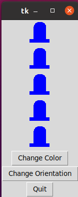
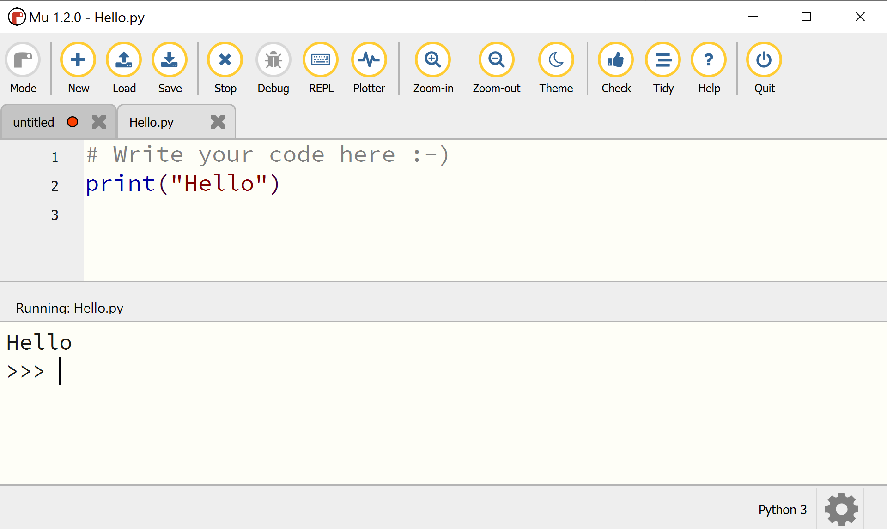
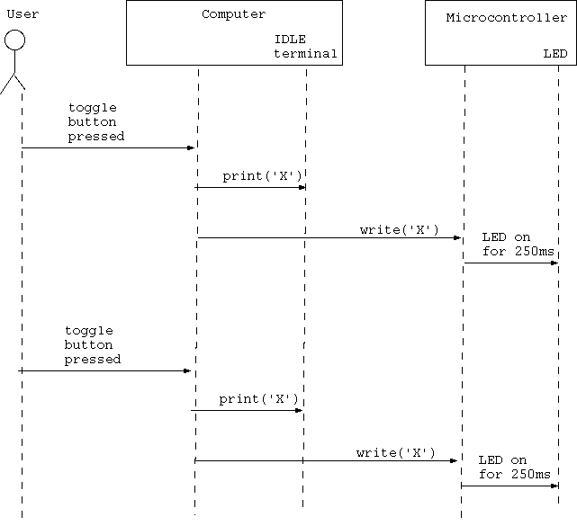
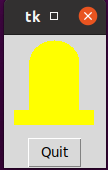
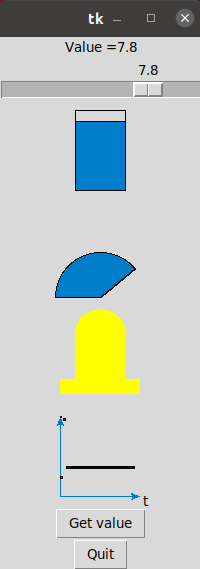
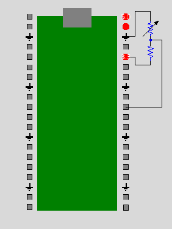
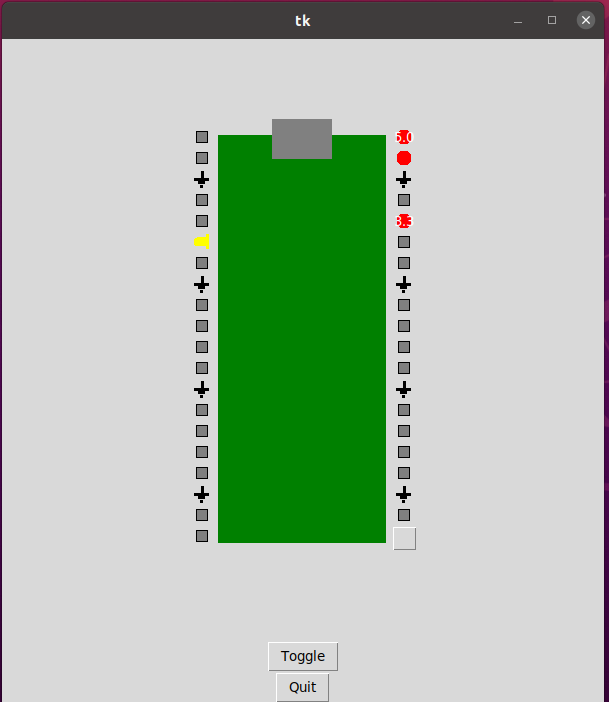

# Data Acquisition aNd DisplaY
**THIS IS A SHORT VERSION OF THE TUTORIAL, FOR ECE483**

## 1.0 Introduction
### 1.1 What is DANDY?
[`DANDY`](https://github.com/amitofsk/dandy) is a set of reusable python examples and a library of python functions to help display sensor data in a graphical user interface (GUI).

### 1.2 What are we building?
Here's a typical hardware setup. A sensor is connected to a microcontroller. The microcontroller sends the sensor data to a computer either over USB or wirelessly. Data is displayed in a GUI on the laptop, perhaps numerically, as a needle rotating in a dial, using a slider, or on a chart plot.
<br><br>
All of these steps can be implemented using existing open software, but some steps are easier than others. For example, Arduino makes writing the microcontroller software easy, and Tkinter and Qt are user-friendly libraries for writing GUIs. 

**Where are the challenges in writing the software?**
 
First, the code for the microcontroller and the code for the GUI on the laptop are typically written in different languages. Multiple languages are not a problem for an experienced coder, but they are an obstacle for a novice or a hobbyist. Second, libraries for writing GUI software typically have reusable widgets like buttons and spinboxes, but they don't have ones made specifically for handling inputs from analog sensors. Third, the software on the laptop has to both continually read from the sensors and continually update the GUI. These should appear to the user to happen simultaneously, without either task blocking the other.
<br><br> 
This project addresses all of these challenges. The goal of this project is not to show a new application of a sensor. Instead, it is to simplify writing software for this typical setup easier.  


### 1.3 Who is this tutorial for?

This guide is intended for:
 - Students interested in learning about sensor hardware, microcontroller programming,  and writing GUI software.
 - Engineers who want to learn a new way to perform data acquisition using the Python language. 
 - People with at least a little Python coding experience. For example, you should know how to write functions in Python, and you should know what classes and objects are. 
<br><br>

This guide is NOT for you if:
 - You have not programmed before.
 - You want a plug-and-play solution. This is a software library, so you will have to program.
 - You want to acquire sensor data with precise timing. In this project, data collection happens with an inexpensive microcontroller without a real time operating system.
 - You want to collect data using elaborate equipment. This project involves small discrete sensors.  
## 2.0 Gather hardware supplies
Hardware used:
- Small [protoboard](https://www.digikey.com/en/products/detail/bud-industries/BB-32656/8602381) and wires
- Buttons that fit in the protoboard
- Resistors (300 $\Omega$ - 1k $\Omega$ ) 
- [Potentiometer](https://www.digikey.com/en/products/detail/bourns-inc/PTV09A-4025U-B103/3781137) that fits in the protoboard
- USB cable to connect your microcontroller
- [Raspberry Pi Pico](https://www.digikey.com/en/products/detail/raspberry-pi/SC0915/13624793) (RPi)

We will be using the button as an example digital input sensor, and we will be using the potentiometer as an example analog sensor.

If you are using the RPi and your microcontroller didn't come with headers pre-installed, solder them on now, Then, plug your RPi into the protoboard. The picture below shows a RPi without and with headers. 


## 3.0 Install software
This tutorial involves both writing Python code for a computer as well as writing code for a microcontroller, so we have two programming environments to set up.

### 3.1 Check your Python installation

We will be using Python to write code for the computer. Python is available through AppsAnywhere. We will be using the IDLE IDE which comes with Python. 

This tutorial requires at least Python version 3.7.


### 3.3 Install the pyserial library 
The pyserial library is used to communicate with devices connected by a USB cable. We will use it to communicate between the computer and the microcontroller.

On Windows, open a Windows Powershell Terminal and execute the following command.  

```python
pip install pyserial
```


 
### 3.4 Download the DANDY library.
The next step is to download the DANDY library from github. Github is a website that hosts tons of open source software projects. 
<br><br>
This step requires Git. Git comes with Linux, but requires separate installation with Windows.  On Windows, open the gitbash terminal. Git is also available in AppsAnywhere. 
<br><br>
Change to the directory that you want work in. Then, use the following command in the terminal to download the DANDY repository from github. 
 ```python
 git clone https://github.com/amitofsk/dandy.git
 ```

Alternatively, the DANDY library is available as a zip file in Moodle. 

### 3.5 Install the Mu IDE or the Arduino IDE
In addition to writing Python code for the computer using the IDLE IDE, we will also be writing code for the microcontroller. In this step, we will download the IDE used for programming the microcontroller. 

One advantage of using a different IDE for the computer code and the microcontroller code is that the IDE will remind you which hardware you are programming for. 

If you will be using MicroPython or CircuitPython with the RPi, download and install the [Mu IDE](https://codewith.mu/en/download). The Thonny IDE could also work, but this tutorial will use Mu. Most other Python IDEs do not have the needed libraries.


## 4.0 GUI Programming
Files used in section 4:
- widgets/LEDDisplay.py
- widgets/LEDBarDisplay.py
- widgets/SymbolDisplay.py
- examples/ButtonGUI.py
- examples/ButtonPicGUI.py
- examples/DigitalNoHW.py
- examples/smileOn.png
- examples/smileOff.png

DANDY contains a set of widgets useful for displaying input data and other functions. In this section, we'll learn how to program GUIs with Tkinter as well as use the DANDY widgets. We will be programming for the computer here using the IDLE IDE.
   

### 4.1 What Tkinter is?
Tk is a cross-platform set of tools for writing graphical user interfaces (GUIs). Tkinter is Python's version of the library, and it comes preinstalled with Python. 
<br><br>
Tkinter contains many widgets including labels, buttons, scales, and spinboxes. For a nice list along with the API reference, see [tkdocs](https://tkdocs.com/pyref/). 

### 4.2 Tkinter widgets

#### 4.2.1 Example with a quit button 
Let's write our first GUI program using Python and Tkinter. We're writing code to run on the computer, not the microcontroller, in this section, so use the IDLE IDE. In this example, we use two Tkinter widgets: `Label` and `Button`. The `pack` function puts a widget into a window. 
<br><br>
Try out the example below. You should see a window with a label and a working quit button. 

If you downloaded the DANDY library, examples are in the `src/examples` directory. 

(See file src/examples/ButtonGUI.py.)

```python
import tkinter as tk

#Define the ButtonGUI class, which is a child of Tk.
class ButtonGUI(tk.Tk):
    # The function __init__ is the constructor for the class.
    def __init__(self):
        super().__init__()
        self.label1=tk.Label(self, text="Welcome")
        self.button_quit=tk.Button(self, text="Quit", \
                            command=self.destroy)
        #We pack widgets to put them in the window.
        self.label1.pack()
        self.button_quit.pack()
        tk.mainloop()

# Here is our main function which creates an object of class ButtonGUI.
if __name__=="__main__":
    mygui=ButtonGUI()
```

<br><br><br>
#### 4.2.2 Example with two buttons

Let's try another example to get more familiar with Tkinter. This example has two `Buttons` and a `Label` which shows a `PhotoImage`. If you press one of the buttons, the label toggles between two images. Here we write our own function, named `toggle_me`, that is executed when the button is pressed. 
<br><br> 
Either make sure the images smileOn.png and smileOff.png are in the same directory as the example, or alter the code below to point to their location. This example and the images are also in the `example` directory of the DANDY library you downloaded. 
<br><br>
Try out this example too.
<br><br>
(See file src/examples/ButtonPicGUI.py.)
```python
import tkinter as tk

class ButtonPicGUI(tk.Tk):
    def __init__(self):
        super().__init__()
        self.smileOn=tk.PhotoImage(file='./smileOn.png')
        self.smileOff=tk.PhotoImage(file='./smileOff.png')
        self.image_number=0

        #This label contains a PhotoImage instead of text.
        self.label1=tk.Label(self, image=self.smileOn)
        #When button1 is pressed, the instructions in the function
        #toggle_me are followed. We define this function below.
        self.button1=tk.Button(self, text="Press Me", \
                               command=self.toggle_me)
        self.button_quit=tk.Button(self, text="Quit", \
                                   command=self.destroy)

        self.label1.pack()
        self.button1.pack()
        self.button_quit.pack()

        tk.mainloop()

        
    #Here we define the toggle_me function
    def toggle_me(self):
        if self.image_number==0:
            self.label1.configure(image=self.smileOff)
            self.image_number=1
        else:
            self.label1.configure(image=self.smileOn)
            self.image_number=0


if __name__=="__main__":
    mygui=ButtonPicGUI()
```


### 4.3 DANDY widgets 

#### 4.3.1 The LEDDisplay widget

Our examples so far have used widgets that are part of the Tkinter library that comes with Python. The DANDY library, which you just installed, has additional widgets. These widgets are designed for displaying sensor data and related tasks. They are summarized in the figure below.


See the [DANDY API](./WidgetApi.md) for additional details about the available widgets. 


The next example uses the DANDY widget `LEDDisplay`. When you run it, you will see two buttons and an image of an LED. When you press the button, the LED color changes. Try it out.
<br><br>
You may need to change the third line to point to the location of the widgets folder of the DANDY library. This example is also available in the examples folder of the DANDY library. If you open that version, Python should find the widgets folder correctly.

(See file src/examples/DigitalNoHW.py.)

```python

import tkinter as tk
import sys
#We need to import the file for the LEDDisplay widget
#You may need to change the next line so it points to the correct directory.
sys.path.append('../widgets')
import LEDDisplay as ld

class DigitalNoHW(tk.Tk):
    def __init__(self):
        super().__init__()
        #The class LEDDisplay is defined in the file ../widgets/LEDDisplay.py
        self.led1=ld.LEDDisplay(self)
        self.button1=tk.Button(self, text="Press Me", \
                               command=self.toggle_me)
        self.button_quit=tk.Button(self, text="Quit", \
                                   command=self.destroy)

        self.led1.pack()
        self.button1.pack()
        self.button_quit.pack()

        tk.mainloop()

        
    #Here we define the toggle_me function
    def toggle_me(self):
        if(self.led1.get_color()=="yellow"):
            self.led1.change_LED_color("blue")
        else:  
            self.led1.change_LED_color("yellow")


if __name__=="__main__":
    mygui=DigitalNoHW()
```


#### 4.3.2 The LEDBarDisplay Widget
The DANDY library contains the class `SymbolDisplay` for displaying ground and power symbols. It also contains the class `LEDBarDisplay` for displaying bars of LEDs. 
<br><br>
Try out the example below. When you run it, you will see a bar of 5 `LEDDisplay` widgets as well as three additional buttons. The first button toggles the LED color, the second button toggles the LED orientation, and the third button is a quit button.

(See file src/examples/LEDBarDemo.py.)

```python

import tkinter as tk
import sys 
sys.path.append ('../widgets') 
import LEDDisplay as ld
import SymbolDisplay as sd
import LEDBarDisplay as lbd

class LEDBarDemo(tk.Tk):
    def __init__(self):
        super().__init__()
        self.lbd1=lbd.LEDBarDisplay(self)
        self.button1=tk.Button(self, text="Change Color", command=self.color_me)
        self.button2=tk.Button(self, text="Change Orientation", \
                               command=self.rotate_me)
        self.button_quit=tk.Button(self, text="Quit", command=self.destroy)

        self.lbd1.pack()
        self.button1.pack()
        self.button2.pack()
        self.button_quit.pack()

        self.color1="blue"
        self.orient1="vertical"
        self.lbd1.set_all_color(self.color1)

        tk.mainloop()

    def color_me(self):
        if (self.color1=="blue"):
            self.color1="purple"
        else:
            self.color1="blue"
        self.lbd1.set_all_color(self.color1)

    def rotate_me(self):
        if (self.orient1=="vertical"):
            self.orient1="horizontal"
        else:
            self.orient1="vertical"
        self.lbd1.set_orientation(self.orient1)
        

if __name__=="__main__":
    mygui=LEDBarDemo()


```


## 5.0 Programming the microcontroller
Files used in section 5:
- microcontr/serialReadMP.py 
- microcontr/serialWriteMP.py

In section 4, we wrote Python code for the computer, and we used the IDLE IDE. In this section, we will instead write code for the microcontroller. 

Note that all of the example files in the `microcontr` directory contain code for the microcontroller. All of the files in the `examples`, `widgets`, and `utilities` directories, however, contain code for the computer.

### 5.1 Option A: Micropython and RPi
#### 5.1.1 Build the circuit
Connect a button between pin 21 (GP16) and pin 36 (3.3V power)<br>

Refer to the [pinout](https://datasheets.raspberrypi.com/pico/Pico-R3-A4-Pinout.pdf) for the Raspberry Pi Pico (RPi). <br>


#### 5.1.2 Install MicroPython firmware on the RPi
The RPi does not have a full operating system. Instead, we'll install MicroPython firmware, which contains a Python interpreter specifically for embedded devices. Think of MicroPython firmware as a Python interpreter along with a minimal operating system, that contains just enough instructions to run a Python program. 
<br><br>
Download the latest release of MicroPython from [here](https://micropython.org/download/rp2-pico/).
<br><br>
The RPi has a small button on it labeled `BOOTSEL`. Hold that button down, and use a USB cable to plug the RPi into the computer. Once it is plugged in, you can release the button.
<br><br>
You should now see the RPi drive available (for example, in Windows Explorer). Drag the file that you just downloaded to that drive. 
<br><br>
Disconnect the RPi by unplugging the USB cable. Reconnect the RPi, this time without holding down the `BOOTSEL` button.  

#### 5.1.3 Hello world

Now we're ready to write our first MicroPython program that will run on the RPi. We'll use the Mu IDE, so open it now.
<br><br>
This step requires some libraries for interacting with the hardware, so you can't use IDLE or a text editor unless you manually download those libraries. If you don't want to use Mu, Thonny is another IDE option that has the needed libraries. This tutorial, however, uses Mu.

Click on the `Mode` button and select `RP2040` to tell the Mu IDE that you will be programming in MicroPython. You should now see `RP2040` on the lower right of the MU IDE window.

The middle of the Mu IDE is a text editor where you can enter your code. The section below that is called the [REPL](https://learn.adafruit.com/getting-started-with-raspberry-pi-pico-circuitpython/circuitpython-programming-basics) terminal, short for Read, Evaluate, Print, and Loop.

You can type individual MicroPython instructions in the REPL terminal. They will be evaluated on the microcontroller. If they contain any print statements, the microcontroller will send the message serially via the USB cable, and you will see the result in the REPL terminal.

Since most of our programs will be more than one line, we'll write our instructions in the editor instead of the REPL terminal. After we run our programs, we will still see results of any print statements on the REPL terminal.

Write the following instruction in the editor, and save it as `hello.py`. Next, press the `RUN` button. You should see the message printed in the REPL terminal.
```python
print ("Hello")
```




#### 5.1.4  Blinky lights

Now let's write a MicroPython program that uses the pushbutton you wired to the RPi. In this example, when you press down the pushbutton, the internal LED on the RPi will turn on and `T` will be printed in the REPL terminal. When the button is not pressed down, the LED will be off and `F` will be printed. 

Copy the program below into the editor or load the `microcontr/serialWriteMP.py` example program. Then, run it. 

(See file src/mircrocontr/serialWriteMP.py.)


```python
from machine import Pin
import time
print ("hello")

button = Pin(16, Pin.IN, Pin.PULL_DOWN)
led=Pin(25, Pin.OUT)
while True:
    if button.value():
        print("T")
        led.value(True)
    else:
        print("F")
        led.value(False)
    time.sleep(1)
```
The fourth line tells the RPi that we will call GP16 (pin 21) the name `button`. This line also says `button` will be an input. The `Pin.PULL_DOWN` option connects this pin to an internal resistor so that when nothing is connected to it, the pin will be low. 
<br><br>
The fifth line tells the RPi that we will call GP25, the internal LED, the name `led`. This line also says `led` will be an output.
<br><br>When you run this example and hold down the pushbutton wired to the RPi, the program prints `T` and turns on the internal LED. Otherwise it prints `F` and turns off the LED. 


#### 5.1.5 Reading data from the computer
In section 6.0, we will send data from the computer to the microcontroller. To complete this example, we will need to write both Python code for the computer and MicroPython code for the microcontroller. While we're programming the microcontroller, let's write this code. 
<br><br> 
Create a new file in the Mu editor and copy in the code below. Alternatively, load the `microcontr/serialReadMP.py` example file. 

Run it. When you run it, nothing will happen until you send a character from the computer to the microcontroller. If the microcontroller receives a character, the internal LED will blink. We'll complete this example in section 6. 
<br><br>
If you close the Mu IDE, the microcontroller continues to run this code. If you unplug the RPi and plug it back into your computer, the microcontroller continues to run this code.
 
(See file src/microcontr/serialReadMP.py.)

```python
from machine import Pin
import time
import select
import sys
print ("hello")

led=Pin(25, Pin.OUT)
led.value(True)
# setup poll to read USB port
poll_object = select.poll()
poll_object.register(sys.stdin,1)
while True:
    if poll_object.poll(0):
        #read as character
        ch = sys.stdin.read(1)
        print (ch)
        led.value(True)
        time.sleep(0.25)
        led.value(False)
    time.sleep(1)
```


## 6.0 Sending characters TO the MICROCONTROLLER from the computer

Files used in 6.0:
- examples/DigitalOut.py
- examples/DigitalOutDisplay.py

Now let's get the computer to talk to the microcontroller. More specifically, in this section, we'll send a character from the computer to the microcontroller. When the microcontroller receives a character, the internal light will blink on and off.
<br><br>
In section 5.1.4, you wrote the necessary code for the microcontroller and ran it. Make sure your microcontroller is still plugged in and running that code. We won't use the pushbutton connected to the microcontroller in this example, so it doesn't matter if it is connected or not. 
<br><br>
Close the Mu, Arduino, or Arduino Lab IDE that you used to program the microcontroller.
<br><br> 
In this section we write Python code for the computer. When we wrote code for the microcontroller, there were different options for the different hardware choices: MicroPython and the RPi, CircuitPython and the RPi, MicroPython and the PSoC6, and Arduino. Examples in this section will apply for any computer with a Python interpreter, whether that computer runs Windows or Linux.

### 6.1 Sending characters to the microcontroller, without a GUI
Let's write the Python code that will run on the computer for this example. Open the IDLE IDE, and copy the code below, and run it. Every second, this program sends the character `Z` from the computer, down the USB cable, to the microcontroller. 
<br><br>
This code needs to know the port of your microcontroller. On a Windows machine, the port is something like `COM1`, but it may be `COM2`, `COM3`, and so on. Look in the Device Manager of the Windows Control Panel to find the appropriate port. On a Linux machine, the port is likely `/dev/ttyACM0` or `/dev/ttyACM1`. Alter the code below so that the correct port is used. 
<br><br>
If you are used CircuitPython to write the microcontroller code (Option B), make sure to use the port for the communication channel that doesn't involve the REPL terminal.

We'll be communicating over a serial channel, using the USB cable. For this type of communication, the sender and receiver must agree on the baud rate, bytesize, and number of stopbits. If you are using the PSoC6 (Option C), replace `STOPBITS_TWO` with `STOPBITS_ONE` near line 17. 
<br><br>

(See file src/examples/DigitalOut.py.)

```python
import serial
import serial.tools.list_ports as port_list
import time

#Set up PORT.
#If you are on Windows, uncomment the next line and adjust as needed.
PORT='COM1'
#If you are on Linux, uncomment the next line and adjust as needed.
#PORT='/dev/ttyACM0'

class DigitalOut():
    baudrate=115200
    serialPort=serial.Serial(port=PORT, baudrate=baudrate, bytesize=8, \
                         timeout=0.1, stopbits=serial.STOPBITS_TWO)
    while True:
        serialPort.write(bytes('80', 'utf-8'))
        print('I wrote Z')
        time.sleep(1) 
    serialPort.close()


if __name__=="__main__":
    example=DigitalOut()
```
When you run the example above, the computer sends a character to the microcontroller every second. The microcontroller is still running code that blinks the LED when it receives a character, so you should see the microcontroller's internal LED blink every second. To verify that it works, replace `time.sleep(1)` with `time.sleep(3)`. Now the computer will send a character every three seconds, and the microcontroller's LED will blink at this slower rate.
<br><br>

You may be able to automatically assign the serial port with the following lines. However, these lines aren't too reliable, so it is better to set `PORT` manually.

```python
ports=list(port_list.comports())
port=(ports[0].device)
print(ports[0].device)
```
Keep in mind that whenever you send serially using the USB cable in this way, you are sending characters. You can send characters like `4` or `3`, but even though these look like integers, they are actually characters. If you are writing software for the receiver, you can include an instruction that, for example, casts the character `4` into an integer if you want to treat it as a number.

### 6.2 Sending characters to the microcontroller, with a GUI

Let's rewrite the Python code in the example above to include a GUI. Try out the example below. 

Make sure to set `PORT` for your machine.

When you run it, you will see a window with a quit button and a second button. When you press that button, the computer sends a character to the microcontroller. Your microcontroller should still be running the same code, so when the microcontroller receives a character, its internal LED will blink.

(See file src/examples/DigitalOutDisplay.py.)

```python
import asyncio
import tkinter as tk
import time
import serial
import serial.tools.list_ports as port_list
import sys

#If you are on Windows, uncomment the next line and adjust as needed.
PORT='COM1'
#If you are on Linux, uncomment the next line and adjust as needed.
#PORT='/dev/ttyACM0'

class DigitalOutDisplay(tk.Tk):
    def __init__(self):
        super().__init__()
        self.button1= tk.Button(self, text="toggle", \
                               command= self.toggle_me)
        self.button_quit=tk.Button(self, text="Quit", command=self.destroy)
        self.button1.pack()
        self.button_quit.pack()

        baudrate=115200
        self.serial_port=serial.Serial(port=PORT, baudrate=baudrate, \
                        bytesize=8, timeout=0.1, stopbits=serial.STOPBITS_TWO)

        tk.mainloop()


    def toggle_me(self):
        out_string='X'
        print('X')
        self.serial_port.write(bytes(out_string,'utf-8'))


if __name__=="__main__":
    mygui=DigitalOutDisplay()
```





The strategies in section 6 really only work if you are sending single characters and the characters are available whenever the microcontroller tries to read them. If you want to send longer messages to the microcontroller or want to ensure that the microcontroller doesn't block waiting to get information, you need more complicated instructions. See section 10 for more information.

## 7.0 Displaying CHARACTERS sent FROM the MICROCONTROLLER to the computer

Files used in section 7:
- microcontr/serialWriteMP.py
- examples/DigitalIn.py
- examples/DigitalHWShort.py
- examples/DigitalHWLong.py
- widgets/LEDDisplay.py
- utilities/SerialAndGui.py

<br><br>
In this section, we will send data from the microcontroller to the computer. 

More specifically, you should have a pushbutton wired to a microcontroller, and your microcontroller should be connected to the computer by a USB cable. If you aren't pressing the pushbutton, the microcontroller sends the character `F` to the computer. If you are pressing the pushbutton, it sends `T`. We'll go through this example multiple ways. 

Think of the pushbutton like a digital input sensor that can either be in one of two possible states. You could instead replace it with a [tilt switch](https://www.digikey.com/en/products/detail/c-k/RB-220-07A-R/2747176), [limit switch](https://www.digikey.com/en/products/detail/e-switch/SS0750302F035P1A/16018860), or other such type of digital input sensor instead. 

### 7.1 Set up the microcontroller and run the example

You should still have the pushbutton wired to the microcontroller. We'll need it for this example. Now, let's program the microcontroller. Open the Mu or Arduino IDE. Re-open the blinky lights example from section 5.1.3. (See file microcontr/serialWriteMP.py.)
 We'll use this program once again in this section. Run it, and then close the IDE for your microcontroller. Leave the microcontroller connected to your computer with the USB cable. 
<br><br>

### 7.2 Receiving characters from the microcontroller, no GUI

In the previous section, we wrote code for the microcontroller using the Mu or Arduino IDE. In this section, we will be writing code for the computer using IDLE IDE. 
<br><br> 
Copy the code below or open the example that came with the DANDY library. Make sure to set your port appropriately. 
<br><br>
Run the code. When you are not pressing the pushbutton wired to the microcontroller, it will print `F`. When you are pressing the pushbutton, it will print `T`. 

(See file src/examples/DigitalIn.py.)

```python
#This example reads characters in from the microcontroller to the computer
#and prints the result. Be sure to set the correct port for your machine.

import serial
import serial.tools.list_ports as port_list


#Set up PORT.
#If you are on Windows, uncomment the next line and adjust as needed.
PORT='COM1'
#If you are on Linux, uncomment the next line and adjust as needed.
#PORT='/dev/ttyACM0'

class DigitalIn(): 
    baudrate=115200
    serialPort=serial.Serial(port=PORT, baudrate=baudrate, \
            bytesize=8, timeout=0.1, stopbits=serial.STOPBITS_TWO)
    while True:
        serialString=serialPort.read()
        print(serialString)
    serialPort.close()


if __name__=="__main__":
    example=DigitalIn()

```


### 7.3 Receiving data from the microcontroller, now with widgets and asyncIO
#### 7.3.1 What is asyncio and why do we need it here.
We are using the graphics library Tkinter. Typically, tkinter runs in a loop to continually refresh the graphical user interface. In the previous example, we used a loop to continually read serial data.
The problem is that we want both loops to run continuously and simultaneously. One possible solution would be to put each of these tasks in a different thread. 
We are not quite doing this, but we are doing something quite similar. 
<br><br>
We will be using the asyncIO Python library. This library isn't quite multithreading, but it accomplishes the same task. 
Also, instead of telling Tkinter to loop continually, we will tell it to manually update inside a loop. 
The asyncIO library is new to Python, so make sure you are at least using Python version 3.7.
<br><br> 
More info on asyncIO can be found at [async-io-python](https://realpython.com/async-io-python).
Information on using asyncIO with Tkinter came from [asyncio-and-tkinter](https://stackoverflow.com/questions/47895765/use-asyncio-and-tkinter-or-another-gui-lib-together-without-freezing-the-gui) 

#### 7.3.2 Tkinter and widgets, the short way (recommended)

Make sure the microcontroller is plugged in and still running the previous example.
<br><br>
Run the example below. When you run it, you will see a window with an `LEDDisplay` widget and a quit button. When the pushbutton connected to your microcontroller is held down, the `LEDDisplay` widget will be yellow. Otherwise it will be blue.
<br><br>
Even though this example is short, it has a lot going on. The `DigitalHWShort` class defined in this example is a child of class `SerialAndGui` which is a child of `Tk`. The class `SerialAndGui` comes with the DANDY library, and it is detailed in `src/utilities/SerialAndGui.py`. 
The class `SerialAndGui` is an abstract class. If you run it by itself, you see an empty window which is not useful. Instead, as shown below, you should define a child class and overload the constructor and the `use_serial_data` function.
<br><br>
The `SerialAndGui` class involves three asynchronous tasks: `check_serial_data`, `use_serial_data`, and `updater`. Each is defined in its own function. The `check_serial_data` task reads serially from the USB cable and writes the result to a queue. The `use_serial_data` task reads from the queue and does something with the data it finds. The `updater` task updates the GUI. All of these happen inside loops which appear to happen simultaneously. 
<br><br>
You don't have to write all the code for these tasks every time you want to use them. Instead, you can just define a child class of `SerialAndGui` as shown below.   

(See file src/examples/DigitalHWShort.py.)

```python

import asyncio
import tkinter as tk
import time
import serial
import serial.tools.list_ports as port_list
import sys
sys.path.append('../widgets')
sys.path.append('../utilities')
import LEDDisplay as ld
import SerialAndGui as sg

#Set up PORT.
#If you are on Windows, uncomment the next line and adjust as needed.
PORT='COM1'
#If you are on Linux, uncomment the next line and adjust as needed.
#PORT='/dev/ttyACM0'

class DigitalHWShort(sg.SerialAndGui):
    #Here's the constructor.
    def __init__(self, loop, interval=1/20, port=PORT):
        super().__init__(loop, port=PORT, data_format="char")
        #The line above says run the parent's constructor.
        #The parent's constructor starts the three async tasks:
        #check_serial_data, use_serial_data, and updater.
        #Below, we set up the widgets for a simple GUI
        #and pack them in the window.
        self.led1=ld.LEDDisplay(self)
        self.button_quit=tk.Button(self, text="Quit", \
                                   command=self.close)
        self.led1.pack()
        self.button_quit.pack()

  
    #This async function reads from the queue and uses the data it finds.
    #We're overloading the parent's version of this function.
    async def use_serial_data(self, interval, qIn: asyncio.Queue):
        while True:
            await asyncio.sleep(interval)
            in_string=await qIn.get()
    
            if in_string=="T":
                print("T")
                self.led1.change_LED_color("yellow")
            if in_string=="F":
                print("F")
                self.led1.change_LED_color("blue")


if __name__=="__main__":
    loop=asyncio.get_event_loop()
    example=DigitalHWShort(loop)
    loop.run_forever()
    loop.close()
```

<br><br>

#### 7.3.3 Tkinter and Widgets, the long way
The previous example relied on the `SerialAndGui` class. A lot of the details were swept up into that class. What actually  happened? What if you want to write all the instructions yourself without relying on any parent classes? 
<br><br>
This example accomplishes the same task as the previous example. Before you run it, make sure your microcontroller is still plugged in and running its code. As in the last section, when you run this example, you will see a window with an `LEDDisplay` widget. When the pushbutton connected to the microcontroller is pressed, the `LEDDisplay` is yellow, and otherwise it is blue. 
<br><br>
In this example, you can see the details of how to use asyncIO to both read serially from the USB cable and update the Tkinter GUI. As explained above, it involves three asynchronous tasks, which are detailed in the functions `check_serial_data`, `use_serial_data`, and `updater`. The `DigitalWithHW` class defined below is a child only of `Tk`, so the details of using asyncIO are not hidden in a parent class. You don't need to understand every line of this example, and I recommend using the short example above instead. 

(See file src/examples/DigitalHWLong.py.)

```python


import asyncio
import tkinter as tk
import time
import serial
import serial.tools.list_ports as port_list
import sys
sys.path.append('../widgets')
import LEDDisplay as ld

#Set up PORT.
#If you are on Windows, uncomment the next line and adjust as needed.
PORT='COM1'
#If you are on Linux, uncomment the next line and adjust as needed.
#PORT='/dev/ttyACM0'

class DigitalHWLong(tk.Tk):
    #Here's the constructor for the DigitalWithHW class.
    #DigitalWithHW is a child of class tk.Tk, which opens a window.
    def __init__(self, loop, interval=1/20):
        super().__init__()
        self.loop=loop
        self.protocol("WM_DELETE_WINDOW", self.close)

        #We have three async tasks: check_serial_data, use_serial_data
        #and updater. Each are detailed in their own function.
        self.q=asyncio.Queue()
        self.tasks=[]
        self.tasks.append(loop.create_task \
                          (self.check_serial_data(interval, self.q)))
        self.tasks.append(loop.create_task \
                          (self.use_serial_data(interval, self.q)))
        self.tasks.append(loop.create_task(self.updater(interval)))

        #Set up the widgets for a simple GUI and pack them in the window.
        self.led1=ld.LEDDisplay(self)
        self.button_quit=tk.Button(self, text="Quit", \
                                   command=self.close)
        self.led1.pack()
        self.button_quit.pack()

        #Notice that we don't start Tkinter's main loop here. Instead
        #the function updater will update the GUI.

        
    async def check_serial_data(self, interval, qIn: asyncio.Queue):
        #This async function reads data from the serial port and puts the
        #data in the queue.

        #Set up to read from the serial port.
        baudrate=115200
        serial_port=serial.Serial(port=PORT, baudrate=baudrate, \
                        bytesize=8, timeout=0.1, stopbits=serial.STOPBITS_TWO)
        
        #Read a byte at a time from the serial port.
        #Convert the byte to a string, and put the string in the queue.
        while True:
            await asyncio.sleep(interval)
            serial_byte=serial_port.read()
            serial_string=serial_byte.decode()
            if serial_string != "":
                await qIn.put(serial_string)
                #Uncomment the next line to see what the serial port is getting.
                #print(serial_byte)
        serial_port.close()
        

    async def use_serial_data(self, interval, qIn: asyncio.Queue):
        #This async function reads from the queue and uses the data it finds.
        while True:
            await asyncio.sleep(interval)
            in_string=await qIn.get()
            if in_string=="T":
                print("T")
                self.led1.change_LED_color("yellow")
            if in_string=="F":
                print("F")
                self.led1.change_LED_color("blue")
        

    async def updater(self, interval):
        #This async function manually updates the Tkinter GUI.
        while True:
            self.update()
            await asyncio.sleep(interval)


    def close(self):
        for task in self.tasks:
            task.cancel()
        self.loop.stop()
        self.destroy()


if __name__=="__main__":
    loop=asyncio.get_event_loop()
    example=DigitalHWLong(loop)
    loop.run_forever()
    loop.close()

```


## 8.0 Displaying NUMERICAL DATA sent FROM the MICROCONTROLLER to the computer

Files used in section 8:
- widgets/AnalogInDisplay.py
- widgets/DialDisplay.py
- widgets/SimplePlotDisplay.py
- widgets/SlideDisplay.py
- widgets/TricolorDisplay.py
- widgets/VectorDisplay.py
- examples/AnalogHWShort.py
- examples/singleAInDemo.py
- examples/tripleAInDemo.py
- utilities/SerialAndGui.py
- microcontr/analogToComputerMP.py

In this section, we'll detail how to send numerical data from a microcontroller to a computer and display the result in a GUI. In this section, the data will come from a potentiometer wired in to the microcontroller. However, you can directly replace that potentiometer with an analog sensor such as a  [thermistor](https://www.digikey.com/en/products/detail/vishay-beyschlag-draloric-bc-components/NTCLE100E3333JB0/769418) or [force sensor](https://www.digikey.com/en/products/detail/ohmite/FSR07BE/10127625).


### 8.1 DANDY widgets for displaying numerical data, no hardware

The DANDY library contains multiple widgets designed to display numerical data. In this section, we don't use any hardware. Instead, we just try out these widgets. 

#### 8.1.1 Displaying a scalar numerical value

Try out the example below. When you run it, you see a number of widgets. The `Label`, `Button`, and `Scale` widgets are built into Tkinter. The `SlideDisplay`, `DialDisplay`, `TricolorDisplay`, and `SimplePlotDisplay` widgets are from the DANDY library. 
<br><br>
Adjust the `Scale` then press the `Get value` button. You will see the DANDY widgets change appropriately. The `TricolorDisplay` widget is one color below some cutoff value, a second color above another cutoff value, and a third color between those values. 
<br><br>
This example uses Tkinter as well as multiple widgets that come with the DANDY library. It does not use asyncIO because it only needs one loop, for the GUI. 

(See file src/examples/SingleAInDemo.py)

```python

import tkinter as tk
import sys 
sys.path.append('../widgets') 
import DialDisplay as dd 
import SlideDisplay as sd 
import TricolorDisplay as td
import SimplePlotDisplay as spd 

 
class SingleAInDemo:
    def __init__(self):
        self.main_window=tk.Tk()
        self.button_quit=tk.Button(self.main_window, text="Quit", \
                            command=self.main_window.destroy)
        self.button2=tk.Button(self.main_window, text="Get value", \
                            command=self.get_value)
        self.label1=tk.Label(self.main_window, text="Hello")
        self.scale1=tk.Scale(self.main_window, from_=0, to=10, \
                            orient=tk.HORIZONTAL, length=200, resolution=0.1)   
        self.dial1=dd.DialDisplay(self.main_window, \
                            height=100, width=100)
        self.slide1=sd.SlideDisplay(self.main_window, width=100, \
                            height=100)
        self.tric1=td.TricolorDisplay(self.main_window, width=100, \
                            height=100)
        self.plot1=spd.SimplePlotDisplay(self.main_window)
        self.label1.pack()
        self.scale1.pack()
        self.slide1.pack()
        self.dial1.pack()
        self.tric1.pack()
        self.plot1.pack()
        self.button2.pack()
        self.button_quit.pack()
        
        #Main loop
        tk.mainloop()


    def get_value(self):
        slide_message="Value ="+str(self.scale1.get())
        self.label1.config(text=slide_message)
        self.dial1.set_to_value(self.scale1.get())
        self.slide1.set_to_value(self.scale1.get())
        self.tric1.set_to_value(self.scale1.get())
        self.plot1.add_point(self.scale1.get())


if __name__=="__main__":
    mygui=SingleAInDemo()

```



#### 8.1.2 Displaying vector numerical data

Some data, such as velocity, acceleration, and magnetic field at a point, is inherently three dimensional. The DANDY library contains the `VectorDisplay` widget for displaying vector data. Try out the example below.

(See src/examples/tripleAInDemo.py.)

```python

import tkinter as tk
import sys
sys.path.append('../widgets')
import VectorDisplay as vd 

class TripleAInDemo:
    def __init__(self):
        self.main_window=tk.Tk()
        self.button_quit=tk.Button(self.main_window, text="Quit", \
                            command=self.main_window.destroy)
        self.button2=tk.Button(self.main_window, text="Get Value", \
                            command=self.getValue)
        self.label1=tk.Label(self.main_window, text="Hi")
        self. scaleX=tk.Scale(self.main_window, from_=0, to=50, \
                            orient=tk.HORIZONTAL, length=200, resolution=0.1)
        self.scaleY=tk.Scale(self.main_window, from_=0, to=50, \
                            orient=tk.HORIZONTAL, length=200, resolution=0.1)
        self.scaleZ=tk.Scale(self.main_window, from_=0, to=50, \
                            orient=tk.HORIZONTAL, length=200, resolution=0.1)
        self.vector1=vd.VectorDisplay(self.main_window, \
                            height=100, width=200)

        self.label1.pack()
        self.scaleX.pack()
        self.scaleY.pack()
        self.scaleZ.pack()
        self.vector1.pack()
        self.button2.pack()
        self.button_quit.pack()

        #Main loop
        tk.mainloop()


    def getValue(self):
        value_message="X Value="+str(self.scaleX.get())
        self.label1.config(text=value_message)
        self.vector1.set_to_value(self.scaleX.get(), self.scaleY.get(), \
                            self.scaleZ.get())

if __name__=="__main__":
    triple_demo=TripleAInDemo()
```


### 8.2 Displaying numerical data, the microcontroller side
In the previous example, we tried out some widgets that come with the DANDY library. In the previous examples, input values came from a `Scale` widget. 

The inputs in this section will come from a potentiometer wired to the microcontroller. Let's set up the hardware and microcontroller code for this example.

Follow the option for the hardware of your choice. 

#### 8.2.1 Option A: Micropython and RPi
##### 8.2.1.1 Build the circuit

Connect a resistor and a potentiometer in series between pin 36 (3.3V power) and pin 38 (GND). Also, add a wire from the node between the resistor and potentiometer to pin 31. Pin 31 is also known as GP26, and it is connected to the internal analog to digital converter ADC0.

If your potentiometer has three pins, make sure to use the middle pin and one of the outer ones.




##### 8.2.2.2 Write the microcontroller code

Let's write the code for the microcontroller, so open the Mu IDE.

The microcontroller code below reads an analog value from pin 31, also known as GP26 and ADC0. This value is then written serially to the computer.  

We could just print out the value itself. Instead, here we're a bit smarter. We're printing a message in JSON format that contains the value we read in addition to other pieces of information. 

JSON is a format for writing variable names along with their values. For more information, see [wikipedia](https://en.wikipedia.org/wiki/JSON). 

All elements of the JSON are strings, not integers. While `value` may look like an integer, it really is a string. When we send information serially down the USB cable, we can only send characters, not integers.


Copy the code below into the editor of the Mu IDE or open the example. Run it. As you adjust the potentiometer, values displayed in the REPL terminal of the MU IDE should change.


(See file src/microcontr/analogToComputerMP.py.)

```python
from machine import Pin
from machine import ADC
import time
print ("hello")

adc=ADC(Pin(26 ))

value=0
while True:
    value=adc.read_u16()
    outstring='{\"boardName\":\"RPP1\", \"pinName\":\"ADC0\", \"value\":\"'+str(value)+'\"}'
    print(outstring)
    time.sleep(1)

```


### 8.3 Displaying numerical data, the computer side

Back to writing code for the computer in Python using the IDLE IDE. 
This example reads the data from the microcontroller. It also picks off the part of the json that we're interested in. This example does not use a GUI. We'll add a GUI in the next section.  

Make sure your microcontroller is still plugged in and running the example from the last section.
Also make sure you've closed your Mu or Arduino IDE. Additionally, set port for your computer.

(See file src/examples/ReadInJson.py)

```python
import serial
import serial.tools.list_ports as port_list
import json

#Set up PORT.
#If you are on Windows, uncomment the next line and adjust as needed.
PORT='COM1'
#If you are on Linux, uncomment the next line and adjust as needed.
#PORT='/dev/ttyACM0'


class ReadInJson():
    baudrate=115200
    serialPort=serial.Serial(port=PORT, baudrate=baudrate, \
            bytesize=8, timeout=0.1, stopbits=serial.STOPBITS_TWO)

    while True:
        #Read until you see the two end characters '\r\n'
        serial_string=serialPort.read_until('\r\n')
        #Convert the bytes read into an actual string.
        serial_string=serial_string.decode('utf-8')
        if serial_string!="":
            #Slice off the two end characters
            serial_string=serial_string[:-2]
            #Parse the json and save the result in serial_json
            serial_json=json.loads(serial_string)
            #Pick off the element named "value" of the json
            val=serial_json["value"]
            print(serial_string)
            print(val)

    serialPort.close()

if __name__=="__main__":
    example=ReadInJson()
```
### 8.4 Displaying numerical data, the computer side, now with widgets and asyncIO

Now let's put all the pieces together. The microcontroller reads analog data from the potentiometer and sends that data, in JSON format, to the computer. The code below runs on the computer. It reads that data and displays it using widgets from Tkinter and the DANDY library. The class `AnalogHWShort` defined below is a child of the class `SerialAndGui`. The asyncIO library is needed because we want to both update the GUI and read the serial data in loops, and these loops should appear to the user to happen at the same time. The details of using asyncIO are hidden in the parent's class `SerialAndGui`. 

You should still have the potentiometer wired to the microcontroller. The microcontroller should still be connected to your computer with the USB cable, and it should still be running the same example used in section 8.2.

Make sure to set `PORT` near line 21 for your machine.

Try out the example below. While this example is short, it is not simple. It has a lot going on.  

(See file src/examples/AnalogHWShort.py.)

```python

import asyncio
import tkinter as tk
import time
import json
import serial
import serial.tools.list_ports as port_list
import sys
sys.path.append('../widgets')
sys.path.append('../utilities')
import SerialAndGui as sg
import DialDisplay as dd 
import SlideDisplay as sd 
import TricolorDisplay as td
import SimplePlotDisplay as spd 

#Set up PORT.
#If you are on Windows, uncomment the next line and adjust as needed.
PORT='COM1'
#If you are on Linux, uncomment the next line and adjust as needed.
#PORT='/dev/ttyACM0'


class AnalogHWShort(sg.SerialAndGui):
    #Here's the constructor.
    def __init__(self, loop, interval=1/20, port=PORT):
        super().__init__(loop, port=PORT)
        #The line above says run the parent's constructor.
        #The parent's constructor starts the three async tasks:
        #check_serial_data, use_serial_data, and updater.
        #Below, we set up the widgets for a simple GUI
        #and pack them in the window.
        
        self.button_quit=tk.Button(self, text="Quit", \
                                   command=self.close)
        self.label1=tk.Label(self, text="Hello")
        self.slide1=sd.SlideDisplay(self)
        self.dial1=dd.DialDisplay(self, \
                            height=100, width=100)

        self.tric1=td.TricolorDisplay(self, width=100, \
                            height=100)
        self.plot1=spd.SimplePlotDisplay(self)

        self.label1.pack()
        self.slide1.pack()
        self.dial1.pack()
        self.tric1.pack()
        self.plot1.pack()
        self.button_quit.pack()

  
    #This async function reads from the queue and uses the data it finds.
    #We're overloading the parent's version of this function.
    async def use_serial_data(self, interval, qIn: asyncio.Queue):
        while True:
            await asyncio.sleep(interval)
            #get the string from the queue
            in_string=await qIn.get()
            print(in_string)
            #Parse the json and pick off the element named "value"
            in_json=json.loads(in_string)
            val=in_json["value"]
            val_float=float(val)
            #print(val)
            #Scale val so it is in a reasonable range for display
            scaled_val=val_float/10000.0
            slide_message="Value ="+str(scaled_val)
            self.label1.config(text=slide_message)
            self.dial1.set_to_value(scaled_val)
            self.slide1.set_to_value(scaled_val)
            self.tric1.set_to_value(scaled_val)
            self.plot1.add_point(scaled_val)
            

if __name__=="__main__":
    loop=asyncio.get_event_loop()
    example=AnalogHWShort(loop)
    loop.run_forever()
    loop.close()

``` 


## 9.0 Widgets that look like microcontrollers

Files used in section 9:
 - examples/MCDemo.py
 - examples/MCDemo2.py 
 - widgets/MCDisplay.py
 - widgets/RPiPicoDisplay.py
 - widgets/AUnoDisplay.py
 - widgets/AMKRDisplay.py
 - widgets/ANanoEveryDisplay.py
 - widgets/PSoCDisplay.py 
 - microcontr/serialWriteMP.py
 - microcontr/analogToComputerMP.py

The DANDY library contains five widgets that look like specific microcontrollers. First we show how to use these widgets without any hardware. Next we show how to use them with one microcontroller attached, and finally we show how to use them with two microcontrollers connected to the computer.


#### 9.1 Microcontroller widgets, example with no hardware
This example demonstrates the widgets that look like microcontrollers. This section does not use hardware.  The file `MCDisplay.py` is a parent class. The files `RPiPicoDisplay.py`, `AUnoDisplay.py`, `AMKRDisplay.py`, `ANanoEveryDisplay.py`, and `PSoCDisplay.py` are child classes that look like the RPi, Arduino Uno, Arduino MKR1010, Arduino Nano Every, and PSoC microcontrollers respectfully. These child classes have access to member functions of the parent.

When you run this example, you will see a widget that looks like the RPi. Pin 6 shows a `LEDDisplay` widget, and pin 21 shows a button. Additionally, a `toggle` button is at the bottom of the screen. If you press either the button near bin 31 or the toggle button, the `LEDDisplay` changes color.

The `set_led` function of line 39 displays the `LEDDisplay` widget near pin 6. Other member functions display `SlideDisplay`, `DialDisplay`, or `TricolorDisplay` widgets near individual pins.

When you run the example, you see a widget that looks like the RPi. To see widgets that look like the other microcontrollers, comment out between lines 28-32. Next, uncomment one of lines, corresponding to one of the microcontrollers. Save, and rerun the example.

(See file src/examples/MCDemo.py.)
 
```python

import tkinter as tk
import sys  
sys.path.append('../widgets') 
import MCDisplay as mcd  
import RPiPicoDisplay as rpp
import SymbolDisplay as sd
import AUnoDisplay as aud
import ANanoEveryDisplay as aned
import AMKRDisplay as amd
import PSoCDisplay as cd

class MCDemo(tk.Tk):
    def __init__(self):
        super().__init__()
        self.button_quit=tk.Button(self, text="Quit", \
                                   command=self.destroy) 
        self.button2=tk.Button(self, text="Toggle",\
                               command=self.go_button)
        self.mc1=rpp.RPiPicoDisplay(self)
        #self.mc1=aud.AUnoDisplay(self)
        #self.mc1=aned.ANanoEveryDisplay(self)
        #self.mc1=amd.AMKRDisplay(self)
        #self.mc1=cd.PSoCDisplay(self)
           
        self.mc1.pack()
        self.button2.pack()
        self.button_quit.pack()

        #Let's add an LED at pin 6
        self.mc1.set_led(6)

        #Let's add a button at pin 21
        self.button3=self.mc1.set_button(21)
        self.button3.bind('<ButtonPress>',self.go_button2)
        
        #Run tkinter's main loop
        tk.mainloop()


    #When the toggle button is pressed, we follow the instructions in go_button.
    def go_button(self):
        pin_loc=6
        if(self.mc1.get_led_color(pin_loc)=="yellow"):
            self.mc1.set_led_color(pin_loc, "blue")
        else:
            self.mc1.set_led_color(pin_loc, "yellow")


    #When the button at pin 21 is pressed, we follow instructions in go_button2.
    #I need an extra input here for some reason.
    def go_button2(self, x):
        pin_loc=6
        if(self.mc1.get_led_color(pin_loc)=="yellow"):
            self.mc1.set_led_color(pin_loc, "blue")
        else:
            self.mc1.set_led_color(pin_loc, "yellow")
        
        
if __name__=="__main__":
    mygui=MCDemo()
```




#### 9.2 Microcontroller widgets, example with hardware

Follow the instructions in section 5.1.1 to wire a pushbutton to your micrcontroller, and use a USB cable to plug your micrcontroller into the computer. Upload the `serialWriteMP.py`, `serialWriteCP.py`, `serialWritePSoC.py`, or `serialWriteArd.ino` example used in section 5.1.4 to that microcontroller. When the user presses the pushbutton, `T` is sent serially to the computer. When the pushbutton is not pressed, `F` is sent.

Next, we'll program the computer to respond to the character received. Close the Arduino or Mu IDE. Open the IDLE IDE. Copy the example below or load the file `examples/MCDemo2Short.py` that came with the DANDY library. Set `PORT` at the top of the example for your machine.

When you run this example, you will see a widget that looks like a RPi microcontroller. The line which creates the widget, `self.mc1=rpp.RPiPicoDisplay(self)`, can be replaced with a line to create one of the widgets for the other microcontrollers instead if desired. 

Run the example on the computer. Press the pushbutton attached to the microcontroller. You should see the color of the `LEDDisplay` widget near pin 21 cahnge. 

This example uses the asyncIO library. The `MCDemo2Short` class defined in this example is a child of the `SerialAndGui` class defined in the file `src/utilities/SerialAndGui.py`. The `MCDemo2Short` class redefines the parent's `use_serial_data` member function. The file `MCDemo2Long.py` contains the same example without relying on the `SerialAndGui` parent class.


(See file src/examples/MCDemo2Short.py.)
```python

import asyncio
import tkinter as tk
import time
import serial
import serial.tools.list_ports as port_list
import sys
sys.path.append('../widgets')
sys.path.append('../utilities')
import LEDDisplay as ld
import SerialAndGui as sg
import RPiPicoDisplay as rpp  

#Set up PORT.
#If you are on Windows, uncomment the next line and adjust as needed.
PORT='COM1'
#If you are on Linux, uncomment the next line and adjust as needed.
#PORT='/dev/ttyACM0'

#Button is wired to pin 21
BUTTON_NO=21

class MCDemo2Short(sg.SerialAndGui):
    #Here's the constructor.
    def __init__(self, loop, interval=1/20):
        super().__init__(loop, port=PORT, data_format="char")
        #The line above says run the parent's constructor.
        #The parent's constructor starts the three async tasks:
        #check_serial_data, use_serial_data, and updater.
        #Below, we set up the widgets for the GUI
        #and pack them in the window.
 
        self.button_quit=tk.Button(self, text="Quit", command=self.close)
        self.mc1=rpp.RPiPicoDisplay(self)
        self.mc1.set_led(BUTTON_NO)
        self.mc1.pack()
        self.button_quit.pack()

  
    
    async def use_serial_data(self, interval, qIn: asyncio.Queue):
    #This async function reads from the queue and uses the data it finds.
    #We're overloading the parent's version of this function.
       while True:
            await asyncio.sleep(interval)
            in_string=await qIn.get()
            if in_string=="T":
                print("T")
                self.mc1.set_led_color(BUTTON_NO, "yellow")
            if in_string=="F":
                print("F")
                self.mc1.set_led_color(BUTTON_NO, "blue")  
 


if __name__=="__main__":
    loop=asyncio.get_event_loop()
    example=MCDemo2Short(loop)
    loop.run_forever()
    loop.close()
```


## 10.0 Widgets for ANALOG or PWM OUTPUT
In this section, we demonstrate a widget that is useful when sending analog or pulse width modulated (PWM) signals out of the computer.
This will allow us to control motors or other actuators that accept an analog voltage.

Not all microcontrollers have this feature. The Arduino and PSoC can send pulse width modulated (PWM) signals to specific pins. The RPPi does not. The PSoC has an internal digital to analog converter on a particular pin. The Arduino and RPi do not have this feature. 

Therefore, the example section 10.2 is only for option D, the Arduino.

### 10.1 KnobDisplay widget without hardware

DANDY also includes a `KnobDisplay` widget. Try out the example below. It contains a `KnobDisplay` widget, a `SlideDisplay` widget, and a quit button. Put your cursor over the `KnobDisplay` widget and scroll the middle mouse button.
You will see the `SlideDisplay` widget change.

Note that in this example, we don't run Tkinter's main loop. Instead, we run the function `updater` which we define ourselves, and this function manually updates Tkinter's loop.

(See file src/examples/KnobDemo.py.)


```python
import tkinter as tk
import sys
sys.path.append('../widgets') 
import KnobDisplay as kd 
import SlideDisplay as sd

class KnobDemo(tk.Tk):
    def __init__(self):
        super().__init__()
        self.canvasK=tk.Canvas(self, height=300, width=300)
        self.button_quit=tk.Button(self, text="Quit", \
                            command=self.destroy)
        self.slide1=sd.SlideDisplay(self, width=100, \
                            height=100)
        self.knob1=kd.KnobDisplay(self.canvasK, width=100, height=100)

        self.value=5
        self.canvasK.pack()
        self.knob1.pack()
        self.slide1.pack()
        self.button_quit.pack()

        #We don't run Tkinter's main loop. Instead, we run the function
        #updater, which we define below. That function manually updates
        #the Tkinter loop.
        self.updater()


    def updater(self):
        while True:
            print(self.value)
            self.value=self.knob1.get_angle()
            self.slide1.set_to_value(10*self.value)    
            self.update()
            

if __name__=="__main__":
    mygui=KnobDemo()

```


## 11.0 Glossary

 
| Terms and Abbreviations| Definition |
| ---------------------- | ------------------------------------------------------------ |
| Ain | Abbreviation (in file names) for analog input |
| API | Application programming interface |
| Ard | Abbreviation (in file names) for Arduino |
| baud rate | Speed that information is sent in bits per second | 
| CP  | Abbreviation (in file names) for CircuitPython |
| Git | A version control tool |
| GUI | Graphical user interface |
| IDE | Integrated development environment |
| JSON | JavaScript Object Notation, a format for sending data |
| LED | Light emitting diode |
| MP | Abbreviation (in file names) for MicroPython |
| Mu | The IDE used to program the Raspberry Pi microcontroller |
| pip | The Python Package Index, a repository for Python libraries |
| port | How an operating system keeps track of a hardware connection |
| PSoC6 | The Infineon microcontroller CY8CPROTO-062-4343W kit |  
| PWM | Pulse width modulation |
| REPL | Read, evaluate, print, loop. The terminal window in the Mu IDE |
| RPi | Raspberry Pi Pico microcontroller |
| Tkinter | A Python library for making graphical user interfaces |

