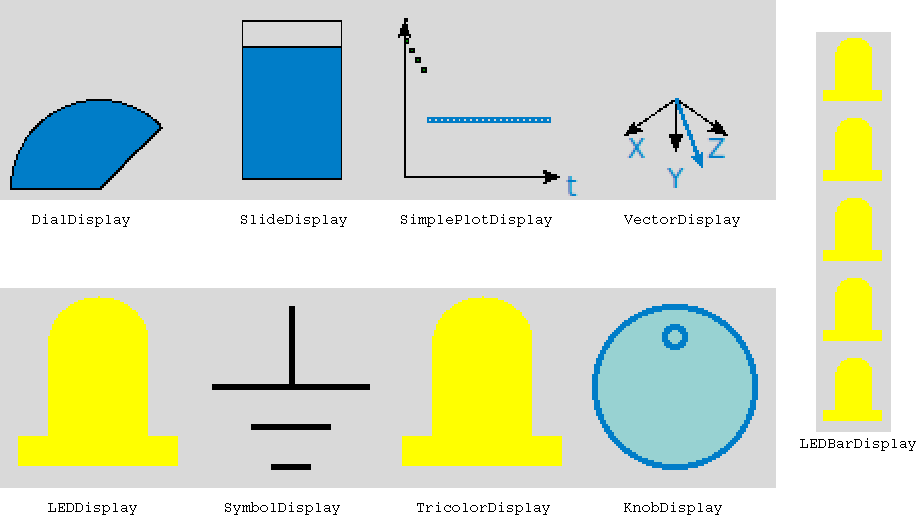
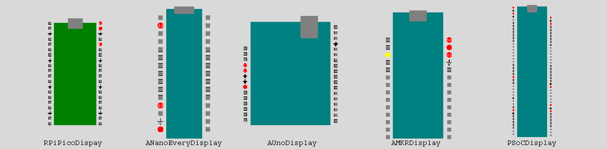

# API for the Widgets Directory of the  Dandy project

Class diagram for the widgets folder:


Pictures of widgets:



## AMKRDisplay Class
### Description
The `AMKRDisplay` class shows a widget that looks like the Arduino MKR1010 microcontroller. 

### Member Functions
The constructor:
```python
__init__(self, windowP)
```

Other member functions:
```python
redraw_body(self)
```

```python
draw_pwr_gnd(self)
```
The Arduino MKR1010 has ground at pin 25, 3.3V power at pin 26, Vin power at pin 27, and 5V power at pin 28. This function draws the symbols for these pins.  

### Example

```python
import tkinter
import sys
sys.path.append('../widgets')
import AMKRDisplay

main_window=tkinter.Tk()
mc1= AMKRDisplay.AMKRDisplay(main_window)
mc1.set_led(3)
mc1.pack()
tkinter.mainloop()
```


### Similar Classes 
`AMKRDisplay` is a child of `MCDisplay`, so it has access to the parent's member functions. The class `ANanoEveryDisplay` displays an Arduino Nano Every. `AUnoDisplay` displays an Arduino Uno. 

## AnalogInDisplay Class
### Description
`AnalogInDisplay` is the parent class of a number of widgets used to display numerical values. These widgets are useful, for example, when displaying analog sensor data into a computer.
### Member Functions

The constructor:
```python
__init__(self, windowAIn, a_height=100, a_width=100)
```

Setters and getters:
```python
set_minimum(self, min_value=0)
```

```python
set_maximum(self, max_value=10.0)
```

```python
get_minimum(self)
```

```python
get_maximum(self)
```

```python
set_ain_height(self, aheight=100)
```

```python
set_ain_width(self, awidth=100)
```

```python
get_ain_height(self)
```

```python
get_ain_width(self)
```

```python
get_color1(self)
```

```python
get_color2(self)
```

Member functions related to packing:
```python
pack(self)
```

```python
pack_forget(self)
```


### Example
You should declare objects of the child classes instead of this class. 

### Similar Classes 
`SlideDisplay`, `VectorDisplay`, `SimplePlotDisplay`, and `DialDisplay` are child classes of `AnalogInDisplay`.


## ANanoEveryDisplay
### Description
The `ANanoEveryDisplay` class shows a widget that looks like the Arduino Nano Every microcontroller.


### Member Functions

The constructor:
```python
__init__(self, windowP)
```

Other member functions:
```python 
redraw_body(self)
```

```python 
draw_pwr_gnd(self)
```
The Arduino Nano Every pin 14 and 19 are ground. Pin 2 is 3.3V power, pin 12 is 5V power, and pin 15 is Vin power. This function draws these symbols. 

### Example

```python
import tkinter
import sys
sys.path.append('../widgets')
import ANanoEveryDisplay

main_window=tkinter.Tk()
mc1= ANanoEvery.ANanoEveryDisplay(main_window)
mc1.set_led(3)
mc1.pack()
tkinter.mainloop()
```


### Similar Classes 
`NanoEveryDisplay` is a child of `MCDisplay`, so it has access to the parent's member functions. The class `AMKRDisplay` displays an Arduino MKR1010 Every. `AUnoDisplay` displays an Arduino Uno.


## AUnoDisplay
### Description
The `AUnoDisplay` class shows a widget that looks like the Arduino Uno microcontroller.

### Member Functions
The constructor:
```python
__init__(self, windowP)
```

Other member functions:
```python
redraw_body(self)
```

```python
draw_pwr_gnd(self)
```
The Arduino Uno pins 6, 7, and 29 are ground. Pin 4 is 3.3V power, pin 5 is 5V power, and pin 8 is Vin. This function draws these symbols.

### Example
```python
import tkinter
import sys
sys.path.append('../widgets')
import AUnoRDisplay

main_window=tkinter.Tk()
mc1= AUnoDisplay.AUnoDisplay(main_window)
mc1.set_led(3)
mc1.pack()
tkinter.mainloop()
```


### Similar Classes 
`AUnoDisplay` is a child of `MCDisplay`, so it has access to the parent's member functions. The class `ANanoEveryDisplay` displays an Arduino Nano Every. `AMKRDisplay` displays an Arduino MKR1010.


## DialDisplay

### Description

A `DialDisplay` object displays numerical value as a needle on a dial. It may be useful in displaying information from an analog sensor in the computer. 

### Member Functions

The constructor is:

```python
__init__(self, windowDD, height=100, width=100)
```

Other member functions:

```python
set_to_value(self, aValue)
```
The parameter `aValue` should be a float value between the minimum and maximum set in the parent class `AnalogInDisplay`.


### Example

```python
import tkinter
import sys
sys.path.append('../widgets')
import DialDisplay 

main_window=tkinter.Tk()
dial1= DialDisplay.DialDisplay(main_window)
dial1.set_to_value(7.5)
dial1.pack()
tkinter.mainloop()
```


### Similar Classes 
`DialDisplay` is a child of `AnalogInDisplay`. `SlideDisplay`, `TricolorDisplay`,  and `SimplePlotDisplay` also display numerical values.


## KnobDisplay
### Description
A `KnobDisplay` object is a controllable knob. Put your cursor over the widget and scroll the middle mouse button to adjust the knob value. This widget can be used to send a numerical value to control an output. 

### Member Functions
The constructor:
```python
__init__(self, windowK, height=100, width=100)
```
Member functions related to packing:
```python
pack(self)
```

```python
pack_forget(self)
```

Other member functions:
```python
get_angle(self)
```

```python
turn_clockwise(self, event)
```

```python
turn_counterwise(self, event)
```

### Example
```python
import tkinter as tk
import sys
sys.path.append('../widgets') 
import KnobDisplay as kd 

class MinimalKnobDemo(tk.Tk):
    def __init__(self):
        super().__init__()
        self.canvasK=tk.Canvas(self, height=300, width=300)
        self.button_quit=tk.Button(self, text="Quit", \
                            command=self.destroy)
        self.knob1=kd.KnobDisplay(self.canvasK, width=100, height=100)
        self.value=0
        self.canvasK.pack()
        self.knob1.pack()
        self.button_quit.pack()
        #We don't run Tkinter's main loop. Instead, we run the function
        #updater, that manually updater the Tkinter loop.
        self.updater()


    def updater(self):
        while True:
            self.value=self.knob1.get_angle()
            print(self.value)
            self.update()
            
mygui=MinimalKnobDemo()
```


### Similar Classes 
The Tkinter widget `Scale` is a controllable slider that can also be used to send a numerical value to control an output. 

## LEDBarDisplay 
### Description
An `LEDBarDisplay` widget displays multiple digital input bits as an LED bar. 
### Member Functions
The constructor:
```python
__init__(self, bar_window, led_count=5, orientation="vertical", LED_height=50, LED_width=50, LED_orientation="north")
```

The parameter `orientation` can be `vertical` or `horizontal`, and it determines if the LEDs will be arranged horizontally or vertically. The parameter `LED_orientation` can be `north`, `south`, `east`, or `west`, and it determines the rotation of the LEDs in the bar.

Setters and getters:
```python
set_all_color(self, color="yellow")
```

```python
set_one_color(self, led_number, color="yellow")
```

```python
set_gnd(self, pin_no)
```

```python
set_power(self, pin_no, volts=0)
```
In the function `set_power`, `volts` should be zero or another float value. If `volts` is not zero, the voltage value will be printed on the widget.

```python
set_box(self, pin_no)
```
The `set_box` function draws a box at a particular pin location. It is useful for indicating pins with nothing wired to them.

```python
set_orientation(self, orientation)
```

```python
set_LED_orientation(self, pin_no, LED_orientation="north")
```


Member functions related to packing:
```python
pack(self)
```

```python
pack_forget(self)
```


### Example

```python
import tkinter
import sys
sys.path.append('../widgets')
import LEDBarDisplay
import SymbolDisplay

main_window=tkinter.Tk()
bar1= LEDBarDisplay.LEDBarDisplay(main_window, led_count=4)
bar1.set_all_color("yellow")
bar1.set_one_color(2, "green")
bar1.set_gnd(3)
bar1.pack()
tkinter.mainloop()
```

### Similar Classes 
The `LEDDisplay` class displays single LED widgets. The `SymbolDisplay` class displays the power symbol, ground symbol, and box. The `LEDBarDisplay` widget uses these classes.

## LEDDisplay class
### Description
A `LEDDisplay` widget displays a horizontal or vertical row of LEDs. The LEDs can be replaced by power symbols, ground symbols, or boxes too. This widget can be used to display the status of multiple bits. 

### Member Functions 
The constructor is:
```python
___init___(self, LED_window, height=100, width=100, color="yellow")
```

Setter and getter member functions:

```python
get_color(self)
```

```python
change_LED_color(self, new_color)
```

```python
get_bg_color(self) #bg stands for background
```

```python
change_bg_color(self, new_color) 
```

```python
set_size(self, width=100, height=100)
```

```python
get_pin_number(self) 
```
LEDDisplay widgets can be numbered by a pin number. If the number is nonzero, it will be displayed on
 the widget. Input `pin_value` should be an integer.

```python
set_pin_number(self, pin_value=0) 
```

```python
get_orientation(self)
```

LEDDisplay widgets can be rotated with the `set_orientation` function. The parameter `LED_orientation` can be `north`, `south`, `east`, or `west`. 

```python
set_orientation(self, LED_orientation="north")
```

Member functions related to packing: 

`Pack` puts a Tkinter widget in a window. The `bar_orientation` optional parameter may be `vertical` or `horizontal`. It is only used with an `LEDBarDisplay` widget.
```python
pack(self, bar_orientation="vertical")
```

`Pack_forget` removes a Tkinter widget from a window.
```python
pack_forget(self)
```

Member functions related to drawing an LED in different orientations:

The parameter `orientation` may be `north`, `south`, `east`, or `west`.
```python
draw_LED(self, orientation="north")
```

```python
draw_LED_north(self)
```

```python 
draw_LED_south(self)
```

```python
draw_LED_east(self)
```

```python
draw_LED_west(self)
```


### Example
```python
import tkinter
import sys
sys.path.append('../widgets')
import LEDDisplay 

main_window=tkinter.Tk()
led1= LEDDisplay.LEDDisplay(main_window)
led1.change_LED_color("purple")
led1.set_orientation("east")
led1.pack()
tkinter.mainloop()
```


### Similar Classes
`LEDBarDisplay` displays multiple `LEDDisplay` or `SymbolDisplay` widgets.

## MCDisplay class
### Description
`MCDisplay` is the parent class of a number of widgets that look like specific microcontrollers. 
### Member Functions
The constructor:
```python
__init__(self, windowMC, leftPins=15, rightPins=15, widgetSize=21)
```
Setters and getters:
```python
get_left_pins(self)
```

```python
get_right_pins(self)
```

```python
get_widget_size(self)
```

```python
set_widget_size(self, widgetSize)
```

```python 
get_left_bar_frame(self)
```

```python
get_right_bar_frame(self)
```

```python
get_left_bar(self)
```

```python
get_right_bar(self)
```

```python
set_led_color(self, pin_no, color="yellow")
```

```python 
get_led_color(self, pin_no)
```

```python
set_led(self, pin_no)
```

```python
set_button(self, pin_no)
```
The `set_button` function just sets up the button. The button won't do anything until you `bind` it in another class.

```python
set_tricolor(self, pin_no)
```

```python
set_dial(self, pin_no)
```

```python
set_slide(self, pin_no)
```

```python
get_pin_loc(self, pin_no)
```

```python
draw_pwr_gnd(self)
```
The `draw_pwr_gnd` function also sets pin numbers.

Member functions related to packing:
```python
pack(self, side='bottom')
```

```python
pack_forget(self)
```

Other member functions:
```python 
redraw_body(self)
```

### Example
You should declare objects of the child classes instead of class `MCDisplay`.
### Similar Classes 
The following are child classes of `MCDisplay` and have access to its member functions: `AMKRDisplay`, `ANanoEveryDisplay`, `AUnoDisplay`, `PSoCDisplay`, and `RPiPicoDisplay`.


## PSoCDisplay
### Description
The `PSoCDisplay` class shows a widget that looks like the Infineon PSoC6 microcontroller. 
### Member Functions
The constructor
```python
__init__(self, windowP)
```

Other member functions
```python 
redraw_body()
```

```python
draw_pwr_gnd()
```
Pins 2, 4, 31, 36, 53, 61, 74, and 82 are ground. Pins 1, 3, 5, 24, 35, 52, 54, 60, 81, and 83 are power.
This function draws these symbols.

### Example
```python
import tkinter
import sys
sys.path.append('../widgets')
import RPiPicoDisplay

main_window=tkinter.Tk()
mc1= RPiPicoDisplay.RPiPicoDisplay(main_window)
mc1.pack()
tkinter.mainloop()
```


### Similar Classes 
`PSoCDisplay` is a child of `MCDisplay`, so it has access to the parent's member functions. Other classes that display specific microcontrollers are `AMKRDisplay`, `AUnoDisplay`, `ANanoEveryDisplay`, and `RPiPicoDisplay`.


## RPiPicoDisplay class
### Description
The `RPiPicoDisplay` class shows a widget that looks like a Raspberry Pi Pico microcontroller. 
### Member Functions
The constructor:
```python
__init__(self, windowP)
```

Other member functions:
```python
redraw_body(self)
```

```python
draw_pwr_gnd(self)
```
Pins 3, 8, 13, 18, 23, 28, 33, and 38 are ground. Pin 36 is 3.3V power, pin 39 is Vsys, and pin 40 is Vbus.
This function draws symbols at these pins.  

### Example
```python
import tkinter
import sys
sys.path.append('../widgets')
import RPiPicoDisplay

main_window=tkinter.Tk()
mc1= RPiPicoDisplay.RPiPicoDisplay(main_window)
mc1.pack()
tkinter.mainloop()
```

### Similar Classes 
`RPiPicoDisplay` is a child of `MCDisplay`, so it has access to the parent's member functions. Other classes that display specific microcontrollers are `AMKRDisplay`, `AUnoDisplay`, `ANanoEveryDisplay`, and `PSoCDisplay`.


## SimplePlotDisplay class
### Description
A `SimplePlotDisplay` object displays numerical values on a plot verses time. It may be useful in displaying information from an analog input sensor in the computer. The plot extends horizontally 25 points. After 25 points, it loops back to the beginning and replots the points. 

### Member Functions
The constructor:
```python
__init__(self, windowP, height=100, width=100)
```
Other member functions:
```python
add_point(self, valueA)
```
### Example

```python
import tkinter
import sys
sys.path.append('../widgets')
import SimplePlotDisplay

main_window=tkinter.Tk()
plot1=SimplePlotDisplay.SimplePlotDisplay(main_window)
plot1.pack()
plot1.add_point(7.0)    
plot1.add_point(6.5)
plot1.add_point(6.0)
plot1.add_point(5.5)
tkinter.mainloop()
```

### Similar Classes 
`SimplePlotDisplay` is a child of `AnalogInDisplay`, so it has access to the parent's member functions. `DialDisplay`, `SlideDisplay`, and `TricolorDisplay` also display numerical values. 

## SlideDisplay
### Description
`SlideDisplay` is used to display a numerical value as a slider along a bar. It may be useful in displaying information from an analog sensor.  It is a child of class `AnalogInDisplay`.
### Member Functions
The constructor is:
```python
__init__(self, windowS, height=100, width=100)
```

Other member functions:
```python
set_to_value(self, aValue)
```
The parameter `aValue` should be a numerical value between the minimum and maximum set in the parent class `AnalogInDisplay`.

### Example

```python
import tkinter
import sys
sys.path.append('../widgets')
import SlideDisplay 

main_window=tkinter.Tk()
slide1= SlideDisplay.SlideDisplay(main_window)
slide1.set_to_value(7.5)
slide1.pack()
tkinter.mainloop()

```


### Similar Classes 
`TricolorDisplay`, `DialDisplay`, and `SimplePlotDisplay` also display numerical values. 

## SymbolDisplay
### Description
The `SymbolDisplay` class displays static symbols including power symbols, ground symbols, and boxes.
### Member Functions
The constructor:
```python
__init__(self, windowS, height=75, width=75)
```
Member functions related to packing:
```python
pack(self, bar_orientation="vertical")
```
The parameter `bar_orientation` can be `vertical` or `horizontal`.

```python
pack_forget(self)
```


Other member functions
```python
destroy(self)
```

```python
draw_power(self, volts=5.0)
```
The parameter `volts` should be a float. If it is nonzero, the value will be printed on the widget.

```python
draw_ground(self)
```

```python
draw_box(self)
```


### Example
```python
import tkinter
import sys
sys.path.append('../widgets')
import SymbolDisplay

main_window=tkinter.Tk()
symbol1=SymbolDisplay.SymbolDisplay(main_window)
symbol1.draw_ground()
symbol1.pack()
```


### Similar Classes 
The `SymbolDisplay` class is used by `LEDBarDisplay`, `MCDisplay`, and child classes of `MCDisplay` that show widgets that look like specific microcontrollers.

## TricolorDisplay 
### Description
The `TricolorDisplay` object displays a numerical value as if it went through a comparator to a tricolor LED. If the input value is below one cutoff level, the LED is green. If it is between that value and a second cutoff level, the LED is yellow. If it is above the second cutoff level, the LED is red.

### Member Functions
The constructor:
```python
__init__(self, windowT, height=100, width=100, low_level=3.0, high_level=8.0)
```

Other member functions:
```python
set_to_value(self, valueA)
```

```python
set_low_cutoff(self, low_level)
```

```python
get_low_cutoff(self)
```

```python
set_high_cutoff(self, high_level)
```

```python
get_high_cutoff(self)
```

### Example
```python
import tkinter
import sys
sys.path.append('../widgets')
import TricolorDisplay

main_window=tkinter.Tk()
led1=TricolorDisplay.TricolorDisplay(main_window)
led1.set_to_value(5.5)
led1.pack()
tkinter.mainloop()
```


### Similar Classes 
`TricolorDisplay` is a child class `LEDDisplay`. The classes `DialDisplay`, `SlideDisplay`, and `SimplePlotDisplay` also display numerical values.

## VectorDisplay
### Description
The `VectorDisplay` widget displays three numerical values as a vector. Use this class to display velocity, magnetic field at a point, or other vector quantities. `VectorDisplay` is a child of class `AnalogInDisplay`. 
### Member Functions

The constructor:

```python
__init__(self, windowV, height=100, width=100)
```

Other member functions:
```python
set_to_value(self, xValue, yValue, zValue)
```

### Example

```python
import tkinter
import sys
sys.path.append('../widgets')
import VectorDisplay 

main_window=tkinter.Tk()
vec1= VectorDisplay.VectorDisplay(main_window)
vec1.set_to_value(5, 30, 25.2)
vec1.pack()
tkinter.mainloop()
```


### Similar Classes 
The `DialDisplay`, `SlideDisplay`, and `SimplePlotDisplay` widgets display single numerical values. 


